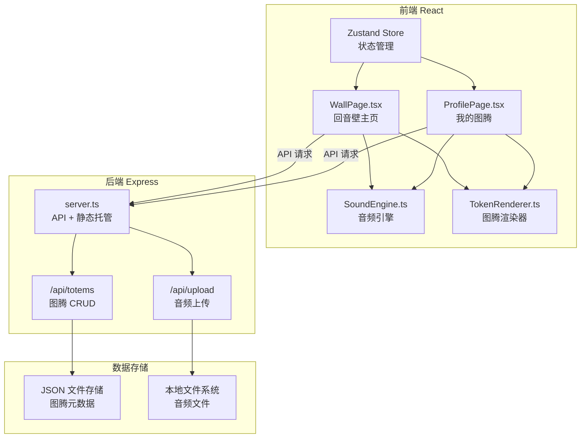
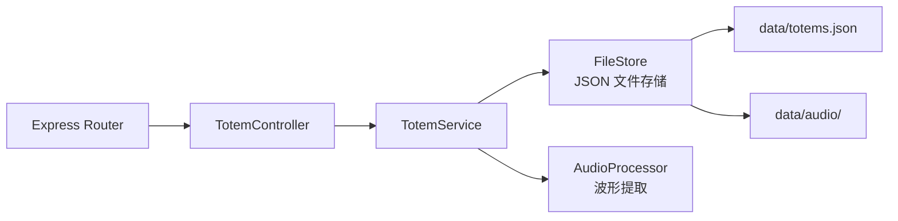

## 1. 架构设计



## 2. 技术说明

- **前端**：React@18 + TypeScript + Tailwind CSS + Vite
- **初始化工具**：vite-init（react-express-ts 模板）
- **后端**：Express@4 + TypeScript
- **数据库**：JSON 文件存储（无需外部数据库，适合演示项目）
- **音频处理**：Web Audio API（浏览器原生）
- **Canvas 渲染**：Canvas 2D API + requestAnimationFrame
- **状态管理**：Zustand

## 3. 路由定义

| 路由 | 用途 |
|------|------|
| `/` | 回音壁主页，展示所有声波图腾动态墙面 |
| `/profile` | 我的图腾页面，展示用户创建的所有图腾 |

## 4. API 定义

### 4.1 类型定义

```typescript
interface Totem {
  id: string;
  audioData: string;       // Base64 编码音频数据
  waveform: number[];      // 波形特征数组
  frequencyBands: {        // 频率分布
    low: number;           // 低频能量
    mid: number;           // 中频能量
    high: number;          // 高频能量
  };
  colorPrimary: string;    // 主色（基于频率映射）
  colorSecondary: string;  // 副色
  createdAt: number;       // 创建时间戳
  playCount: number;       // 播放次数
  ownerId: string;         // 创建者 ID（浏览器本地标识）
  position: { x: number; y: number };  // 在回音壁上的位置
  rotation: number;        // 旋转角度
  mergedFrom?: string[];   // 共鸣融合来源图腾 ID
}

interface CreateTotemRequest {
  audioData: string;       // Base64 音频
  ownerId: string;         // 用户标识
}

interface MergeTotetRequest {
  sourceId: string;        // 发起共鸣的图腾 ID
  targetId: string;        // 目标图腾 ID
}
```

### 4.2 接口定义

| 方法 | 路径 | 请求体 | 响应 | 说明 |
|------|------|--------|------|------|
| GET | `/api/totems` | - | `Totem[]` | 获取所有图腾 |
| GET | `/api/totems/:id` | - | `Totem` | 获取单个图腾详情 |
| POST | `/api/totems` | `CreateTotemRequest` | `Totem` | 创建新图腾 |
| DELETE | `/api/totems/:id` | `{ ownerId: string }` | `{ success: boolean }` | 删除图腾 |
| POST | `/api/totems/merge` | `MergeTotetRequest` | `Totem` | 共鸣融合两个图腾 |
| GET | `/api/totems/user/:ownerId` | - | `Totem[]` | 获取用户的所有图腾 |

## 5. 服务端架构图



## 6. 数据模型

### 6.1 数据模型定义

```mermaid
erdiag
    TOTEM {
        string id PK
        string audioData
        number[] waveform
        number lowFreq
        number midFreq
        number highFreq
        string colorPrimary
        string colorSecondary
        number createdAt
        number playCount
        string ownerId
        number posX
        number posY
        number rotation
    }
```

### 6.2 文件存储结构

```
data/
  totems.json        # 图腾元数据数组
  audio/
    {id}.webm        # 音频文件
```

## 7. 前端模块职责

| 模块 | 文件 | 职责 |
|------|------|------|
| 音频引擎 | `src/utils/SoundEngine.ts` | 麦克风录制、音频播放（淡入淡出）、波形数据提取、频率分析 |
| 图腾渲染器 | `src/utils/TokenRenderer.ts` | Canvas 绘制声波图腾、颜色映射、缓动动画循环、悬停/选中状态 |
| 回音壁页面 | `src/pages/WallPage.tsx` | 回音壁主页面、Canvas 容器、交互处理、录制面板 |
| 我的图腾页面 | `src/pages/ProfilePage.tsx` | 图腾网格/列表、筛选、删除 |
| 状态管理 | `src/store/useStore.ts` | Zustand store，管理图腾数据、用户标识、UI 状态 |
