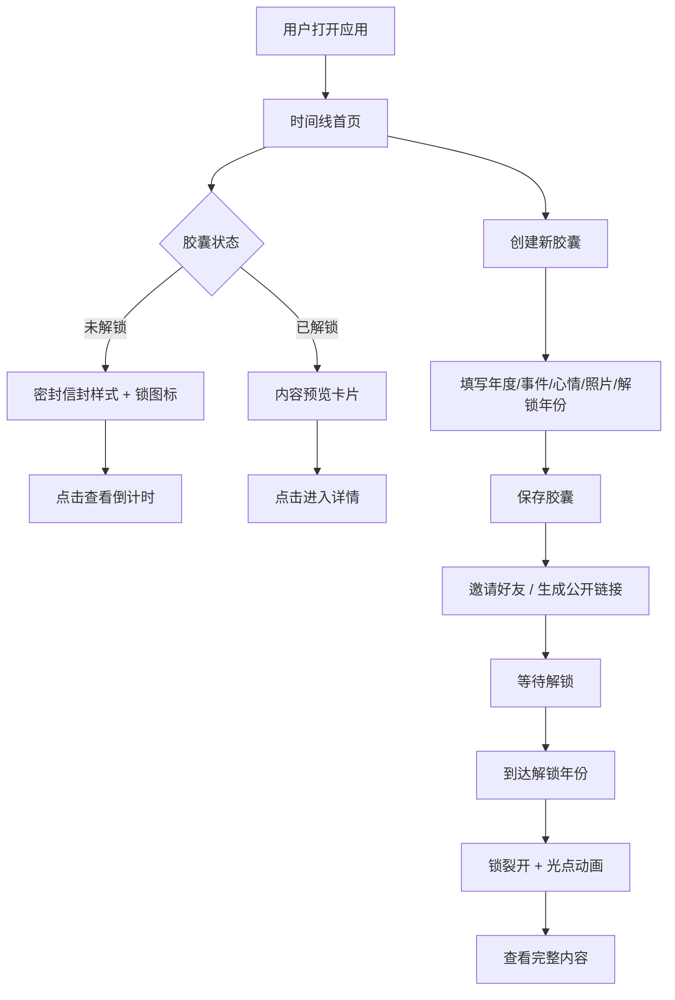

## 1. 产品概述

「时光藏品」是一个数字时间胶囊全栈Web应用，用户可为每一年创建胶囊记录重要事件、心情和照片，并设定解锁年份，到达解锁时间后胶囊自动打开，用户和受邀好友可查看内容。
- 目标用户：希望以仪式感保存和回顾人生记忆的年轻用户群体
- 核心价值：通过时间锁定机制赋予记忆保存以稀缺性和期待感，复古怀旧视觉增强情感共鸣

## 2. 核心功能

### 2.1 用户角色
| 角色 | 注册方式 | 核心权限 |
|------|----------|----------|
| 普通用户 | 邮箱注册 | 创建胶囊、邀请好友、公开分享 |
| 受邀好友 | 邮件链接加入 | 查看已解锁胶囊内容 |
| 访客 | 公开链接访问 | 查看已解锁公开胶囊内容 |

### 2.2 功能模块
1. **时间线首页**：展示用户所有胶囊的时间线视图，未解锁显示密封信封，已解锁显示内容预览
2. **胶囊详情页**：完整记录展示（文字、图片）、年份倒计时进度条、已邀请好友列表
3. **胶囊创建/编辑**：填写年度、事件记录、心情、上传照片、设定解锁年份
4. **邀请与分享**：通过邮件链接邀请好友、生成公开分享链接（内容仍受解锁时间限制）

### 2.3 页面详情
| 页面名称 | 模块名称 | 功能描述 |
|----------|----------|----------|
| 时间线首页 | 时间线列表 | 垂直时间线展示所有胶囊，按年份排列，未解锁胶囊显示密封信封+锁图标，已解锁显示内容预览卡片 |
| 时间线首页 | 创建入口 | 页面顶部/底部创建新胶囊按钮，点击弹出创建表单 |
| 胶囊详情页 | 内容展示 | 显示完整文字记录（手写体风格）和照片（褪色风格） |
| 胶囊详情页 | 倒计时进度条 | 渐变墨水流动效果的年份倒计时，显示距解锁还有多久 |
| 胶囊详情页 | 好友列表 | 展示已邀请好友头像和状态，支持新增邀请 |
| 胶囊详情页 | 分享功能 | 邮件邀请按钮和公开链接生成按钮 |
| 创建/编辑胶囊 | 表单 | 年份选择、事件文字输入、心情选择、照片上传、解锁年份设定 |

## 3. 核心流程

用户打开应用 → 时间线首页展示所有胶囊 → 点击"创建胶囊" → 填写年度/事件/心情/照片/解锁年份 → 保存后胶囊显示为密封信封 → 邀请好友（邮件链接）或生成公开链接 → 到达解锁年份后胶囊自动解锁（锁裂开+光点动画）→ 用户和好友查看完整内容

## 4. 用户界面设计

### 4.1 设计风格
- 主色调：米白(#F5F0E8)到浅棕(#D4C5A9)渐变背景
- 强调色：深棕(#8B6914)用于标题和重要文字，墨蓝(#2C3E50)用于链接和按钮
- 按钮风格：圆角、柔和阴影、微缓动悬停效果
- 字体：手写体用于内容展示（如 Caveat / Ma Shan Zheng），衬线体用于标题（如 Playfair Display / Noto Serif SC），无衬线体用于UI元素
- 布局风格：垂直时间线，信封卡片式布局
- 图标风格：线性复古图标，锁图标为核心交互元素

### 4.2 页面设计概述
| 页面名称 | 模块名称 | UI元素 |
|----------|----------|--------|
| 时间线首页 | 时间线列表 | 垂直时间线轴，左右交替排列信封卡片，泛黄纸张质感，纸纹纹理，柔和阴影，未解锁卡片居中显示锁图标 |
| 时间线首页 | 创建按钮 | 圆形浮动按钮，毛玻璃效果，墨水图标，悬停缩放 |
| 胶囊详情页 | 内容展示 | 手写体文字，褪色棕色调照片（CSS滤镜），泛黄纸张背景 |
| 胶囊详情页 | 倒计时进度条 | 渐变墨水流动线条动画，显示"距解锁还有X年X月" |
| 胶囊详情页 | 好友列表 | 圆形头像列表，受邀状态标签，邀请按钮 |
| 胶囊详情页 | 控制面板 | 半透明毛玻璃圆角面板，浅色调，微缓动悬停 |
| 创建胶囊 | 表单 | 泛黄纸张风格表单卡片，复古输入框样式，照片上传预览 |

### 4.3 响应式设计
- 桌面端优先设计，移动端自适应
- 时间线在桌面端左右交替排列，移动端单侧排列
- 控制面板在桌面端侧边展示，移动端底部弹出
- 触摸优化：按钮最小44px触摸区域，滑动浏览时间线
- 交互帧率保持60fps，动画使用CSS transform和opacity

### 4.4 动画设计
- 锁动画：未解锁时显示小锁图标，解锁时锁裂开并散落光点（粒子效果）
- 卡片进入：滚动触发淡入+轻微上浮
- 进度条：墨水流动渐变动画（CSS keyframes + linear-gradient）
- 悬停效果：卡片微上浮+阴影加深，按钮微缩放
- 页面切换：淡入淡出过渡
