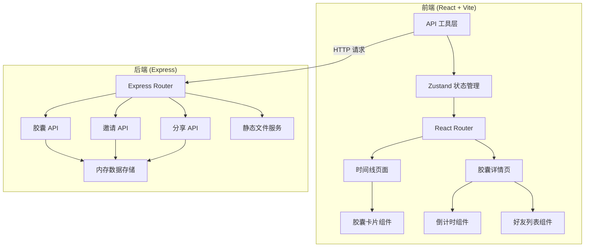
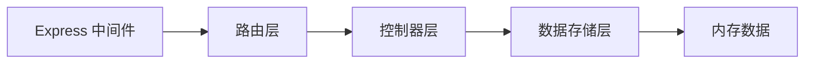
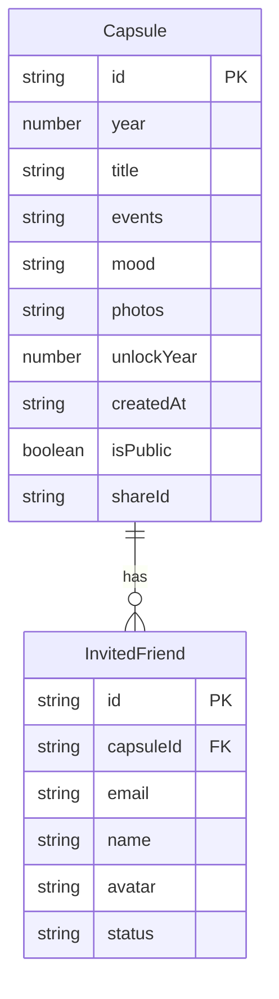

## 1. 架构设计



## 2. 技术说明
- 前端：React 18 + TypeScript + TailwindCSS 3 + Vite
- 初始化工具：vite-init（react-express-ts 模板）
- 后端：Express 4 + TypeScript
- 数据库：内存数据存储（Mock数据，项目可快速运行）
- 状态管理：Zustand
- 路由：React Router DOM v6
- 文件上传：Multer
- 跨域：CORS

## 3. 路由定义
| 路由 | 用途 |
|------|------|
| / | 时间线首页，展示所有胶囊 |
| /capsule/:id | 胶囊详情页，含倒计时、好友列表、分享 |
| /capsule/new | 创建新胶囊 |
| /share/:shareId | 公开分享页面（受解锁时间限制） |

## 4. API 定义

```typescript
interface Capsule {
  id: string;
  year: number;
  title: string;
  events: string[];
  mood: string;
  photos: string[];
  unlockYear: number;
  createdAt: string;
  isPublic: boolean;
  shareId?: string;
  invitedFriends: InvitedFriend[];
}

interface InvitedFriend {
  id: string;
  email: string;
  name: string;
  avatar: string;
  status: 'pending' | 'accepted';
}

interface CreateCapsuleRequest {
  year: number;
  title: string;
  events: string[];
  mood: string;
  photos: string[];
  unlockYear: number;
  isPublic: boolean;
}

interface CapsuleResponse {
  capsule: Capsule;
  isUnlocked: boolean;
  countdown: {
    years: number;
    months: number;
    days: number;
    progress: number;
  };
}
```

| 方法 | 路径 | 请求体 | 响应 | 说明 |
|------|------|--------|------|------|
| GET | /api/capsules | - | CapsuleResponse[] | 获取所有胶囊列表 |
| GET | /api/capsules/:id | - | CapsuleResponse | 获取单个胶囊详情 |
| POST | /api/capsules | CreateCapsuleRequest | CapsuleResponse | 创建新胶囊 |
| PUT | /api/capsules/:id | Partial<CreateCapsuleRequest> | CapsuleResponse | 更新胶囊 |
| DELETE | /api/capsules/:id | - | { success: boolean } | 删除胶囊 |
| POST | /api/capsules/:id/invite | { email: string } | InvitedFriend | 邀请好友 |
| POST | /api/capsules/:id/share | - | { shareId: string } | 生成公开分享链接 |
| GET | /api/share/:shareId | - | CapsuleResponse | 通过分享链接获取胶囊 |
| POST | /api/upload | FormData (file) | { url: string } | 上传照片 |

## 5. 服务端架构图



## 6. 数据模型

### 6.1 数据模型定义



### 6.2 数据定义语言

```sql
CREATE TABLE capsules (
  id TEXT PRIMARY KEY,
  year INTEGER NOT NULL,
  title TEXT NOT NULL,
  events TEXT NOT NULL DEFAULT '[]',
  mood TEXT NOT NULL DEFAULT '',
  photos TEXT NOT NULL DEFAULT '[]',
  unlock_year INTEGER NOT NULL,
  created_at TEXT NOT NULL DEFAULT (datetime('now')),
  is_public BOOLEAN NOT NULL DEFAULT 0,
  share_id TEXT
);

CREATE TABLE invited_friends (
  id TEXT PRIMARY KEY,
  capsule_id TEXT NOT NULL REFERENCES capsules(id),
  email TEXT NOT NULL,
  name TEXT NOT NULL,
  avatar TEXT NOT NULL DEFAULT '',
  status TEXT NOT NULL DEFAULT 'pending' CHECK(status IN ('pending', 'accepted'))
);

CREATE INDEX idx_capsules_year ON capsules(year);
CREATE INDEX idx_friends_capsule ON invited_friends(capsule_id);
CREATE INDEX idx_capsules_share ON capsules(share_id);
```
