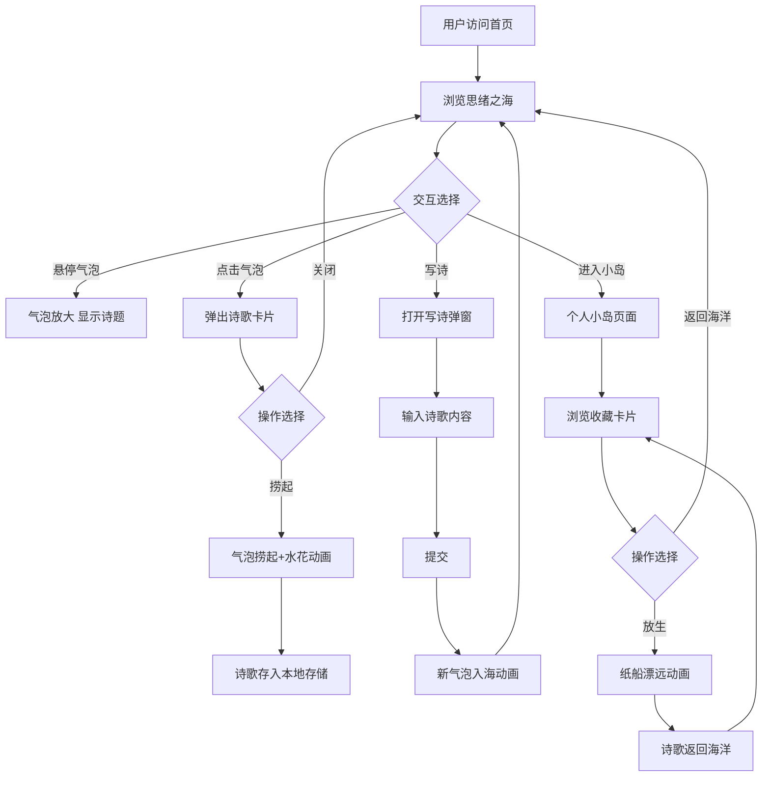

## 1. 产品概述

「字间浮岛」是一个匿名短诗漂流瓶平台，用户可以匿名创作140字以内的短诗，诗歌以虚拟漂流瓶的形式投入「思绪之海」——一片由半透明彩色气泡组成的动态海洋场景。其他用户可以探索这片海洋，捞起感兴趣的诗歌收藏到自己的「个人小岛」。

- **核心价值**：为诗歌爱好者提供一个低压力、高美感的匿名创作与发现空间，通过漂流瓶机制创造诗意的偶然相遇
- **目标用户**：诗歌爱好者、文艺青年、寻求治愈与灵感的人群

## 2. 核心功能

### 2.1 用户角色

| 角色 | 注册方式 | 核心权限 |
|------|----------|----------|
| 匿名访客 | 无需注册 | 写诗、浏览海洋、捞起诗歌、管理个人小岛 |

### 2.2 功能模块

1. **思绪之海（首页）**：Canvas绘制的动态气泡海洋场景，展示所有漂流中的诗歌气泡
2. **写诗弹窗**：匿名创作短诗的入口，限制140字，提交后诗歌化为气泡入海
3. **诗歌卡片**：毛玻璃效果弹窗，展示诗歌全文、发布时间、捞起按钮
4. **个人小岛**：收藏诗歌的展示页面，卡片网格布局，支持放生操作

### 2.3 页面详情

| 页面名称 | 模块名称 | 功能描述 |
|----------|----------|----------|
| 思绪之海 | 气泡海洋 | Canvas绘制半透明彩色气泡，每个气泡代表一首诗，有缓动上下漂浮和轻微旋转动画 |
| 思绪之海 | 气泡交互 | 鼠标悬停气泡微微放大并显示诗题前几个字，点击弹出诗歌卡片 |
| 思绪之海 | 控制面板 | 半透明毛玻璃材质，包含写诗入口按钮、刷新海洋按钮、气泡数量统计 |
| 思绪之海 | 写诗弹窗 | 毛玻璃弹窗，文本输入区（限140字），提交按钮，提交后气泡入海动画 |
| 思绪之海 | 诗歌卡片 | 半透明毛玻璃卡片，展示完整诗歌、发布时间、捞起按钮，捞起时气泡被捞起+水花飞溅动画 |
| 个人小岛 | 收藏卡片网格 | 所有已收藏诗歌以卡片网格排列，卡片带缓动淡入和微上滑动画 |
| 个人小岛 | 放生操作 | 每张卡片右下角放生按钮，点击后诗歌返回海洋并触发纸船漂远动画 |
| 个人小岛 | 导航 | 返回海洋的导航入口 |

## 3. 核心流程

**写诗流程**：用户点击写诗按钮 → 弹出写诗弹窗 → 输入诗歌内容（≤140字）→ 点击提交 → 诗歌被装入漂流瓶 → 新气泡出现在海洋中，带入场动画

**捞起流程**：用户在海洋中浏览气泡 → 悬停查看诗题 → 点击气泡弹出诗歌卡片 → 点击捞起按钮 → 气泡被捞起动画（气泡上升+水花飞溅）→ 诗歌收藏到个人小岛

**放生流程**：用户进入个人小岛 → 浏览收藏的诗歌 → 点击放生按钮 → 纸船漂远动画 → 诗歌从个人小岛移除并返回海洋

## 4. 用户界面设计

### 4.1 设计风格

- **主色调**：浅蓝（#E0F4FF）到水绿（#B8F0D8）渐变背景，海洋感十足
- **辅助色**：气泡使用半透明彩色渐变（粉紫、天蓝、水绿、淡金），发光球体效果
- **按钮风格**：圆角按钮，毛玻璃材质，悬停时微放大+光晕效果
- **字体**：诗题使用 ZCOOL XiaoWei（站酷小薇体），正文使用 Noto Sans SC
- **布局风格**：首页全屏Canvas场景+浮动控制面板，个人小岛为卡片瀑布流网格
- **图标**：lucide-react 图标库
- **特效**：毛玻璃（backdrop-filter: blur）、柔光边缘、水花粒子、纸船漂远

### 4.2 页面设计概述

| 页面名称 | 模块名称 | UI元素 |
|----------|----------|--------|
| 思绪之海 | 全屏Canvas | 浅蓝-水绿渐变背景，半透明发光气泡群，缓动漂浮+旋转动画 |
| 思绪之海 | 控制面板 | 底部居中浮动毛玻璃栏，圆角，柔光边缘，内含写诗按钮+刷新按钮+气泡数量 |
| 思绪之海 | 写诗弹窗 | 居中毛玻璃卡片，文本域+字数计数+提交按钮，淡入缩放动画 |
| 思绪之海 | 诗歌卡片弹窗 | 居中毛玻璃卡片，诗歌全文+时间+捞起按钮，淡入动画，关闭时淡出 |
| 思绪之海 | 捞起动画 | 气泡上升缩小+水花粒子四散效果 |
| 个人小岛 | 页面背景 | 与海洋相同的渐变背景，顶部导航栏 |
| 个人小岛 | 卡片网格 | 响应式网格（桌面3列/平板2列/手机1列），卡片淡入+微上滑动画 |
| 个人小岛 | 放生动画 | 纸船元素从卡片位置漂远并淡出 |

### 4.3 响应式适配

- **桌面端**（≥1024px）：Canvas全屏，控制面板底部居中，卡片3列网格
- **平板端**（768-1023px）：Canvas全屏，控制面板底部居中，卡片2列网格
- **移动端**（<768px）：Canvas全屏，控制面板底部居中更紧凑，卡片1列，触摸优化（tap代替hover）

### 4.4 动画与交互

- **气泡漂浮**：正弦波上下运动 + 缓慢自转，60fps流畅
- **悬停反馈**：气泡平滑放大1.2倍，显示诗题tooltip
- **捞起动画**：气泡从原位上升缩小消失 + 水花粒子向四周飞溅
- **放生动画**：纸船从卡片位置出发，沿曲线漂远并淡出
- **卡片入场**：staggered淡入+向上滑入（animation-delay递增）
- **按钮交互**：hover时scale(1.05)+box-shadow光晕
