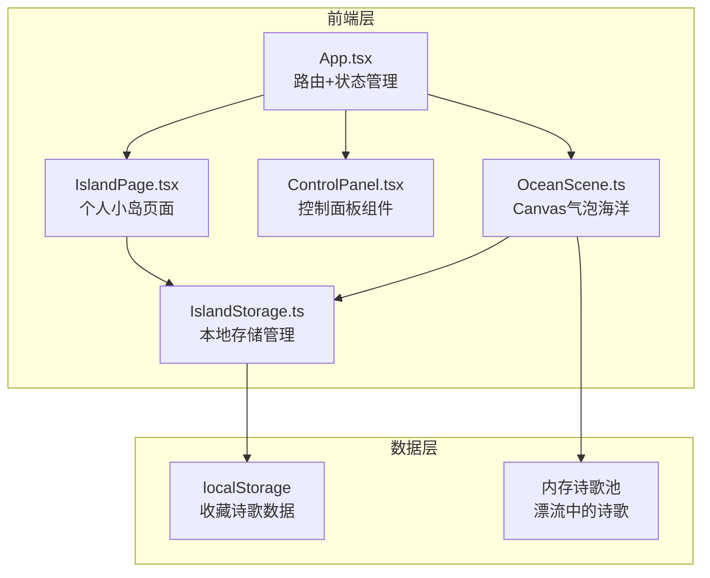

## 1. 架构设计



## 2. 技术说明

- **前端框架**：React 18 + TypeScript
- **构建工具**：Vite + @vitejs/plugin-react
- **样式方案**：Tailwind CSS 3 + 自定义CSS动画
- **状态管理**：Zustand（管理诗歌池、收藏状态、UI状态）
- **路由**：react-router-dom v6
- **图标**：lucide-react
- **本地存储**：localStorage（收藏诗歌持久化）
- **动画**：Canvas 2D绘制 + requestAnimationFrame + CSS动画/transition
- **无后端**：纯前端项目，诗歌数据存储在内存中（刷新后重置），收藏数据持久化到localStorage

## 3. 路由定义

| 路由 | 用途 |
|------|------|
| / | 思绪之海首页，展示Canvas气泡海洋+控制面板 |
| /island | 个人小岛页面，展示收藏的诗歌卡片网格 |

## 4. 数据模型

### 4.1 诗歌数据结构

```typescript
interface Poem {
  id: string;
  content: string;
  title: string;
  createdAt: number;
  color: string;
  x: number;
  y: number;
  radius: number;
  floatOffset: number;
  floatSpeed: number;
  rotationAngle: number;
  rotationSpeed: number;
}
```

### 4.2 收藏数据结构

```typescript
interface CollectedPoem {
  id: string;
  content: string;
  title: string;
  createdAt: number;
  collectedAt: number;
  color: string;
}
```

### 4.3 Zustand Store 结构

```typescript
interface OceanStore {
  poems: Poem[];
  collectedPoems: CollectedPoem[];
  addPoem: (content: string) => void;
  collectPoem: (id: string) => void;
  releasePoem: (id: string) => void;
  refreshOcean: () => void;
}
```

## 5. 关键技术实现

### 5.1 OceanScene（Canvas气泡海洋）

- 使用 Canvas 2D API 绘制半透明发光气泡
- 每个气泡用径向渐变（radialGradient）模拟发光球体效果
- requestAnimationFrame 驱动动画循环，正弦函数控制上下漂浮
- 鼠标位置检测实现悬停放大和点击交互
- 捞起动画：气泡上升缩小 + 粒子系统实现水花飞溅

### 5.2 IslandStorage（本地存储）

- 封装 localStorage 的读写操作
- 收藏时写入，放生时删除
- 页面加载时从 localStorage 恢复收藏数据

### 5.3 动画性能

- Canvas动画使用 requestAnimationFrame 保持60fps
- 减少DOM操作，气泡交互在Canvas内完成
- CSS动画使用 transform 和 opacity，利用GPU加速
- 使用 will-change 提示浏览器优化
