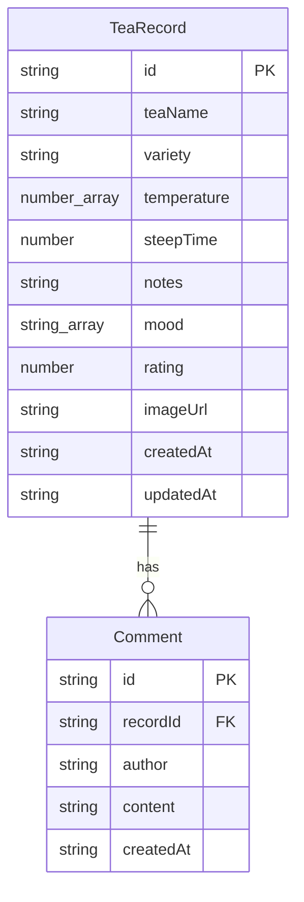

## 1. 架构设计

```mermaid
flowchart TB
    subgraph "前端 (React + TypeScript + Vite)"
        "Router" --> "首页 Home"
        "Router" --> "详情页 Detail"
        "Router" --> "个人页 Profile"
        "首页 Home" --> "Card 组件"
        "详情页 Detail" --> "温度曲线图 Canvas"
        "详情页 Detail" --> "进度条组件"
        "详情页 Detail" --> "评论区"
        "个人页 Profile" --> "日历组件"
        "个人页 Profile" --> "柱状图 Canvas"
        "个人页 Profile" --> "饼图 Canvas"
    end

    subgraph "后端 (Express + TypeScript)"
        "API Router" --> "品茶记录 CRUD"
        "API Router" --> "图片上传"
        "API Router" --> "评论 CRUD"
    end

    subgraph "数据层"
        "JSON 文件 (data/records.json)"
        "JSON 文件 (data/comments.json)"
        "图片文件 (uploads/)"
    end

    "前端" -->|"HTTP API"| "后端"
    "后端" -->|"fs 读写"| "数据层"
```

## 2. 技术说明
- **前端**：React 18 + TypeScript + Tailwind CSS 3 + Vite
- **初始化工具**：vite-init（react-express-ts 模板）
- **后端**：Express 4 + TypeScript（ESM 模式）
- **数据库**：本地 JSON 文件存储（data/records.json, data/comments.json）
- **图片存储**：本地 uploads 文件夹，通过 multer 中间件处理上传
- **状态管理**：Zustand
- **路由**：react-router-dom v6
- **动画**：CSS transitions + framer-motion
- **图标**：lucide-react

## 3. 路由定义
| 路由 | 用途 |
|------|------|
| `/` | 首页卡片墙，展示所有品茶记录 |
| `/create` | 创建新的品茶记录 |
| `/detail/:id` | 品茶记录详情页 |
| `/edit/:id` | 编辑品茶记录 |
| `/profile` | 个人页面（品茶日历和统计） |

## 4. API 定义

### 4.1 品茶记录 API
```
GET    /api/records          # 获取所有品茶记录（支持 ?variety=&mood= 筛选）
GET    /api/records/:id      # 获取单条品茶记录
POST   /api/records          # 创建品茶记录（multipart/form-data，含图片）
PUT    /api/records/:id      # 更新品茶记录（multipart/form-data，含图片）
DELETE /api/records/:id      # 删除品茶记录
```

### 4.2 评论 API
```
GET    /api/records/:id/comments    # 获取某条记录的评论
POST   /api/records/:id/comments    # 发表评论
```

### 4.3 图片 API
```
GET    /uploads/:filename     # 获取上传的图片
```

### 4.4 TypeScript 类型定义
```typescript
interface TeaRecord {
  id: string;
  teaName: string;
  variety: string;
  temperature: number[];
  steepTime: number;
  notes: string;
  mood: string[];
  rating: number;
  imageUrl: string;
  createdAt: string;
  updatedAt: string;
}

interface Comment {
  id: string;
  recordId: string;
  author: string;
  content: string;
  createdAt: string;
}

interface CreateRecordPayload {
  teaName: string;
  variety: string;
  temperature: string;
  steepTime: string;
  notes: string;
  mood: string;
  rating: string;
  image?: File;
}
```

## 5. 服务器架构图

```mermaid
flowchart LR
    "Controller 层" --> "Service 层" --> "Repository 层" --> "JSON 文件"
```

- **Controller 层**：处理 HTTP 请求，参数校验，调用 Service
- **Service 层**：业务逻辑处理
- **Repository 层**：读写 JSON 文件，封装数据访问

## 6. 数据模型

### 6.1 数据模型定义



### 6.2 数据存储
- `data/records.json`：存储所有品茶记录数组
- `data/comments.json`：存储所有评论数组
- `uploads/`：存储上传的茶汤照片
