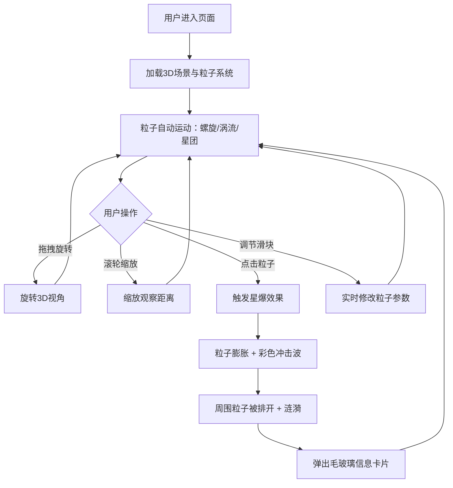

## 1. 产品概述

「星尘织梦」是一款基于 WebGL 的3D交互可视化项目，模拟夜空中星尘粒子在神秘力量下聚散成形的过程。用户可以旋转视角、缩放观察，并与粒子互动触发「星爆」效果。

- 目标用户：对3D可视化、粒子特效和交互艺术感兴趣的创意人群
- 核心价值：沉浸式星尘体验，实时物理模拟与用户交互的完美融合

## 2. 核心功能

### 2.1 功能模块

1. **3D星尘场景页**：全屏3D粒子可视化场景，包含粒子系统、物理引擎、交互处理和UI覆盖层

### 2.2 页面详情

| 页面名称 | 模块名称 | 功能描述 |
|----------|----------|----------|
| 3D星尘场景 | 粒子系统 | 生成成千上万的发光粒子，粒子以螺旋、涡流或星团形态聚集，粒子间有吸引和排斥力，形成梦幻图案 |
| 3D星尘场景 | 物理引擎 | 模拟粒子间的吸引力和排斥力，粒子旋转、聚集和消散的生命周期管理 |
| 3D星尘场景 | 视角控制 | 鼠标拖拽旋转视角、滚轮缩放，自由观察3D空间 |
| 3D星尘场景 | 星爆交互 | 点击粒子触发星爆效果——粒子急速膨胀并放射彩色冲击波，周围粒子被排开产生涟漪 |
| 3D星尘场景 | 信息卡片 | 星爆时弹出半透明毛玻璃信息卡片，显示粒子坐标、亮度值和聚合度 |
| 3D星尘场景 | 控制面板 | 3个滑块调节「聚集速度」、「吸引力强度」和「粒子亮度」 |

## 3. 核心流程

用户打开页面后进入全屏3D星尘场景，粒子自动在空间中以螺旋、涡流或星团形态运动。用户可以：
1. 拖拽旋转视角，滚轮缩放观察
2. 点击任意粒子触发星爆效果，查看粒子信息
3. 通过控制面板调节粒子参数

## 4. 用户界面设计

### 4.1 设计风格

- **主色调**：深蓝 (#0a0a2e) 到紫黑 (#1a0a2e) 渐变背景
- **粒子颜色**：蓝 (#4a7dff)、紫 (#8b5cf6)、粉 (#ec4899) 之间渐变
- **按钮/滑块风格**：半透明毛玻璃 (backdrop-blur)，圆角，微光边框
- **字体**：标题用 Orbitron（科幻感），正文用 Rajdhani（清晰可读）
- **布局**：全屏3D画布 + 左下角控制面板浮层 + 点击弹出信息卡片
- **动画风格**：粒子脉冲光晕、缓动漂浮、星爆冲击波涟漪

### 4.2 页面设计概览

| 页面名称 | 模块名称 | UI元素 |
|----------|----------|--------|
| 3D星尘场景 | 全屏画布 | 深蓝→紫黑渐变背景，WebGL渲染的粒子空间 |
| 3D星尘场景 | 控制面板 | 半透明毛玻璃面板，3个自定义滑块（聚集速度/吸引力强度/粒子亮度），标签+数值显示 |
| 3D星尘场景 | 信息卡片 | 半透明毛玻璃卡片，粒子坐标(x,y,z)、亮度值、聚合度，淡入/淡出动画 |
| 3D星尘场景 | 加载提示 | 居中加载动画，粒子旋转图标+进度文字 |

### 4.3 响应式

- 桌面优先设计，全屏3D画布自适应窗口
- 控制面板在移动端可折叠为底部抽屉
- 信息卡片位置跟随点击坐标

### 4.4 3D场景指引

- **环境/氛围**：深空夜空背景，无HDRI，纯色渐变营造梦幻感
- **灯光设置**：环境光（低强度暖蓝）+ 点光源跟随鼠标微动，粒子自发光（emissive）
- **相机设置**：透视相机，初始位置(0, 0, 50)，鼠标控制旋转+缩放
- **构图与焦点**：粒子系统居中，螺旋/涡流/星团形态为视觉焦点
- **交互与动画**：粒子持续漂浮脉冲，鼠标悬停粒子微亮，点击触发星爆冲击波
- **后处理效果**：Bloom（光晕发光）、UnrealBloomPass 增强粒子发光感
- **性能预算**：目标粒子数 5000-10000，帧率 60fps
