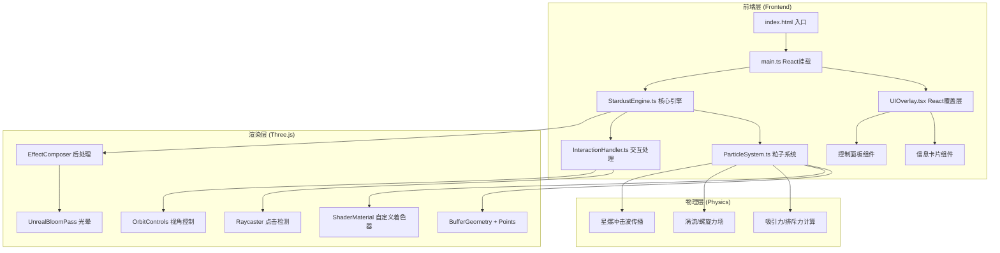

## 1. 架构设计



## 2. 技术说明

- **前端框架**：React@18 + TypeScript + Vite
- **3D渲染**：Three.js（直接使用，非R3F，以满足用户指定的类结构需求）
- **后处理**：Three.js EffectComposer + UnrealBloomPass
- **UI层**：React 组件覆盖在 WebGL Canvas 之上
- **样式**：CSS Modules + Tailwind CSS
- **状态管理**：Zustand（共享粒子参数和交互状态）
- **构建工具**：Vite
- **后端**：无（纯前端项目）

## 3. 路由定义

| 路由 | 用途 |
|------|------|
| / | 全屏3D星尘场景（单页应用，无路由切换） |

## 4. 文件结构

```
src/
├── StardustEngine.ts    # 核心引擎类：管理场景、渲染循环、后处理
├── ParticleSystem.ts    # 粒子系统：生成、更新、物理模拟、生命周期
├── InteractionHandler.ts # 交互处理：视角控制、点击检测、粒子选择
├── UIOverlay.tsx         # React覆盖层：信息卡片 + 控制面板
├── store.ts              # Zustand状态：粒子参数和交互状态共享
├── main.tsx              # 入口：初始化React + Three.js
├── App.tsx               # 根组件
└── index.css             # 全局样式（毛玻璃、渐变背景等）
```

## 5. 核心类设计

### 5.1 StardustEngine

```typescript
class StardustEngine {
  scene: THREE.Scene
  camera: THREE.PerspectiveCamera
  renderer: THREE.WebGLRenderer
  composer: EffectComposer
  particleSystem: ParticleSystem
  interactionHandler: InteractionHandler

  constructor(container: HTMLElement)
  init(): void
  animate(): void
  onResize(): void
  dispose(): void
}
```

### 5.2 ParticleSystem

```typescript
class ParticleSystem {
  geometry: THREE.BufferGeometry
  material: THREE.ShaderMaterial
  points: THREE.Points
  positions: Float32Array
  velocities: Float32Array
  colors: Float32Array
  sizes: Float32Array
  lifetimes: Float32Array

  constructor(count: number, params: ParticleParams)
  update(deltaTime: number): void
  applyForces(): void
  triggerStarburst(index: number): void
  getParticleInfo(index: number): ParticleInfo
  updateParams(params: Partial<ParticleParams>): void
}
```

### 5.3 InteractionHandler

```typescript
class InteractionHandler {
  camera: THREE.PerspectiveCamera
  renderer: THREE.WebGLRenderer
  particleSystem: ParticleSystem
  controls: OrbitControls
  raycaster: THREE.Raycaster

  constructor(camera, renderer, particleSystem)
  onMouseClick(event: MouseEvent): number | null
  onMouseMove(event: MouseEvent): void
  dispose(): void
}
```

### 5.4 状态管理 (Zustand Store)

```typescript
interface StoreState {
  gatheringSpeed: number    // 聚集速度 0-1
  attractionStrength: number // 吸引力强度 0-1
  particleBrightness: number // 粒子亮度 0-1
  selectedParticle: ParticleInfo | null
  setGatheringSpeed(v: number): void
  setAttractionStrength(v: number): void
  setParticleBrightness(v: number): void
  setSelectedParticle(info: ParticleInfo | null): void
}
```

## 6. 着色器设计

### 6.1 顶点着色器
- 接收 position、aColor、aSize、aLifetime 属性
- 根据 aSize 和 aLifetime 计算点大小（脉冲效果）
- 传递颜色和生命周期到片段着色器

### 6.2 片段着色器
- 绘制圆形发光粒子（distance < radius → smoothstep 消隐边缘）
- 应用脉冲光晕效果
- 颜色在蓝/紫/粉之间基于 lifetime 渐变
- 中心亮、边缘半透明的发光效果

## 7. 性能策略

- 使用 BufferGeometry + Points 批量渲染粒子（单次 draw call）
- 自定义 ShaderMaterial 避免 Material 开销
- 物理计算使用 TypedArray，避免对象创建
- 使用 requestAnimationFrame + deltaTime 确保帧率稳定
- UnrealBloomPass 使用较低分辨率（0.5x）减少GPU负担
- 粒子数默认 8000，可通过参数调节
