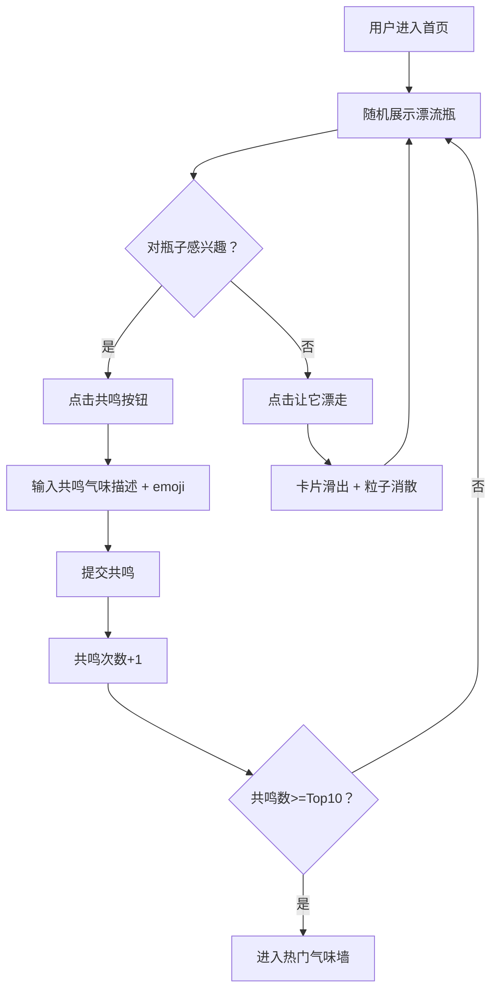

## 1. 产品概述

「气味漂流瓶」是一个匿名气味记忆分享平台，用户可以记录身边的气味并配上文字描述和心情emoji，气味日志会随机漂流到其他用户首页，其他用户可以拾取共鸣或让瓶子漂走。通过气味这个独特的感官维度，连接陌生人之间温暖而微妙的情感共鸣。

- 目标用户：喜欢记录生活细节、热爱文字与感官体验的年轻人
- 核心价值：以气味为媒介，创造一种轻盈而诗意的陌生人社交方式

## 2. 核心功能

### 2.1 用户角色

| 角色 | 注册方式 | 核心权限 |
|------|----------|----------|
| 匿名用户 | 自动分配匿名ID | 发布气味瓶、漂流浏览、拾取共鸣 |
| 注册用户 | 昵称注册 | 匿名用户所有权限 + 个人主页、历史统计 |

### 2.2 功能模块

1. **首页**：随机漂流气味瓶展示区 + 热门气味墙（Top 10 金色光晕）
2. **发布页**：创建气味漂流瓶（文字描述 + 心情emoji选择）
3. **个人主页**：我发布的瓶子列表 + 我共鸣过的瓶子列表 + 统计面板（饼图）

### 2.3 页面详情

| 页面名称 | 模块名称 | 功能描述 |
|----------|----------|----------|
| 首页 | 漂流瓶展示区 | 随机展示3-5个气味瓶，每次刷新随机轮换，卡片从底部飘入动画 |
| 首页 | 热门气味墙 | 按共鸣次数降序排列，前10名金色光晕边框，点击可查看详情 |
| 首页 | 发布入口 | 悬浮按钮，点击打开发布弹窗 |
| 发布弹窗 | 气味描述输入 | 文字输入框（描述气味）+ emoji选择器（心情标记） |
| 气味瓶卡片 | 瓶子信息展示 | emoji图标、气味描述文字、共鸣次数、发布时间 |
| 气味瓶卡片 | 拾取/共鸣操作 | 「共鸣」按钮（波浪动画）点击后弹出共鸣输入框，「让瓶子漂走」按钮（卡片向右滑出+粒子消散） |
| 共鸣弹窗 | 共鸣输入 | 输入相似的气味描述 + 选择对应emoji，提交后共鸣次数+1 |
| 个人主页 | 发布列表 | 按时间倒序展示用户发布的所有气味瓶 |
| 个人主页 | 共鸣列表 | 展示用户共鸣过的所有气味瓶 |
| 个人主页 | 统计面板 | 总发布数、总共鸣数、最常使用气味类型饼图（Chart.js） |

## 3. 核心流程

**发布气味瓶流程**：用户点击发布按钮 → 输入气味描述和选择emoji → 提交 → 瓶子进入漂流池 → 其他用户可在首页随机刷到

**拾取共鸣流程**：用户在首页看到漂流瓶 → 点击「共鸣」→ 输入相似气味描述和emoji → 提交 → 共鸣次数+1 → 瓶子可能进入热门墙

**让瓶子漂走流程**：用户看到不感兴趣的瓶子 → 点击「让它漂走」→ 卡片向右滑出 + 粒子消散动画 → 换一个新瓶子

## 4. 用户界面设计

### 4.1 设计风格

- **主色调**：米白(#FFF8F0)到淡黄(#FFF3E0)渐变背景，温暖怀旧风
- **强调色**：琥珀金(#D4A574)用于热门标记，暖棕(#8D6E63)用于文字
- **卡片风格**：半透明毛玻璃圆角方块（backdrop-filter: blur），柔和阴影，微微泛黄光晕
- **字体**：标题用衬线体（Noto Serif SC），正文用无衬线（Noto Sans SC）
- **布局**：卡片式居中布局，顶部导航栏
- **动画**：卡片悬停上浮+阴影加深，共鸣按钮小波浪动画，拾取时底部飘入，漂走时右滑+粒子消散

### 4.2 页面设计概览

| 页面名称 | 模块名称 | UI元素 |
|----------|----------|--------|
| 首页 | 漂流瓶展示区 | 毛玻璃卡片网格，2列（桌面）/ 1列（移动），卡片从底部fade+slideUp入场 |
| 首页 | 热门气味墙 | 水平滚动卡片列表，Top10金色光晕边框（box-shadow: gold glow），排名徽章 |
| 首页 | 发布按钮 | 右下角悬浮圆形按钮，琥珀金色，hover放大+光晕 |
| 发布弹窗 | 表单 | 居中模态框，毛玻璃背景，emoji选择网格，文字输入区，提交按钮 |
| 气味瓶卡片 | 整体 | 圆角20px，backdrop-filter:blur(12px)，border:1px rgba(255,255,255,0.3)，hover:translateY(-8px) + shadow加深 |
| 共鸣弹窗 | 表单 | 底部滑入弹窗，与发布弹窗类似但标题为"写下你的共鸣气味" |
| 个人主页 | 统计面板 | 左侧固定面板（桌面），三个数字统计+饼图，饼图用Chart.js渲染 |
| 个人主页 | 列表区 | 右侧滚动列表（桌面），移动端上下排列 |

### 4.3 响应式适配

- **桌面端**（>=1024px）：首页双列卡片，个人主页左右分栏，热门墙水平滚动
- **平板端**（768-1023px）：首页单列卡片，个人主页上下排列
- **移动端**（<768px）：全屏单列，卡片全宽，热门墙垂直滚动，底部导航栏替代顶部导航

### 4.4 动画性能要求

- 所有动画使用CSS transform和opacity（GPU加速）
- 粒子消散效果使用Canvas + requestAnimationFrame
- 目标帧率：60fps
- 使用will-change提示浏览器优化
