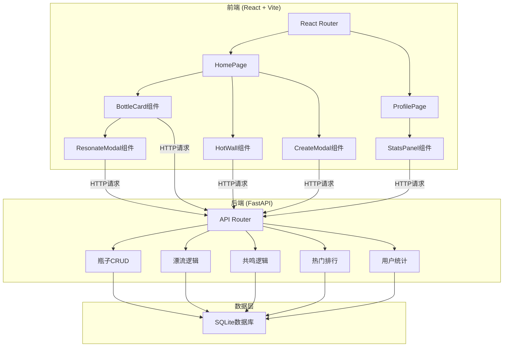
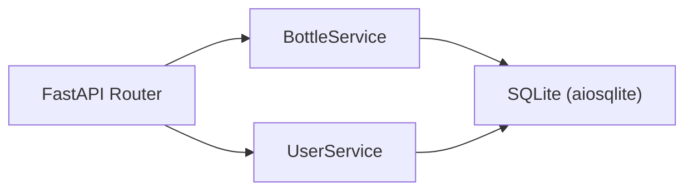
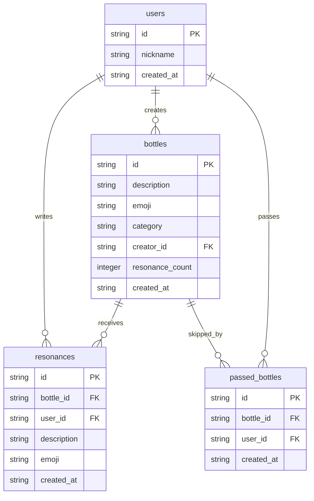

## 1. 架构设计



## 2. 技术说明

- **前端**：React@18 + TypeScript + Vite + TailwindCSS@3 + Zustand（状态管理）+ Chart.js（饼图）+ Framer Motion（动画）
- **初始化工具**：vite-init（react-ts模板）
- **后端**：FastAPI + Uvicorn + SQLite（aiosqlite异步驱动）
- **数据库**：SQLite（轻量级，无需额外安装，文件存储）
- **跨域处理**：FastAPI CORS中间件，允许前端localhost:5173访问

## 3. 路由定义

| 路由 | 用途 |
|------|------|
| `/` | 首页，展示随机漂流气味瓶和热门墙 |
| `/profile/:userId` | 个人主页，展示发布列表、共鸣列表和统计面板 |

## 4. API定义

### 4.1 气味瓶相关

```typescript
interface ScentBottle {
  id: string;
  description: string;
  emoji: string;
  category: string;
  created_at: string;
  resonance_count: number;
  creator_id: string;
}

interface Resonance {
  id: string;
  bottle_id: string;
  description: string;
  emoji: string;
  created_at: string;
  user_id: string;
}

interface UserStats {
  total_published: number;
  total_resonated: number;
  category_distribution: Record<string, number>;
}
```

### 4.2 API端点

| 方法 | 路径 | 请求体 | 响应 | 描述 |
|------|------|--------|------|------|
| GET | `/api/bottles/drift` | - | `ScentBottle[]` | 获取随机漂流瓶（5个） |
| GET | `/api/bottles/hot` | - | `ScentBottle[]` | 获取热门气味瓶（按共鸣数降序，最多20） |
| POST | `/api/bottles` | `{description, emoji, category, creator_id}` | `ScentBottle` | 创建气味瓶 |
| GET | `/api/bottles/{id}` | - | `ScentBottle` | 获取瓶子详情 |
| POST | `/api/bottles/{id}/resonate` | `{description, emoji, user_id}` | `Resonance` | 对瓶子共鸣 |
| GET | `/api/bottles/{id}/resonances` | - | `Resonance[]` | 获取瓶子的共鸣列表 |
| POST | `/api/bottles/{id}/pass` | `{user_id}` | `{message: string}` | 让瓶子漂走 |
| GET | `/api/users/{id}/published` | - | `ScentBottle[]` | 获取用户发布的瓶子 |
| GET | `/api/users/{id}/resonated` | - | `ScentBottle[]` | 获取用户共鸣过的瓶子 |
| GET | `/api/users/{id}/stats` | - | `UserStats` | 获取用户统计 |
| POST | `/api/users` | `{nickname}` | `{id, nickname}` | 创建/获取用户 |

## 5. 服务器架构图



## 6. 数据模型

### 6.1 数据模型定义



### 6.2 数据定义语言

```sql
CREATE TABLE IF NOT EXISTS users (
    id TEXT PRIMARY KEY,
    nickname TEXT NOT NULL,
    created_at TEXT NOT NULL DEFAULT (datetime('now'))
);

CREATE TABLE IF NOT EXISTS bottles (
    id TEXT PRIMARY KEY,
    description TEXT NOT NULL,
    emoji TEXT NOT NULL,
    category TEXT NOT NULL,
    creator_id TEXT NOT NULL REFERENCES users(id),
    resonance_count INTEGER NOT NULL DEFAULT 0,
    created_at TEXT NOT NULL DEFAULT (datetime('now'))
);

CREATE TABLE IF NOT EXISTS resonances (
    id TEXT PRIMARY KEY,
    bottle_id TEXT NOT NULL REFERENCES bottles(id),
    user_id TEXT NOT NULL REFERENCES users(id),
    description TEXT NOT NULL,
    emoji TEXT NOT NULL,
    created_at TEXT NOT NULL DEFAULT (datetime('now'))
);

CREATE TABLE IF NOT EXISTS passed_bottles (
    id TEXT PRIMARY KEY,
    bottle_id TEXT NOT NULL REFERENCES bottles(id),
    user_id TEXT NOT NULL REFERENCES users(id),
    created_at TEXT NOT NULL DEFAULT (datetime('now'))
);

CREATE INDEX IF NOT EXISTS idx_bottles_creator ON bottles(creator_id);
CREATE INDEX IF NOT EXISTS idx_bottles_resonance ON bottles(resonance_count DESC);
CREATE INDEX IF NOT EXISTS idx_resonances_bottle ON resonances(bottle_id);
CREATE INDEX IF NOT EXISTS idx_resonances_user ON resonances(user_id);
CREATE INDEX IF NOT EXISTS idx_passed_bottle_user ON passed_bottles(bottle_id, user_id);
```
