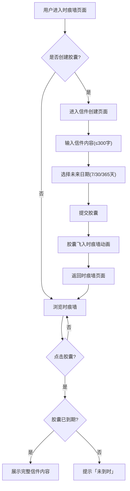

## 1. 产品概述

「时痕胶囊」是一个匿名时间胶囊分享平台，用户可以撰写给未来自己的信件并封存为「胶囊」，在设定的未来日期到期后方可开启阅读。胶囊会被随机嵌入一面由无数发光胶囊组成的动态「时痕墙」，营造出时空交错的沉浸式体验。

- 核心目标：让用户与未来的自己建立情感连接，同时通过时痕墙的视觉奇观带来仪式感和惊喜感
- 目标用户：有情感表达需求的年轻用户，喜欢沉浸式交互体验的创意人群

## 2. 核心功能

### 2.1 用户角色

| 角色 | 注册方式 | 核心权限 |
|------|----------|----------|
| 匿名访客 | 无需注册 | 创建胶囊、浏览时痕墙、查看自己的胶囊 |

### 2.2 功能模块

1. **时痕墙页面**：Canvas绘制的动态发光胶囊墙面，胶囊自转和漂浮动画，悬停放大+日期标签，点击弹出毛玻璃卡片
2. **信件创建页面**：输入信件内容（限300字）、选择未来日期（7天/30天/365天）、提交后胶囊飞入墙的动画反馈
3. **我的胶囊页面**：网格布局展示所有胶囊卡片，已到期和未到期不同边框颜色，支持按到期状态筛选和排序

### 2.3 页面详情

| 页面名称 | 模块名称 | 功能描述 |
|----------|----------|----------|
| 时痕墙页面 | 时痕墙Canvas | 渲染上千个发光胶囊，每个独立动画（自转+漂浮+脉动光晕），颜色按时长渐变（7天暖黄、30天青绿、365天深蓝），60fps |
| 时痕墙页面 | 胶囊悬停交互 | 鼠标悬停胶囊微微放大，显示日期标签 |
| 时痕墙页面 | 胶囊点击交互 | 点击弹出半透明毛玻璃卡片，已到期展示完整信件，未到期提示「未到时」 |
| 时痕墙页面 | 底部导航栏 | 切换「时痕墙」和「我的胶囊」页面 |
| 信件创建页面 | 信件输入表单 | 文本输入区（300字限制+字数计数），日期选择器（7天/30天/365天三个预设），提交按钮 |
| 信件创建页面 | 胶囊飞入动画 | 提交成功后，胶囊从表单位置飞入时痕墙的动画反馈 |
| 我的胶囊页面 | 胶囊卡片网格 | 所有胶囊以卡片网格展示，已到期卡片绿色边框，未到期卡片灰色边框 |
| 我的胶囊页面 | 筛选排序 | 按到期状态筛选（全部/已到期/未到期），按创建时间或到期时间排序 |

## 3. 核心流程

用户打开应用后进入时痕墙页面，看到由无数发光胶囊组成的动态墙面。用户点击「创建胶囊」按钮进入信件创建页面，输入内容并选择未来日期后提交，提交后胶囊飞入时痕墙。用户可通过底部导航切换到「我的胶囊」页面查看所有已创建的胶囊。在时痕墙上点击任意胶囊，如果已到期则展示完整信件内容，否则提示「未到时」。

## 4. 用户界面设计

### 4.1 设计风格

- 主色调：深空黑(#0a0a1a)背景，配冷色调渐变
- 胶囊颜色：7天暖黄(#f5c842)、30天青绿(#2dd4a8)、365天深蓝(#4a7cf7)
- 按钮风格：圆角胶囊形按钮，微弱发光效果
- 字体：标题使用 Noto Serif SC（衬线体），正文使用 Noto Sans SC（无衬线体）
- 布局风格：全屏沉浸式时痕墙，底部浮动导航栏，创建页面从底部滑入
- 动效风格：缓慢漂浮、柔和脉动、流畅过渡，营造时空感

### 4.2 页面设计概览

| 页面名称 | 模块名称 | UI要素 |
|----------|----------|--------|
| 时痕墙页面 | 时痕墙Canvas | 全屏深色背景Canvas，发光胶囊均匀分布，微粒子背景，底部浮动创建按钮（胶囊形状+发光） |
| 时痕墙页面 | 悬停效果 | 胶囊放大1.3倍，显示白色日期标签，光晕增强 |
| 时痕墙页面 | 点击弹窗 | 半透明毛玻璃卡片(backdrop-blur)，到期显示信件内容，未到期显示锁图标+「未到时」提示 |
| 时痕墙页面 | 底部导航 | 固定底部，两个标签「时痕墙」和「我的胶囊」，图标+文字，选中态高亮 |
| 信件创建页面 | 表单区 | 居中卡片式布局，上方标题「写给未来的自己」，文本域带字数计数，三个预设日期按钮组，发光提交按钮 |
| 我的胶囊页面 | 胶囊网格 | 响应式网格(2-4列)，卡片含颜色条、日期、状态标签，已到期绿色边框，未到期灰色虚线边框 |
| 我的胶囊页面 | 筛选排序栏 | 顶部筛选按钮组(全部/已到期/未到期)+排序下拉(创建时间/到期时间) |

### 4.3 响应式设计

- 桌面端(≥1024px)：时痕墙胶囊密度高(60-80个)，网格4列
- 平板端(768-1023px)：时痕墙胶囊密度中(40-60个)，网格3列
- 移动端(<768px)：时痕墙胶囊密度低(20-30个)，网格2列，触摸优化

### 4.4 动效规格

- 胶囊自转：缓慢匀速旋转，周期8-12秒随机
- 胶囊漂浮：上下缓慢移动，幅度3-5px，周期4-6秒
- 脉动光晕：透明度在0.3-0.8间呼吸式渐变，周期2-3秒
- 飞入动画：胶囊从创建表单位置沿弧线飞入时痕墙，持续1.2秒，easeOut曲线
- 毛玻璃弹窗：从点击位置缩放弹入，持续0.3秒
