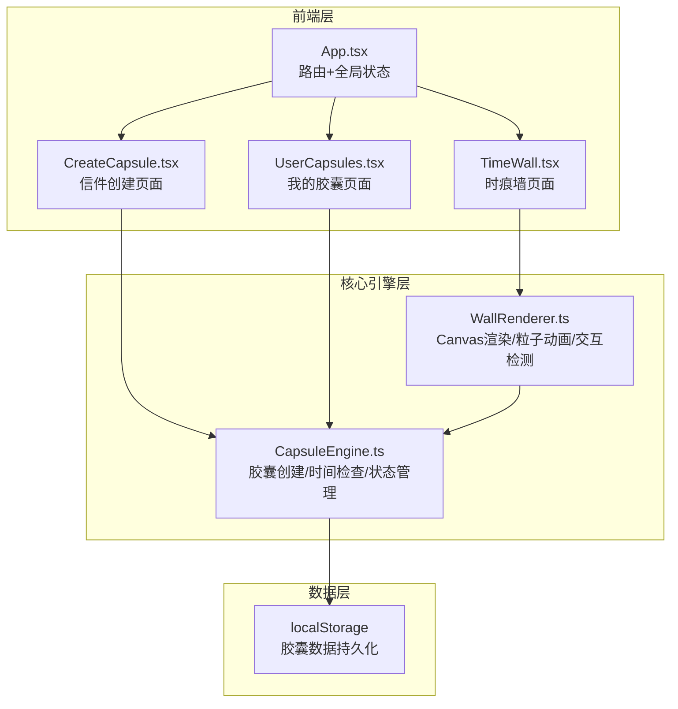
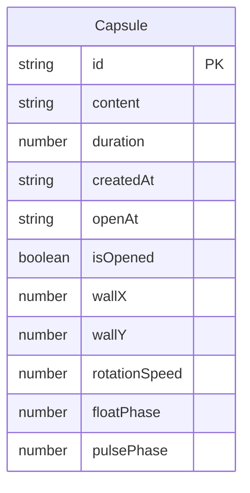

## 1. 架构设计



## 2. 技术说明

- 前端框架：React@18 + TypeScript
- 样式方案：TailwindCSS@3 + CSS Modules（Canvas动画部分纯CSS/JS）
- 构建工具：Vite
- 状态管理：Zustand（胶囊数据全局状态）
- 路由：React Router DOM v6
- 数据持久化：localStorage（纯前端，无需后端）
- Canvas动画：原生Canvas API + requestAnimationFrame

## 3. 路由定义

| 路由 | 用途 |
|------|------|
| / | 时痕墙首页，展示动态胶囊墙面 |
| /create | 信件创建页面，输入内容并选择日期 |
| /mine | 我的胶囊页面，展示所有用户胶囊 |

## 4. 数据模型

### 4.1 数据模型定义



### 4.2 数据定义

```typescript
interface Capsule {
  id: string;
  content: string;
  duration: 7 | 30 | 365;
  createdAt: string;
  openAt: string;
  isOpened: boolean;
  wallX: number;
  wallY: number;
  rotationSpeed: number;
  floatPhase: number;
  pulsePhase: number;
}
```

## 5. 核心模块设计

### 5.1 CapsuleEngine.ts

负责胶囊的创建、时间检查和状态管理：
- `createCapsule(content, duration)`：创建新胶囊，生成随机墙面坐标和动画参数，持久化到localStorage
- `checkExpired(capsuleId)`：检查胶囊是否到期
- `getAllCapsules()`：获取所有胶囊
- `getCapsuleById(id)`：获取单个胶囊
- `openCapsule(id)`：标记胶囊为已开启
- `filterCapsules(status)`：按到期状态筛选
- `sortCapsules(field, order)`：按字段排序

### 5.2 WallRenderer.ts

负责Canvas渲染时痕墙，含粒子动画和交互检测：
- `init(canvas, capsules)`：初始化Canvas和胶囊数据
- `render()`：60fps渲染循环，绘制背景粒子+胶囊+光晕
- `drawCapsule(capsule, time)`：绘制单个胶囊（自转+漂浮+脉动光晕）
- `drawParticles(time)`：绘制背景微粒子
- `hitTest(x, y)`：检测鼠标/触摸位置是否命中胶囊
- `handleResize()`：响应窗口大小变化，重新计算胶囊密度
- `addCapsuleWithAnimation(capsule, fromX, fromY)`：飞入动画
- `destroy()`：清理动画帧和事件监听

### 5.3 颜色映射

| 时长 | 主色 | 渐变色 | 光晕色 |
|------|------|--------|--------|
| 7天 | #f5c842 | #f5c842→#ff9a3c | rgba(245,200,66,0.3) |
| 30天 | #2dd4a8 | #2dd4a8→#06b6d4 | rgba(45,212,168,0.3) |
| 365天 | #4a7cf7 | #4a7cf7→#8b5cf6 | rgba(74,124,247,0.3) |

## 6. 性能策略

- Canvas离屏渲染：背景粒子层缓存到离屏Canvas，减少每帧重绘
- 胶囊数量控制：桌面端80个，平板60个，移动端30个
- requestAnimationFrame驱动渲染循环
- 不可见时暂停渲染（Page Visibility API）
- 事件防抖：悬停和点击检测使用节流
- 胶囊数据冷热分离：视口外的胶囊简化渲染
