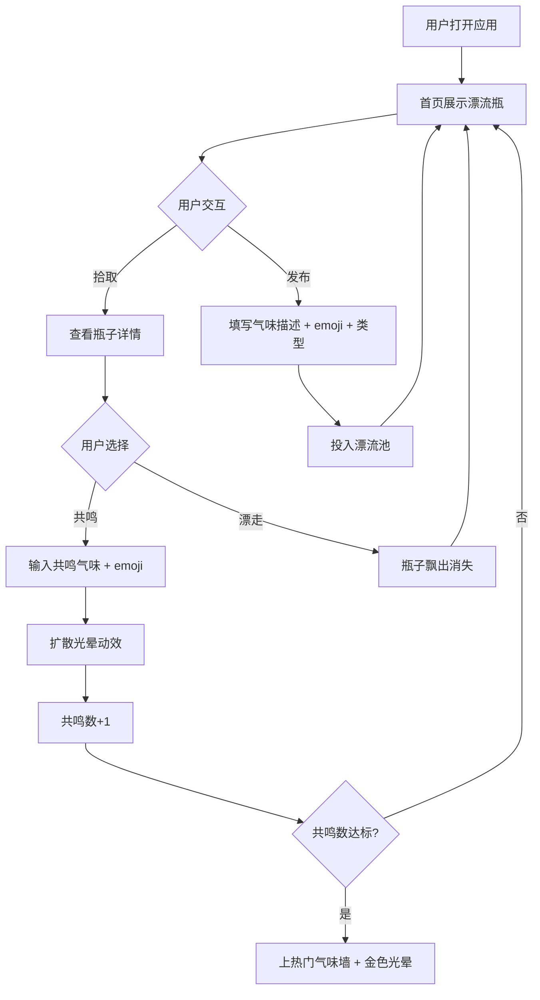

## 1. 产品概述

「气味漂流瓶」是一个匿名气味社交 Web 应用，用户记录身边的气味并让它在网络中随机漂流，通过气味共鸣建立陌生人之间的温暖连接。
- 核心价值：用气味这种最唤起记忆的感官体验，创造一种低压力、治愈系的匿名社交方式
- 目标用户：喜欢记录生活细节、追求慢社交体验的年轻人和文艺爱好者

## 2. 核心功能

### 2.1 用户角色

| 角色 | 注册方式 | 核心权限 |
|------|----------|----------|
| 匿名用户 | 无需注册，自动分配匿名ID | 发布气味瓶、拾取漂流瓶、共鸣回应、查看个人主页 |
| 热门气味 | 系统自动 | 共鸣数高的气味瓶上热门墙 |

### 2.2 功能模块

1. **首页（漂流广场）**：展示随机漂来的气味瓶子，支持拾取、共鸣、放漂操作
2. **发布页**：记录新气味，填写文字描述、心情 emoji、气味类型标签
3. **热门气味墙**：展示共鸣数最高的气味瓶子，带金色光晕标识
4. **个人主页**：展示发布和共鸣过的所有气味，以及简单统计

### 2.3 页面详情

| 页面名称 | 模块名称 | 功能描述 |
|----------|----------|----------|
| 首页 | 漂流瓶列表 | 展示随机漂来的气味瓶，从底部飘入动画进入 |
| 首页 | 拾取交互 | 点击瓶子查看详情，可选择共鸣或让瓶子漂走 |
| 首页 | 共鸣回应 | 输入共鸣气味文字描述 + emoji，发送后显示扩散光晕动效 |
| 首页 | 热门入口 | 导航至热门气味墙 |
| 发布页 | 气味描述输入 | 文字描述 + 心情 emoji 选择 + 气味类型标签 |
| 发布页 | 发布确认 | 确认后瓶子进入漂流池 |
| 热门墙 | 热门排行 | 按共鸣数排序展示热门气味瓶，金色光晕边框 |
| 个人主页 | 我的气味 | 列表展示自己发布的和共鸣过的所有气味 |
| 个人主页 | 统计面板 | 总发布数、总共鸣数、最常使用的气味类型 |

## 3. 核心流程

用户打开应用后，首页随机展示漂来的气味瓶（从底部飘入），用户可以：
- 点击瓶子查看详情（文字描述、emoji、共鸣数）
- 选择「共鸣」，输入类似的气味描述 + emoji，发送后瓶子获得共鸣计数，共鸣动效（扩散光晕）
- 选择「让它漂走」，瓶子飘出消失，下一个瓶子飘入
- 发布自己的气味瓶，填写描述、emoji、类型标签后投入漂流池
- 共鸣数高的瓶子自动上热门气味墙，带金色光晕边框

## 4. 用户界面设计

### 4.1 设计风格

- **主色调**：米白 (#FAF8F0) 到浅草绿 (#E8F5E0) 渐变背景
- **辅助色**：温暖棕色 (#8B7355)、柔绿 (#7BA98F)、金色光晕 (#D4A843)
- **卡片风格**：半透明磨砂玻璃圆角方块，backdrop-filter blur，柔和阴影和微微光晕
- **字体**：正文使用 Noto Sans SC，标题使用 ZCOOL XiaoWei（文艺中文字体）
- **布局**：卡片式居中布局，移动端单列，桌面端双列或三列瀑布流
- **Emoji**：原生 emoji，大号显示作为气味心情标识
- **图标**：lucide-react 图标库

### 4.2 页面设计概述

| 页面名称 | 模块名称 | UI 元素 |
|----------|----------|---------|
| 首页 | 漂流瓶列表 | 卡片从底部飘入动画（translateY + opacity），磨砂玻璃卡片，hover上浮+阴影增强 |
| 首页 | 拾取交互 | 点击展开详情面板，共鸣按钮绿色发光，漂走按钮灰调 |
| 首页 | 共鸣回应 | 底部弹出输入框，发送后卡片周围显示扩散光晕（scale + opacity动画） |
| 发布页 | 气味描述输入 | 大文本域 + emoji选择器 + 类型标签选择 |
| 热门墙 | 热门排行 | 卡片带金色光晕边框（box-shadow金色），排序展示 |
| 个人主页 | 我的气味 | 双栏列表（发布/共鸣），磨砂玻璃卡片 |
| 个人主页 | 统计面板 | 数字统计 + 简易图标，磨砂背景面板 |

### 4.3 响应式设计

- 桌面优先设计，移动端自适应
- 桌面端（≥1024px）：三列卡片网格
- 平板端（768-1023px）：双列卡片网格
- 移动端（<768px）：单列卡片，底部固定导航
- 触摸优化：按钮最小 44px 触摸目标，滑动操作支持

### 4.4 动效规范

- 拾取动效：卡片从页面底部飘入（transform: translateY(100vh) → translateY(0)，600ms ease-out）
- 共鸣动效：微小扩散光晕（pseudo-element scale 0→1.5 + opacity 1→0，800ms）
- 卡片悬停：上浮 8px + 阴影增强（transition 300ms ease）
- 热门光晕：金色 box-shadow 脉冲动画（animation pulse 2s infinite）
- 所有动画保持 60fps，使用 transform 和 opacity 硬件加速
