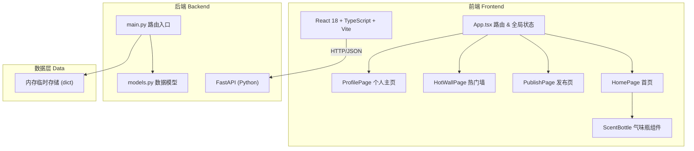
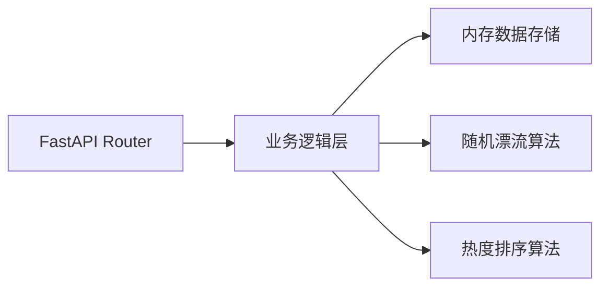
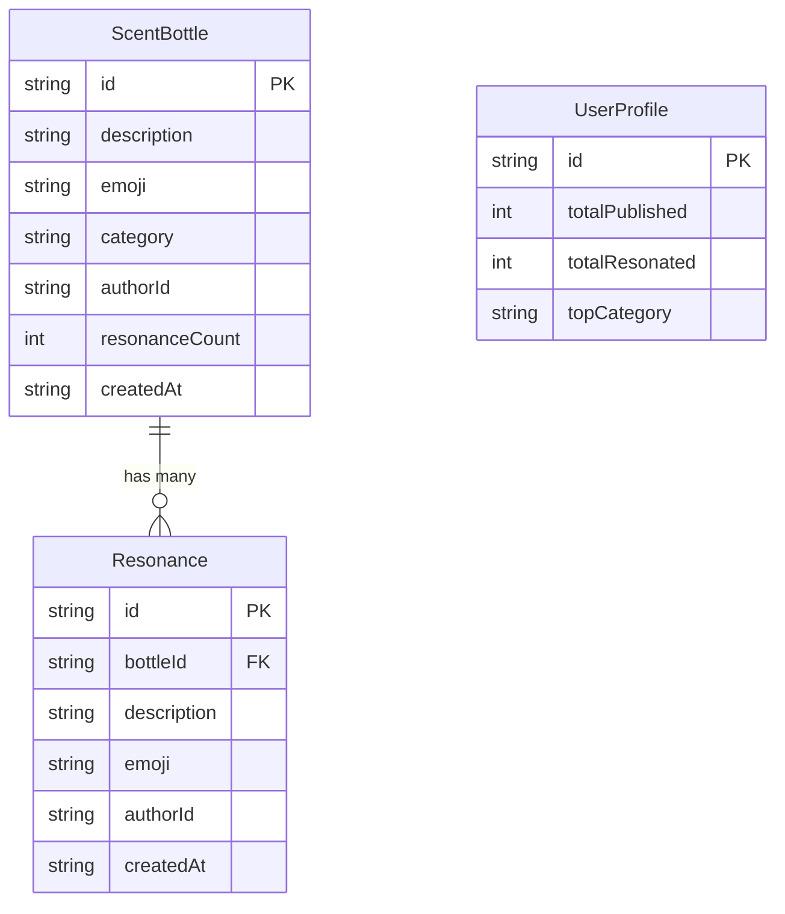

## 1. 架构设计



## 2. 技术说明

- **前端**：React@18 + TypeScript + Vite + TailwindCSS@3 + Zustand + react-router-dom
- **初始化工具**：vite-init (react-ts 模板)
- **后端**：FastAPI@0.104+ (Python 3.10+)
- **数据库**：内存临时存储（Python dict），后续可迁移至 SQLite/PostgreSQL
- **动画**：CSS transitions + keyframes + Framer Motion

## 3. 路由定义

| 路由 | 用途 |
|------|------|
| `/` | 首页，展示漂流的气味瓶子 |
| `/publish` | 发布新气味瓶 |
| `/hot` | 热门气味墙 |
| `/profile` | 个人主页（发布和共鸣记录、统计） |

## 4. API 定义

### 4.1 TypeScript 类型定义

```typescript
interface ScentBottle {
  id: string
  description: string
  emoji: string
  category: string
  authorId: string
  resonances: Resonance[]
  resonanceCount: number
  createdAt: string
}

interface Resonance {
  id: string
  bottleId: string
  description: string
  emoji: string
  authorId: string
  createdAt: string
}

interface UserProfile {
  id: string
  publishedBottles: ScentBottle[]
  resonatedBottles: ScentBottle[]
  totalPublished: number
  totalResonated: number
  topCategory: string
}
```

### 4.2 API 端点

| 方法 | 路径 | 请求体 | 响应 | 说明 |
|------|------|--------|------|------|
| GET | `/api/bottles/drift` | - | `ScentBottle[]` | 获取随机漂流瓶（最多5个） |
| GET | `/api/bottles/hot` | - | `ScentBottle[]` | 获取热门瓶（按共鸣数排序） |
| POST | `/api/bottles` | `{description, emoji, category}` | `ScentBottle` | 发布新气味瓶 |
| GET | `/api/bottles/{id}` | - | `ScentBottle` | 获取瓶子详情 |
| POST | `/api/bottles/{id}/resonate` | `{description, emoji}` | `Resonance` | 共鸣回应 |
| POST | `/api/bottles/{id}/pass` | - | `{message: string}` | 让瓶子漂走 |
| GET | `/api/profile/{userId}` | - | `UserProfile` | 获取用户个人主页 |

## 5. 服务端架构图



## 6. 数据模型

### 6.1 数据模型定义



### 6.2 数据初始化

应用启动时预置若干示例气味瓶数据，包含不同类型（自然、食物、生活、书卷等），确保首页有内容展示。
