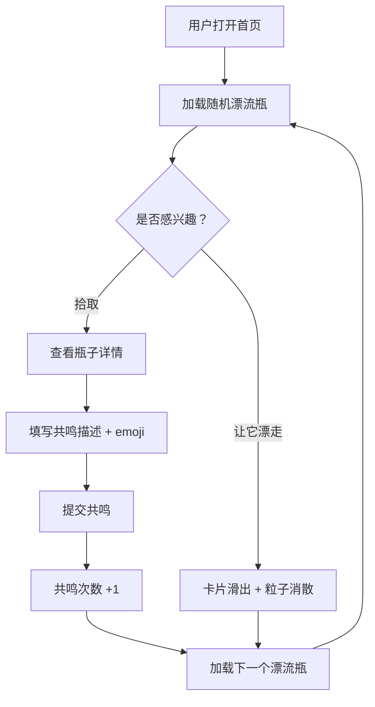

## 1. 产品概述

「气味漂流瓶」是一个匿名气味记录与社交共鸣平台。用户可以记录身边的气味（如雨后泥土、烤面包香、老书页味），配以文字描述和心情 emoji，这些气味日志会随机漂流到其他用户首页。其他用户可以拾取瓶子、回应共鸣气味或让瓶子漂走。热度高的气味瓶会上热门气味墙，形成"气味社交"的温暖体验。

- 目标用户：热爱生活细节、喜欢记录感官体验的年轻人和文艺群体
- 核心价值：通过气味这种最容易被忽视却又最能触发记忆的感官，建立陌生人之间的情感连接

## 2. 核心功能

### 2.1 用户角色

| 角色 | 注册方式 | 核心权限 |
|------|----------|----------|
| 匿名用户 | 无需注册，自动分配临时 ID | 发布气味瓶、拾取/共鸣/漂流瓶子、查看个人主页和热门墙 |

### 2.2 功能模块

1. **首页**：随机漂流瓶展示区 + 热门气味墙
2. **个人主页**：已发布瓶子列表 + 已共鸣瓶子列表 + 统计面板

### 2.3 页面详情

| 页面名称 | 模块名称 | 功能描述 |
|----------|----------|----------|
| 首页 | 随机漂流瓶区域 | 展示随机气味瓶卡片，支持拾取/共鸣/丢回操作，每次刷新出现不同瓶子 |
| 首页 | 热门气味墙 | 展示共鸣次数排名前 10 的气味瓶，带金色光晕边框，降序排列 |
| 首页 | 发布气味瓶 | 点击发布按钮弹出表单，填写气味描述、选择 emoji 和气味类型 |
| 个人主页 | 发布的瓶子 | 按时间倒序展示用户自己发布的所有气味瓶 |
| 个人主页 | 共鸣过的瓶子 | 展示用户曾共鸣过的所有气味瓶 |
| 个人主页 | 统计面板 | 总发布数、总共鸣数、最常使用的气味类型（饼图展示） |

## 3. 核心流程

**发布流程**：用户点击发布 → 填写气味描述 + 选择 emoji + 选择气味类型 → 提交后瓶子进入漂流池 → 随机展示给其他用户

**拾取/共鸣流程**：用户看到漂流瓶 → 点击拾取 → 查看详情 → 填写共鸣描述 + 选择 emoji → 提交后共鸣次数 +1 → 该瓶子不可再次共鸣

**丢回流程**：用户看到漂流瓶 → 点击"让它漂走" → 卡片向右滑出带粒子消散 → 换一个新瓶子

## 4. 界面设计

### 4.1 设计风格

- **主色调**：米白 (#FFF8F0) 到淡黄 (#FFF0D4) 渐变背景，温暖怀旧风
- **强调色**：柔和琥珀色 (#D4A574)，用于按钮和高亮
- **卡片样式**：半透明毛玻璃效果（backdrop-filter: blur），圆角 16px，柔和阴影 + 微微泛黄光晕
- **字体**：标题使用 "Noto Serif SC" 衬线字体（怀旧感），正文使用 "Noto Sans SC" 无衬线字体
- **布局**：卡片式布局，顶部导航栏，居中内容区域
- **Emoji 风格**：使用原生 emoji，放大展示作为卡片视觉焦点

### 4.2 页面设计概览

| 页面名称 | 模块名称 | UI 元素 |
|----------|----------|---------|
| 首页 | 随机漂流瓶区域 | 毛玻璃卡片、emoji 大号展示、气味描述文字、共鸣次数徽章、拾取/共鸣按钮（波浪动画）、丢回按钮 |
| 首页 | 热门气味墙 | 横向滚动或网格布局、前 10 名金色光晕边框、排名序号、共鸣火焰图标 |
| 首页 | 发布按钮 | 底部悬浮发布按钮（琥珀色）、点击弹出模态框表单 |
| 个人主页 | 瓶子列表 | 双栏瀑布流卡片（桌面）/ 单栏（移动端）、时间戳、emoji、描述 |
| 个人主页 | 统计面板 | 毛玻璃面板、数字统计卡片、Chart.js 饼图（气味类型分布） |

### 4.3 响应式适配

- 桌面端（≥1024px）：双栏布局，热门墙网格 5 列，卡片尺寸适中
- 平板端（768-1023px）：单栏布局，热门墙网格 3 列
- 移动端（<768px）：单栏紧凑布局，热门墙横向滚动，底部固定操作栏

### 4.4 动画效果

- **卡片入场**：从底部飘入（translateY + opacity 过渡），延迟错落效果
- **丢回漂流**：卡片向右滑出 + 粒子消散效果（CSS particle animation）
- **共鸣按钮**：小波浪动画（wave keyframes）
- **卡片悬停**：上浮 8px + 阴影加深 + 微微缩放
- **热门金色光晕**：box-shadow 金色脉冲动画
