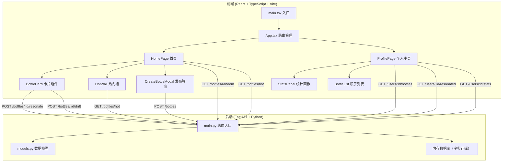
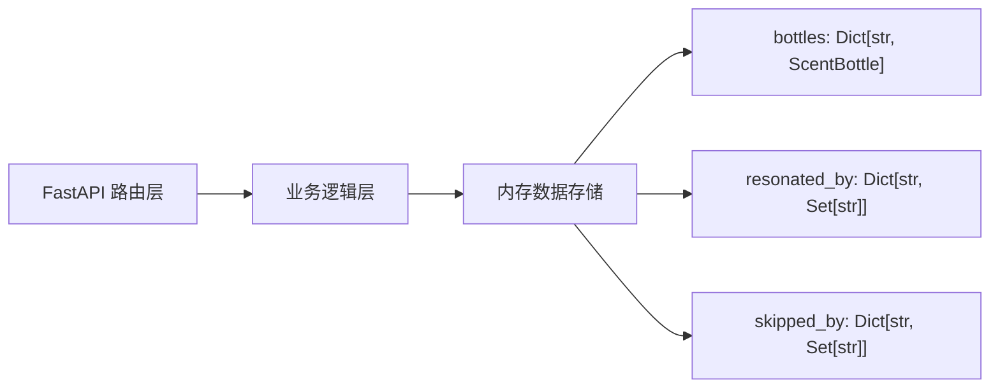
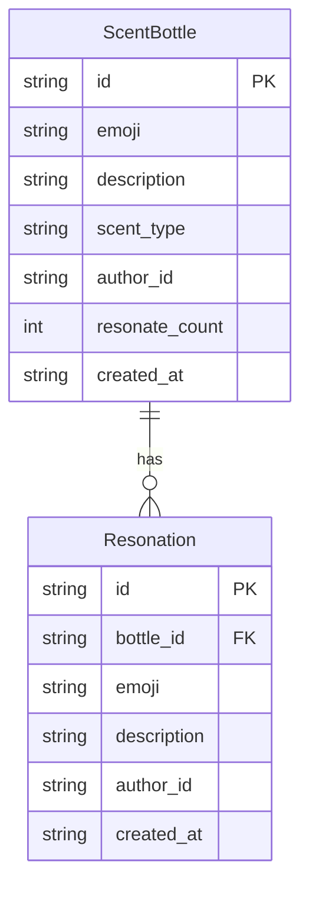

## 1. 架构设计



## 2. 技术说明

- **前端**：React 18 + TypeScript + Vite + TailwindCSS 3 + Zustand + Chart.js + react-chartjs-2 + framer-motion
- **初始化工具**：vite-init (react-ts 模板)
- **后端**：FastAPI + uvicorn + Pydantic
- **数据库**：内存字典存储（无需外部数据库，服务重启清空，适合演示）
- **跨域**：后端配置 CORS 允许前端 localhost 访问

## 3. 路由定义

| 路由 | 用途 |
|------|------|
| `/` | 首页，展示随机漂流瓶和热门墙 |
| `/profile` | 个人主页，展示发布和共鸣的瓶子及统计 |

## 4. API 定义

### 4.1 数据类型

```typescript
interface ScentBottle {
  id: string;
  emoji: string;
  description: string;
  scent_type: string;
  author_id: string;
  resonate_count: number;
  resonations: Resonation[];
  created_at: string;
}

interface Resonation {
  id: string;
  emoji: string;
  description: string;
  author_id: string;
  created_at: string;
}

interface UserStats {
  total_published: number;
  total_resonated: number;
  scent_type_distribution: Record<string, number>;
}
```

### 4.2 API 端点

| 方法 | 路径 | 请求体 | 响应 | 说明 |
|------|------|--------|------|------|
| GET | `/api/bottles/random` | - | `ScentBottle[]` | 获取随机漂流瓶（排除已共鸣的） |
| GET | `/api/bottles/hot` | - | `ScentBottle[]` | 获取热门瓶（按共鸣次数降序，前10金色标记） |
| POST | `/api/bottles` | `{emoji, description, scent_type, author_id}` | `ScentBottle` | 发布新气味瓶 |
| POST | `/api/bottles/{id}/resonate` | `{emoji, description, author_id}` | `ScentBottle` | 对瓶子共鸣 |
| POST | `/api/bottles/{id}/drift` | `{author_id}` | `{message: "ok"}` | 丢回瓶子（记录已跳过） |
| GET | `/api/users/{id}/bottles` | - | `ScentBottle[]` | 获取用户发布的瓶子 |
| GET | `/api/users/{id}/resonated` | - | `ScentBottle[]` | 获取用户共鸣过的瓶子 |
| GET | `/api/users/{id}/stats` | - | `UserStats` | 获取用户统计数据 |

## 5. 服务器架构



## 6. 数据模型

### 6.1 数据模型定义



### 6.2 气味类型枚举

```
花香、果香、草木、美食、雨后、烟熏、木质、书卷、泥土、海洋、其他
```

### 6.3 初始数据

后端启动时预置 15-20 个示例气味瓶，包含各种气味类型，确保首页展示内容丰富。
