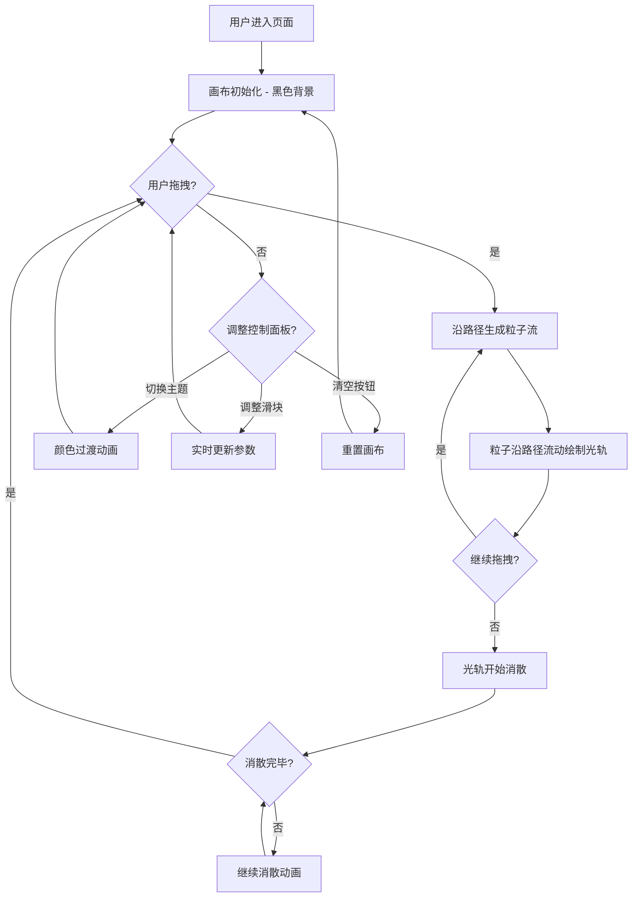

## 1. 产品概述

「幻光轨迹」是一款赛博朋克风格的交互式粒子路径绘画工具。用户通过鼠标或触屏拖拽在画布上绘制路径，五彩粒子沿路径流动并留下彩色光轨，松开后光轨逐渐消散。
- 面向创意设计爱好者、数字艺术创作者，提供沉浸式的光绘体验
- 核心价值：将简单的拖拽手势转化为绚丽的粒子光轨艺术，兼具创作工具与视觉娱乐属性

## 2. 核心功能

### 2.1 功能模块

1. **主画布页面**：粒子绘画画布、控制面板、标题栏、FPS 显示

### 2.2 页面详情

| 页面名称 | 模块名称 | 功能描述 |
|---------|---------|---------|
| 主画布页面 | 标题栏 | 显示"幻光轨迹"标题和操作提示文字 |
| 主画布页面 | 粒子画布 | Canvas 画布，支持鼠标/触屏拖拽生成粒子路径，粒子沿路径流动并产生光轨，松开后渐消 |
| 主画布页面 | 控制面板 | 毛玻璃效果面板，包含颜色主题选择（极光/火焰/深海/霓虹/暖阳）、粒子大小滑块、消散速度滑块、清空按钮 |
| 主画布页面 | FPS 显示 | 画布底部实时显示当前帧率 |

## 3. 核心流程

用户打开页面后，在黑色画布上按住鼠标拖拽，粒子系统沿鼠标轨迹生成彩色粒子流，粒子沿路径方向流动并留下发光光轨。用户可通过右侧控制面板切换颜色主题、调整粒子大小和消散速度。松开鼠标后，已生成的光轨按设定速度逐渐消散。点击清空按钮可一键重置画布。

## 4. 用户界面设计

### 4.1 设计风格

- **整体风格**：赛博朋克 — 深黑到暗紫渐变背景，发光粒子效果
- **主色调**：深黑 (#0a0a0f) 到暗紫 (#1a0a2e) 渐变
- **按钮风格**：圆角胶囊按钮，悬停时有光晕扩散动画，微发光边框
- **字体**：标题使用 Orbitron（科幻感），正文使用 Rajdhani
- **布局**：桌面端左侧大画布 + 右侧控制面板；移动端画布全屏 + 底部可展开控制面板
- **图标风格**：Lucide 图标库，线条风格配合赛博朋克调性

### 4.2 页面设计概述

| 页面名称 | 模块名称 | UI 元素 |
|---------|---------|---------|
| 主画布页面 | 标题栏 | Orbitron 字体标题，渐变色文字，半透明背景，操作提示文字 |
| 主画布页面 | 粒子画布 | 深色渐变背景，Canvas 全尺寸绘制区域，发光粒子（径向渐变圆点），半透明光轨线条 |
| 主画布页面 | 控制面板 | 毛玻璃背景（backdrop-filter: blur），弱紫色光晕边框，5个主题色球选择器，自定义滑块，清空按钮 |
| 主画布页面 | FPS 显示 | 右下角小字，半透明背景，Rajdhani 等宽字体 |

### 4.3 响应式适配

- **桌面端（>768px）**：画布占左侧约 80% 宽度，控制面板固定右侧约 20%
- **移动端（≤768px）**：画布全屏，控制面板变为底部可展开/收起的抽屉面板
- **触屏优化**：touch 事件支持，阻止默认滚动行为，触控点适当放大粒子

### 4.4 颜色主题预设

| 主题名称 | 色彩描述 | 主色值 |
|---------|---------|--------|
| 极光 | 绿色到紫色渐变，北极光风格 | #00ff88, #8844ff, #00ccff |
| 火焰 | 红橙到金色渐变 | #ff4400, #ff8800, #ffcc00 |
| 深海 | 蓝绿到青色渐变 | #0044ff, #00ccff, #00ffcc |
| 霓虹 | 粉红到青色赛博朋克霓虹 | #ff00ff, #00ffff, #ff0088 |
| 暖阳 | 橙到暖黄渐变 | #ff6600, #ffaa00, #ffdd44 |
