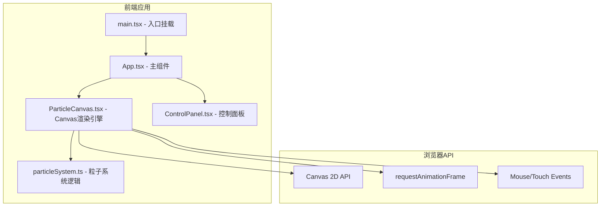
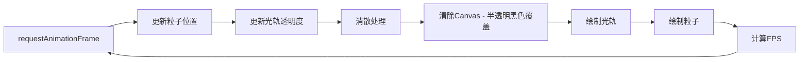

## 1. 架构设计



## 2. 技术说明

- **前端框架**：React 18 + TypeScript
- **构建工具**：Vite
- **样式方案**：Tailwind CSS 3 + CSS Modules（毛玻璃效果等特殊样式）
- **状态管理**：Zustand
- **图标库**：lucide-react
- **无后端**：纯前端应用，所有逻辑在浏览器端运行

## 3. 路由定义

单页应用，无路由切换：

| 路由 | 用途 |
|------|------|
| / | 主画布页面（唯一页面） |

## 4. 核心数据结构

### 4.1 粒子系统数据模型

```typescript
interface Particle {
  x: number;
  y: number;
  vx: number;
  vy: number;
  life: number;
  maxLife: number;
  size: number;
  color: string;
  alpha: number;
}

interface TrailPoint {
  x: number;
  y: number;
  alpha: number;
  color: string;
  size: number;
}

interface ThemeColors {
  name: string;
  colors: string[];
  glowColor: string;
}

interface ParticleSystemState {
  particles: Particle[];
  trails: TrailPoint[];
  isDrawing: boolean;
  currentTheme: string;
  particleSize: number;
  fadeSpeed: number;
  mouseX: number;
  mouseY: number;
  prevMouseX: number;
  prevMouseY: number;
}
```

### 4.2 Zustand Store 定义

```typescript
interface AppStore {
  currentTheme: string;
  particleSize: number;
  fadeSpeed: number;
  isPanelOpen: boolean;
  setTheme: (theme: string) => void;
  setParticleSize: (size: number) => void;
  setFadeSpeed: (speed: number) => void;
  togglePanel: () => void;
  clearCanvas: () => void;
}
```

## 5. 模块职责

| 模块 | 职责 |
|------|------|
| main.tsx | React 应用入口，挂载到 DOM |
| App.tsx | 主组件，管理布局（标题栏 + 画布 + 控制面板），提供全局状态 |
| ParticleCanvas.tsx | Canvas 渲染引擎，监听鼠标/触屏事件，驱动粒子系统更新与绘制，FPS 计算 |
| ControlPanel.tsx | 控制面板 UI，主题选择器、滑块、清空按钮，毛玻璃效果 |
| utils/particleSystem.ts | 粒子核心逻辑：粒子生成、路径插值、运动更新、消散算法、颜色主题管理 |

## 6. 渲染流程



## 7. 性能策略

- **半透明覆盖消散**：每帧用低透明度黑色矩形覆盖画布，实现光轨自然消散，无需逐帧重绘所有历史轨迹
- **粒子池**：限制最大粒子数（~2000），超出后回收最老粒子
- **路径插值**：鼠标移动距离过大时，在前后两点间插值生成中间粒子，保证连续性
- **requestAnimationFrame**：确保与屏幕刷新率同步，目标 60fps
