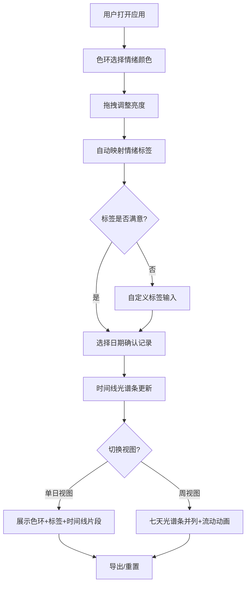

## 1. 产品概述
「情绪光谱」是一款交互式情绪追踪与可视化工具，让用户通过色环直观记录每日心情，以动态光谱形式呈现一周情绪变化趋势。
- 解决传统情绪记录方式抽象难量化的问题，将情绪映射为色彩，降低记录门槛
- 面向关注心理健康的普通用户，提供美学化的自我觉察能力

## 2. 核心功能

### 2.1 用户角色
| 角色 | 注册方式 | 核心权限 |
|------|----------|----------|
| 普通用户 | 无需注册 | 使用全部功能，数据本地存储 |

### 2.2 功能模块
1. **主页面**：色环选择器、情绪时间线、控制面板、视图切换

### 2.3 页面详情
| 页面名称 | 模块名称 | 功能描述 |
|----------|----------|----------|
| 主页面 | 色环选择器 | 点击色环选择颜色，拖拽调整亮度，自动映射情绪标签，支持自定义标签 |
| 主页面 | 情绪时间线 | 水平光谱条展示一周每天情绪，颜色按时间渐变流动，悬停显示快照 |
| 主页面 | 控制面板 | 日期选择器、情绪标签输入框、重置按钮、导出为图片按钮 |
| 主页面 | 视图切换 | 单日详细视图（色环+标签+时间线片段）与全景周视图（七天光谱条并列+流动动画） |

## 3. 核心流程

用户打开应用 → 在色环上点击/拖拽选择代表当前情绪的颜色 → 系统自动映射情绪标签（可自定义）→ 选择日期确认记录 → 时间线自动更新显示光谱条 → 可切换周视图查看全周趋势 → 可导出为图片或重置数据

## 4. 用户界面设计

### 4.1 设计风格
- 主色调：柔和梦幻风，浅灰到淡蓝渐变背景
- 辅助色：色环彩虹色谱作为功能色
- 按钮风格：圆角半透明毛玻璃按钮，悬停缩放+光晕扩散
- 字体：标题使用 Noto Serif SC 衬线体（优雅），正文使用 Noto Sans SC 无衬线体（清晰）
- 布局风格：卡片式布局，半透明毛玻璃效果
- 动画：色环点击脉冲环动画、拖拽色调提示圆点、模式切换卡片滑动缓动过渡、光谱条颜色流动动画

### 4.2 页面设计概览
| 页面名称 | 模块名称 | UI 元素 |
|----------|----------|---------|
| 主页面 | 色环选择器 | 圆形Canvas色环，中心脉冲动画，拖拽提示圆点，毛玻璃容器 |
| 主页面 | 情绪时间线 | 水平渐变光谱条，悬停tooltip显示快照，流动动画 |
| 主页面 | 控制面板 | 日期选择器input，标签输入框，重置/导出按钮，毛玻璃卡片 |
| 主页面 | 视图切换 | 顶部tab切换，滑动过渡动画 |

### 4.3 响应式设计
- 桌面端优先：色环居左，时间线和控制面板居右的双栏布局
- 移动端自适应：单栏纵向布局，色环缩小，光谱条全宽
- 触摸优化：色环支持触摸拖拽，按钮增大触摸区域
- 帧率目标：60fps，使用 requestAnimationFrame 和 Canvas 渲染

### 4.4 3D场景指引
- 不适用
