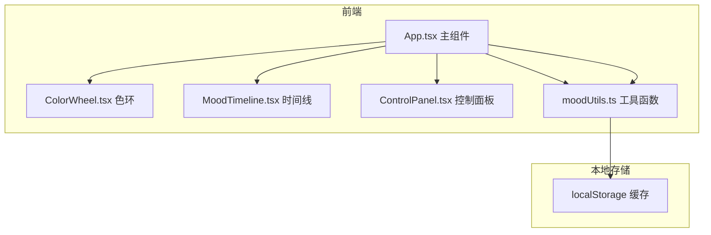
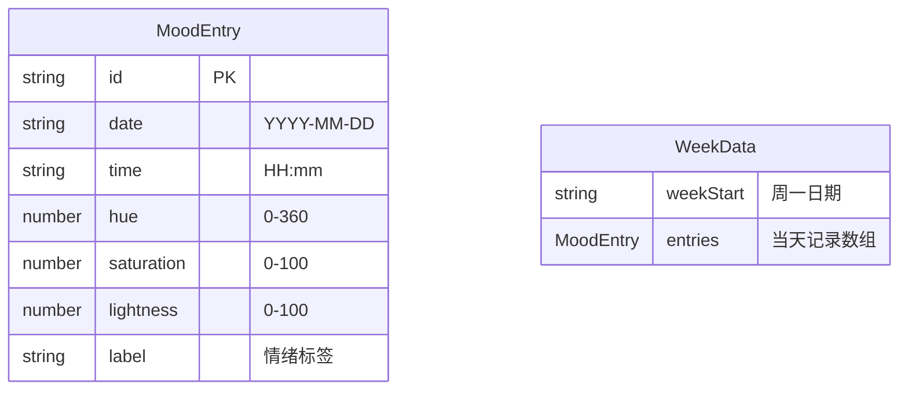

## 1. 架构设计

## 2. 技术说明
- 前端：React@18 + TypeScript + Vite + TailwindCSS
- 初始化工具：vite-init（react-ts 模板）
- 后端：无（纯前端应用）
- 数据库：无（使用 localStorage 本地缓存）

## 3. 路由定义
| 路由 | 用途 |
|------|------|
| / | 主页面（单页应用，无额外路由） |

## 4. API 定义
- 无后端 API，所有数据通过 localStorage 存储

## 5. 服务端架构图
- 不适用

## 6. 数据模型

### 6.1 数据模型定义

### 6.2 数据定义
- MoodEntry：单条情绪记录，包含日期、时间、HSL颜色值、情绪标签
- WeekData：一周数据，以周一为起始日，包含7天的 MoodEntry 数组
- 存储 key：`mood-spectrum-data`，值为 JSON 序列化的 MoodEntry[]
- HSL 到情绪标签映射：红色(0-30)=愤怒、橙色(30-60)=活力、黄色(60-90)=愉悦、黄绿(90-150)=平静、绿色(150-210)=安宁、蓝色(210-270)=忧郁、紫色(270-330)=灵感、品红(330-360)=热情
