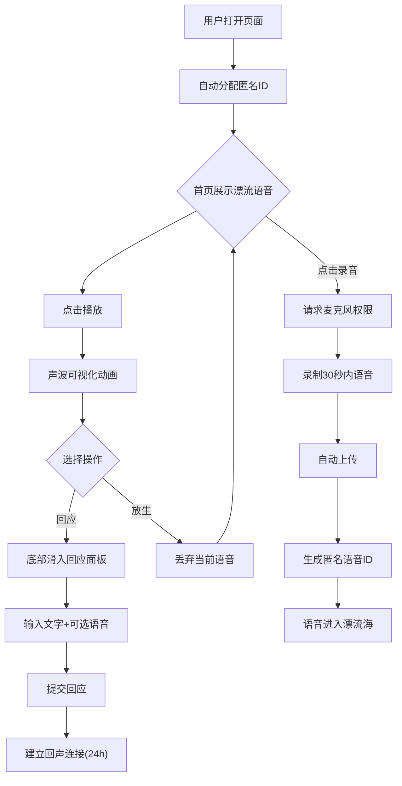

## 1. 产品概述

「回声驿站」是一个匿名语音漂流社交应用，用户录制短语音投放到"漂流海"，系统随机将语音分配给其他匿名用户，收到的人可以倾听并回应，双方由此建立一段仅持续24小时的"回声连接"。

- 目标用户：寻求匿名倾诉、情感连接、好奇陌生声音的年轻用户群体
- 核心价值：以声音为媒介的匿名社交体验，短暂而真实的连接

## 2. 核心功能

### 2.1 用户角色

| 角色 | 注册方式 | 核心权限 |
|------|----------|----------|
| 匿名用户 | 无需注册，自动分配匿名ID | 录音、收听、回应、查看连接 |

### 2.2 功能模块

1. **首页（漂流海）**：随机拾取一条漂流语音，播放、回应或放生
2. **录音功能**：30秒内语音录制，自动上传生成匿名语音ID
3. **回应功能**：收到语音后用文字+可选语音回应，建立回声连接
4. **回声连接列表**：查看发送和回应的语音记录，活跃连接倒计时

### 2.3 页面详情

| 页面名称 | 模块名称 | 功能描述 |
|----------|----------|----------|
| 首页 | 漂流语音卡片 | 展示一条随机拾取的语音（模糊标题+发布时间），点击播放可听声波可视化动画 |
| 首页 | 播放控制 | 圆形发光播放按钮，播放时卡片中心Canvas绘制实时音频频谱 |
| 首页 | 回应/放生操作 | 回应按钮打开回应面板（底部滑入），放生按钮丢弃当前语音重新拾取 |
| 首页 | 录音入口 | 底部录音按钮，点击后请求麦克风权限并开始录音，录音时显示水滴涟漪动画 |
| 首页 | 回应面板 | 底部滑入的毛玻璃面板，包含文字输入框和可选语音录制，提交后建立回声连接 |
| 首页 | 连接列表抽屉 | 侧边抽屉显示所有回声连接，活跃连接显示剩余时间倒计时 |
| 首页 | 波浪动画 | 页面底部持续播放的柔和波浪CSS动画 |

## 3. 核心流程

1. **发送语音流程**：用户点击录音 → 授权麦克风 → 录制30秒内语音 → 自动上传 → 生成匿名语音ID → 语音进入漂流海
2. **拾取语音流程**：用户进入首页 → 系统从漂流海随机分配一条语音 → 用户查看模糊标题和发布时间 → 点击播放收听
3. **回应流程**：用户播放后选择"回应" → 底部滑入回应面板 → 输入文字+可选语音 → 提交 → 双方建立回声连接（24小时）
4. **放生流程**：用户选择"放生" → 当前语音重新漂流 → 系统分配新语音

## 4. 用户界面设计

### 4.1 设计风格

- **主色调**：浅蓝(#7DD3FC)到深蓝(#0C4A6E)渐变，模拟海洋深度
- **辅助色**：海沫绿(#A7F3D0)用于强调，浪花白(#F0F9FF)用于文字
- **卡片风格**：半透明毛玻璃圆角卡片，backdrop-blur + 半透明白色背景
- **按钮风格**：圆形发光按钮，悬停时扩散光晕效果
- **字体**：展示字体使用 ZCOOL KuaiLe（站酷快乐体）传递轻松氛围，正文使用 Noto Sans SC
- **布局**：居中单列卡片式布局，响应式适配
- **动画**：底部柔和波浪、播放声波频谱、录音水滴涟漪、回应面板底部滑入

### 4.2 页面设计概述

| 页面名称 | 模块名称 | UI元素 |
|----------|----------|--------|
| 首页 | 波浪背景 | 浅蓝→深蓝渐变背景，底部多层SVG波浪CSS动画 |
| 首页 | 漂流语音卡片 | 毛玻璃圆角卡片，模糊标题文字，发布时间，中心Canvas声波可视化 |
| 首页 | 播放按钮 | 圆形发光按钮，播放时脉冲动画，悬停光晕扩散 |
| 首页 | 录音按钮 | 浮动圆形按钮，录音时水滴涟漪CSS动画 |
| 首页 | 回应面板 | 底部滑入毛玻璃面板，文字输入框，录音按钮，提交按钮 |
| 首页 | 连接列表 | 侧边抽屉，每条连接显示语音摘要和24h倒计时 |

### 4.3 响应式

- 桌面优先设计，最大宽度480px居中（模拟手机体验感）
- 移动端全宽自适应
- 触摸优化：按钮最小44px触控区域

### 4.4 3D场景指引

不适用
