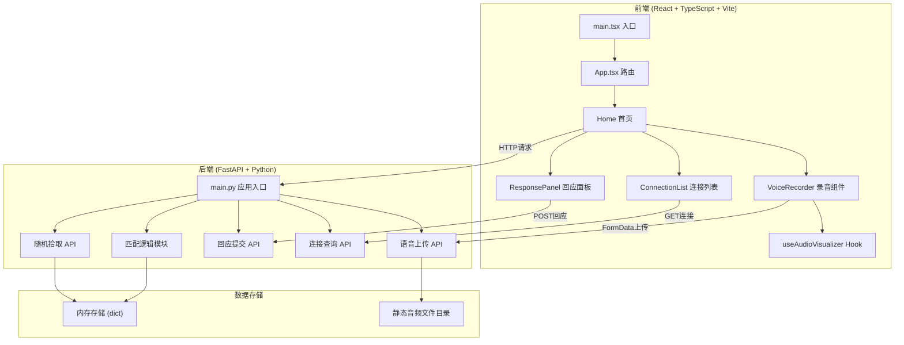
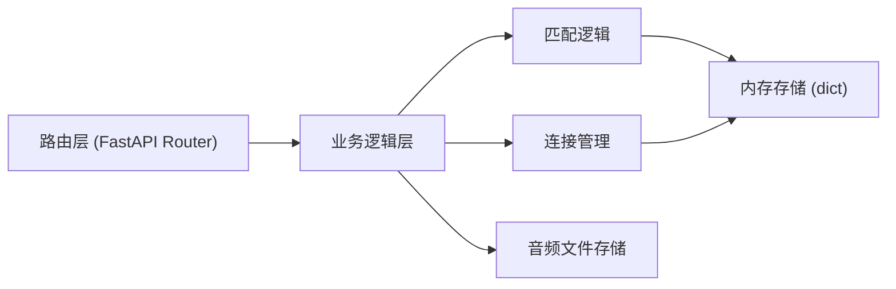
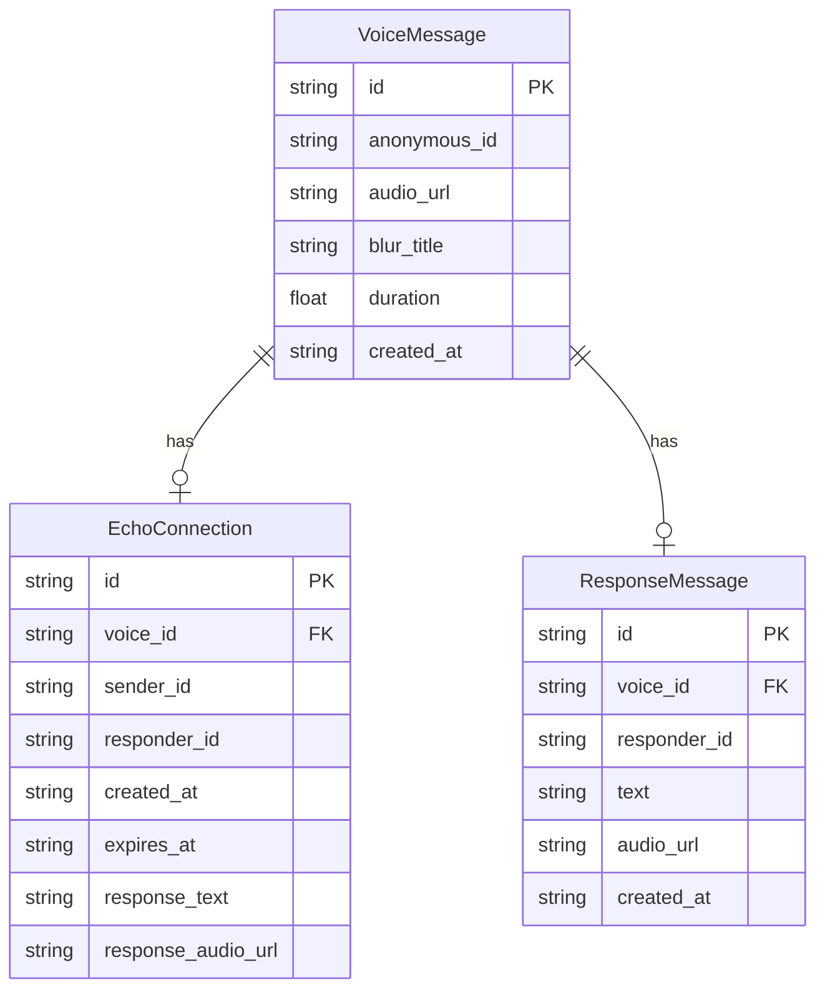

## 1. 架构设计



## 2. 技术说明

- **前端**：React@18 + TypeScript + Vite + Tailwind CSS + Zustand
- **初始化工具**：vite-init (react-ts模板)
- **后端**：FastAPI + Uvicorn + Python-Multipart
- **数据库**：内存字典存储（MVP阶段），静态文件存储音频
- **音频处理**：浏览器 MediaRecorder API 录音，Web Audio API 声波可视化
- **本地存储**：localStorage 存储匿名ID和回声连接列表

## 3. 路由定义

| 路由 | 用途 |
|------|------|
| / | 首页，展示漂流语音、录音、回应、连接列表 |

## 4. API定义

### 4.1 TypeScript类型定义

```typescript
interface VoiceMessage {
  id: string
  anonymous_id: string
  audio_url: string
  blur_title: string
  duration: number
  created_at: string
}

interface ResponseMessage {
  id: string
  voice_id: string
  responder_id: string
  text: string
  audio_url?: string
  created_at: string
}

interface EchoConnection {
  id: string
  voice_id: string
  sender_id: string
  responder_id: string
  created_at: string
  expires_at: string
  response_text: string
  response_audio_url?: string
}
```

### 4.2 请求/响应Schema

| 方法 | 路径 | 请求 | 响应 | 说明 |
|------|------|------|------|------|
| POST | /api/voices | FormData: audio(blob), anonymous_id, blur_title | VoiceMessage | 上传语音 |
| GET | /api/voices/random?exclude_id=xxx | - | VoiceMessage | 随机拾取一条语音 |
| POST | /api/voices/{id}/respond | {responder_id, text, audio?(blob)} | EchoConnection | 回应语音 |
| GET | /api/connections?user_id=xxx | - | EchoConnection[] | 查询用户连接 |
| GET | /api/audio/{filename} | - | audio/wav | 获取音频文件 |

## 5. 服务端架构图



## 6. 数据模型

### 6.1 数据模型定义



### 6.2 数据定义语言

MVP阶段使用Python内存字典存储，无需DDL：

```python
voices_db: dict[str, VoiceMessage] = {}
connections_db: dict[str, EchoConnection] = {}
audio_files_dir: str = "audio_files"
```
