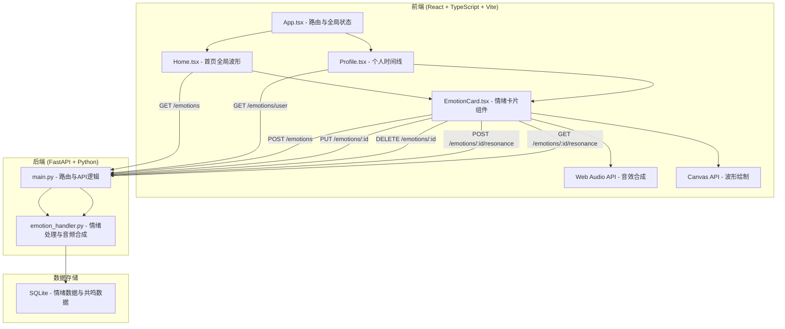
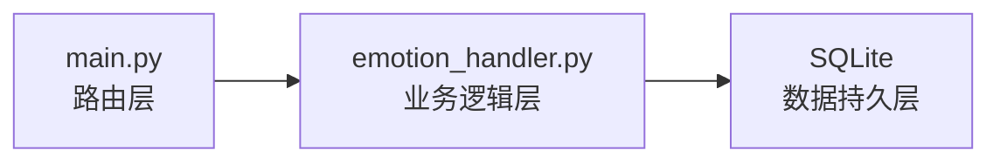
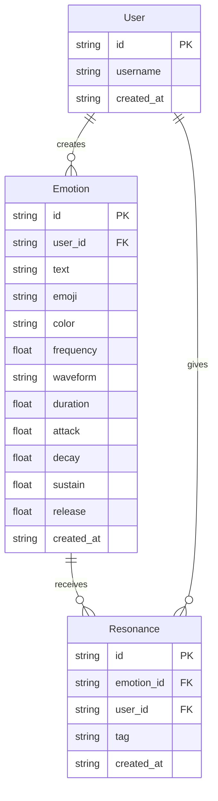

## 1. 架构设计



## 2. 技术说明

- **前端**：React@18 + TypeScript + Vite + TailwindCSS + Zustand
- **初始化工具**：vite-init (react-ts 模板)
- **后端**：FastAPI + Uvicorn
- **数据库**：SQLite (轻量级，无需额外服务)
- **音频合成**：前端 Web Audio API (实时合成) + 后端 numpy (服务端音频数据生成)
- **波形渲染**：Canvas API (高性能 60fps 渲染)

## 3. 路由定义

| 路由 | 用途 |
|------|------|
| / | 首页 - 全局情绪波形图展示 |
| /profile | 个人主页 - 情绪时间线 |

## 4. API 定义

### 4.1 数据类型

```typescript
interface Emotion {
  id: string;
  user_id: string;
  text: string;
  emoji: string;
  color: string;
  audio_params: AudioParams;
  created_at: string;
  resonances: Resonance[];
}

interface AudioParams {
  frequency: number;
  waveform: "sine" | "triangle" | "sawtooth" | "square";
  duration: number;
  attack: number;
  decay: number;
  sustain: number;
  release: number;
}

interface Resonance {
  id: string;
  emotion_id: string;
  user_id: string;
  tag: "同感" | "想听更多" | "心疼" | "加油";
  created_at: string;
}

interface CreateEmotionRequest {
  text: string;
  emoji: string;
  color: string;
}

interface CreateResonanceRequest {
  tag: "同感" | "想听更多" | "心疼" | "加油";
}
```

### 4.2 接口列表

| 方法 | 路径 | 说明 | 请求体 | 响应 |
|------|------|------|--------|------|
| GET | /api/emotions | 获取全局情绪列表 | - | `Emotion[]` |
| GET | /api/emotions/user/{user_id} | 获取用户情绪列表 | - | `Emotion[]` |
| POST | /api/emotions | 创建情绪碎片 | `CreateEmotionRequest` | `Emotion` |
| PUT | /api/emotions/{id} | 更新情绪碎片 | `CreateEmotionRequest` | `Emotion` |
| DELETE | /api/emotions/{id} | 删除情绪碎片 | - | `{ success: bool }` |
| POST | /api/emotions/{id}/resonance | 给予共鸣 | `CreateResonanceRequest` | `Resonance` |
| GET | /api/emotions/{id}/resonance | 获取共鸣列表 | - | `Resonance[]` |
| POST | /api/users/register | 用户注册 | `{ username: string }` | `{ user_id, username }` |
| GET | /api/users/me | 获取当前用户 | - | `{ user_id, username }` |

## 5. 服务器架构图



## 6. 数据模型

### 6.1 数据模型定义



### 6.2 数据定义语言

```sql
CREATE TABLE users (
    id TEXT PRIMARY KEY,
    username TEXT NOT NULL UNIQUE,
    created_at TEXT NOT NULL DEFAULT (datetime('now'))
);

CREATE TABLE emotions (
    id TEXT PRIMARY KEY,
    user_id TEXT NOT NULL REFERENCES users(id),
    text TEXT NOT NULL,
    emoji TEXT NOT NULL,
    color TEXT NOT NULL,
    frequency REAL NOT NULL DEFAULT 440.0,
    waveform TEXT NOT NULL DEFAULT 'sine',
    duration REAL NOT NULL DEFAULT 1.5,
    attack REAL NOT NULL DEFAULT 0.05,
    decay REAL NOT NULL DEFAULT 0.2,
    sustain REAL NOT NULL DEFAULT 0.4,
    release REAL NOT NULL DEFAULT 0.3,
    created_at TEXT NOT NULL DEFAULT (datetime('now'))
);

CREATE TABLE resonances (
    id TEXT PRIMARY KEY,
    emotion_id TEXT NOT NULL REFERENCES emotions(id) ON DELETE CASCADE,
    user_id TEXT NOT NULL REFERENCES users(id),
    tag TEXT NOT NULL,
    created_at TEXT NOT NULL DEFAULT (datetime('now'))
);

CREATE INDEX idx_emotions_user_id ON emotions(user_id);
CREATE INDEX idx_emotions_created_at ON emotions(created_at);
CREATE INDEX idx_resonances_emotion_id ON resonances(emotion_id);
```

## 7. 音频合成方案

### 7.1 颜色到音频参数映射

- **频率**：根据颜色色相映射到 200Hz-800Hz 范围
- **波形**：蓝色→sine（柔和），绿色→triangle（明亮），红色→sawtooth（尖锐），紫色→square（厚重）
- **包络**：Attack 0.02-0.1s, Decay 0.1-0.3s, Sustain 0.3-0.6, Release 0.2-0.5s

### 7.2 前端 Web Audio 合成流程

1. 用户保存情绪碎片
2. 后端根据颜色生成音频参数并存储
3. 前端播放时用 Web Audio API 的 OscillatorNode + GainNode 实时合成
4. 波形动画与音频播放同步

## 8. 波形渲染方案

- 使用 Canvas 2D API 绘制波形
- 每个情绪碎片对应一个波形脉冲（waveform pulse）
- 波形绘制为正弦波的衰减振荡，颜色匹配情绪颜色
- 添加发光效果（shadowBlur + 透明度渐变）
- 悬停时振幅增大（脉动效果）
- 使用 requestAnimationFrame 保证 60fps
