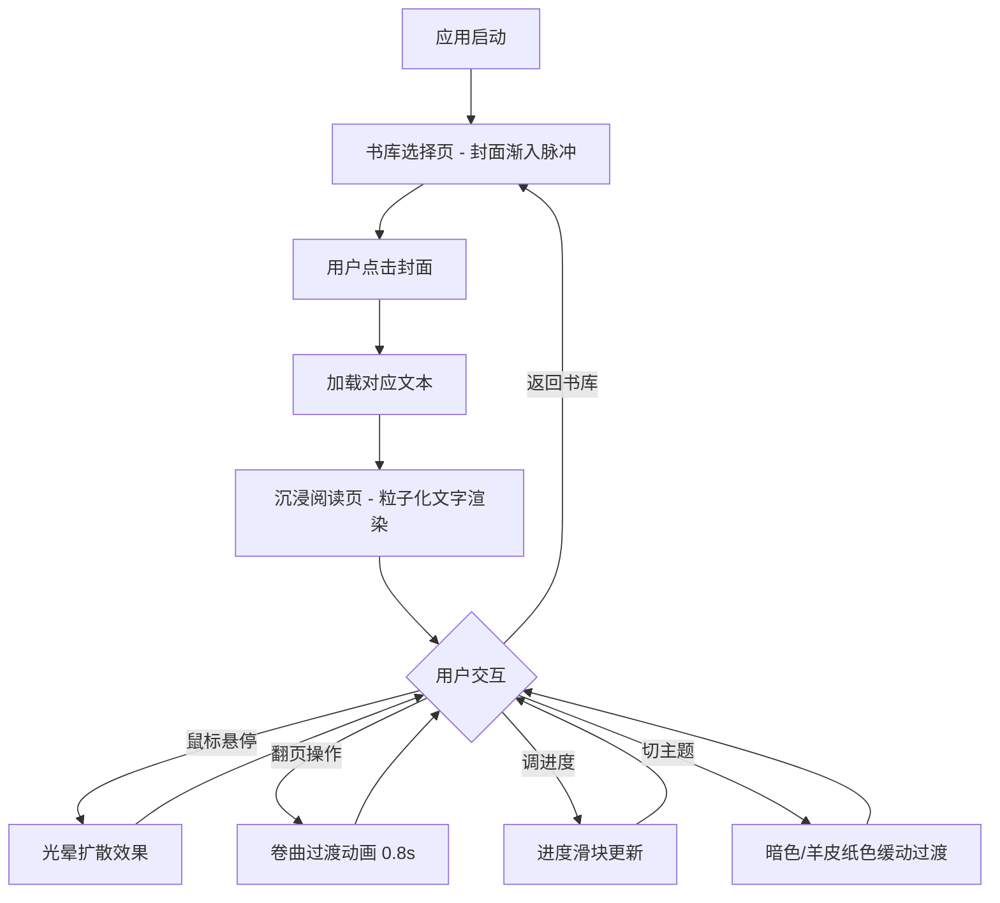

## 1. 产品概述

「影隙书库」是一款交互式阅读可视化工具，将传统文学阅读体验与粒子化光影渲染技术融合。用户从预设书库中选择一本书后，文字以发光粒子群的形式缓缓浮现于黑暗背景中，配合鼠标交互产生微光扩散效果，营造沉浸式的"风中书页"阅读氛围。

- 目标用户：追求沉浸阅读体验的文学爱好者、视觉艺术鉴赏者
- 核心价值：以动态光影和粒子美学重新定义文字呈现方式，让阅读成为一场视觉仪式

## 2. 核心功能

### 2.1 功能模块

1. **书库选择页**：展示3-5本预设书籍的封面缩略图，点击加载对应文本
2. **沉浸阅读页**：Canvas粒子化文字渲染、光影效果、翻页动画

### 2.2 页面详情

| 页面名称 | 模块名称 | 功能描述 |
|----------|----------|----------|
| 书库选择页 | 封面网格 | 3-5本书封面缩略图排列，初始加载时向中心渐入并轻微脉冲动画 |
| 书库选择页 | 封面交互 | 鼠标悬停封面边缘产生轻微卷曲效果，点击进入阅读 |
| 沉浸阅读页 | 粒子文字画布 | 文字以粒子群形式渲染，句子按固定间隔淡入出现，粒子间距和颜色随机微调 |
| 沉浸阅读页 | 悬停光晕 | 鼠标悬停某句时，该句粒子亮度增加并向外扩散微弱光晕，离开后恢复 |
| 沉浸阅读页 | 翻页动画 | 半透明卷曲过渡动画，持续0.8秒，60fps |
| 沉浸阅读页 | 控制栏 | 翻页按钮、阅读进度滑块、主题切换按钮，支持键盘快捷键 |
| 沉浸阅读页 | 主题切换 | 暗色/羊皮纸色两种主题，切换时背景和文字颜色缓动过渡 |

## 3. 核心流程

用户打开应用 → 看到书库选择页，封面渐入脉冲 → 点击某本书封面 → 封面展开过渡到阅读页 → 文字粒子逐句浮现 → 鼠标悬停产生光晕交互 → 翻页时卷曲动画 → 通过控制栏翻页/调进度/切主题 → 返回书库选择其他书

## 4. 用户界面设计

### 4.1 设计风格

- **主色调**：暗色主题 - 深灰(#1a1a2e)到墨黑(#0a0a0f)渐变；羊皮纸主题 - 暖米色(#f5e6c8)到浅棕(#d4b896)渐变
- **文字颜色**：暗色主题 - 柔白(#e8e8e8)带微光；羊皮纸主题 - 深棕(#3d2b1f)
- **按钮风格**：圆角图标 + 毛玻璃效果(backdrop-filter: blur)，半透明白/深色边框
- **字体**：中文使用"站酷仓耳渔阳体"或"ZCOOL XiaoWei"作为展示字体，英文使用"Cormorant Garamond"作为衬线展示字体
- **布局**：全屏Canvas沉浸式，底部浮动控制栏，右上角主题切换
- **纸纹肌理**：暗色主题下文字区域有微妙纸纹；羊皮纸主题纸纹更明显
- **阴影**：文字区域柔和投影，营造纸张飘浮感

### 4.2 页面设计概述

| 页面名称 | 模块名称 | UI元素 |
|----------|----------|--------|
| 书库选择页 | 封面网格 | 深色背景，3-5张封面以卡片形式排列，圆角+阴影+纸纹肌理，封面渐入+脉冲动画 |
| 沉浸阅读页 | 粒子文字画布 | 全屏Canvas，深色渐变背景，粒子化文字，句子淡入，纸纹叠加层 |
| 沉浸阅读页 | 悬停光晕 | Canvas内鼠标位置追踪，悬停句子粒子增亮+向外扩散光晕 |
| 沉浸阅读页 | 翻页动画 | Canvas卷曲效果，半透明叠加，0.8秒过渡 |
| 沉浸阅读页 | 控制栏 | 底部浮动，毛玻璃效果，圆角图标按钮，自定义进度滑块，居中对齐 |
| 沉浸阅读页 | 主题切换 | 右上角图标按钮，点击缓动过渡背景和文字色 |

### 4.3 响应式适配

- 桌面端(≥1024px)：全屏Canvas，侧边可显示书名信息
- 平板端(768-1023px)：Canvas自适应，控制栏精简
- 键盘快捷键：左右箭头翻页，Ctrl+滚轮调进度

### 4.4 预设书库内容

| 书名 | 类型 | 内容概要 |
|------|------|----------|
| 《静夜诗抄》 | 诗歌集 | 5首短诗，关于夜色与孤寂 |
| 《巷尾故事》 | 短篇小说 | 3个微型故事，市井生活切片 |
| 《山间信笺》 | 散文集 | 4封书信体散文，山居感悟 |
| 《星尘低语》 | 诗歌集 | 4首关于星空与宇宙的诗 |
| 《旧时光书》 | 短篇小说 | 2篇怀旧题材短篇 |
