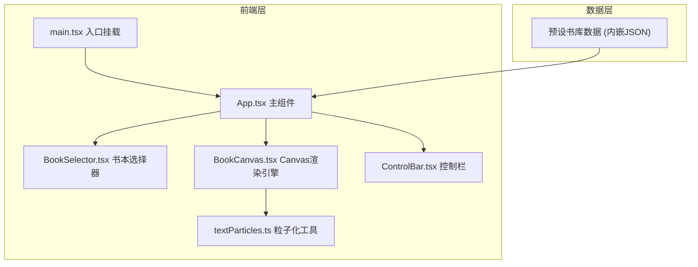

## 1. 架构设计



## 2. 技术说明

- **前端框架**：React 18 + TypeScript
- **构建工具**：Vite
- **样式方案**：CSS Modules + CSS变量（主题切换）
- **动画引擎**：Canvas 2D API + requestAnimationFrame
- **状态管理**：React useState/useReducer（项目规模较小，无需引入Zustand）
- **后端**：无，纯前端应用
- **数据来源**：预设书库数据内嵌于前端代码中

## 3. 路由定义

本项目为单页应用，无路由切换，通过组件状态控制"选择页"和"阅读页"的显示切换。

| 状态 | 显示内容 |
|------|----------|
| idle | 书库选择页 |
| reading | 沉浸阅读页 |

## 4. 核心模块设计

### 4.1 textParticles.ts 粒子化工具

- `textToParticles(text, canvas, options)`: 将文字渲染到离屏Canvas，采样像素点生成粒子数组
- `Particle` 类型：`{ x, y, originX, originY, size, color, alpha, velocity }`
- 粒子间距和颜色随机微调，生成发光效果

### 4.2 BookCanvas.tsx 渲染引擎

- Canvas全屏渲染，60fps动画循环
- 管理当前页面所有句子的粒子群
- 鼠标位置追踪，实现悬停光晕效果
- 翻页卷曲过渡动画实现
- 纸纹肌理叠加层渲染

### 4.3 BookSelector.tsx 书本选择器

- 封面缩略图网格布局
- 初始渐入+脉冲动画
- 鼠标悬停封面边缘卷曲效果(CSS transform)
- 点击回调传递选中书籍

### 4.4 ControlBar.tsx 控制栏

- 翻页按钮(前/后)
- 进度滑块(自定义样式)
- 主题切换按钮
- 键盘事件监听(左右箭头翻页，Ctrl+滚轮调进度)

### 4.5 App.tsx 主组件

- 管理当前书籍、当前页码、主题状态
- 协调子组件间数据流
- 主题切换时CSS变量缓动过渡

## 5. 数据模型

### 5.1 书籍数据结构

```typescript
interface Book {
  id: string;
  title: string;
  author: string;
  coverColor: string;
  pages: Page[];
}

interface Page {
  sentences: Sentence[];
}

interface Sentence {
  text: string;
  delay: number;
}
```

### 5.2 粒子数据结构

```typescript
interface Particle {
  x: number;
  y: number;
  originX: number;
  originY: number;
  size: number;
  color: string;
  alpha: number;
  vx: number;
  vy: number;
  brightness: number;
}
```

## 6. 性能优化策略

- 离屏Canvas预渲染文字，减少主Canvas绘制压力
- 粒子数量控制：每句不超过300个粒子
- 使用requestAnimationFrame确保60fps
- 翻页动画期间暂停粒子更新，专注过渡效果
- 视口外粒子不渲染
