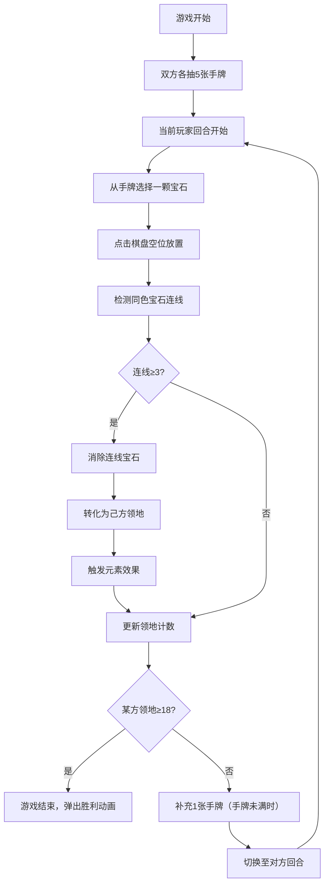

## 1. 产品概述

「龙息棋局」是一款双人对战策略棋盘游戏，玩家在6×6六边形棋盘上交替放置带有元素属性的龙息宝石（火、冰、风、土），通过连珠消除和元素相克机制夺取对方领地，先占领棋盘一半以上格子（18格）者获胜。

- 核心目标：打造一款视觉震撼、策略深度与运气兼备的奇幻对战游戏
- 目标用户：策略游戏爱好者、棋类游戏玩家、奇幻题材粉丝

## 2. 核心功能

### 2.1 用户角色

| 角色 | 进入方式 | 核心权限 |
|------|----------|----------|
| 玩家一（火龙方） | 默认分配 | 放置宝石、触发元素效果、占领领地 |
| 玩家二（冰龙方） | 默认分配 | 放置宝石、触发元素效果、占领领地 |

### 2.2 功能模块

1. **游戏棋盘页面**：六边形棋盘渲染、宝石放置交互、连线检测与消除动画、元素效果触发、领地占领与转换
2. **玩家面板**：手牌展示与选择、领地计数、回合结束操作

### 2.3 页面详情

| 页面名称 | 模块名称 | 功能描述 |
|----------|----------|----------|
| 游戏棋盘页面 | 六边形棋盘 | 6×6六边形网格，显示宝石、领地标记、发光边框，支持点击放置宝石 |
| 游戏棋盘页面 | 宝石放置 | 点击手牌选中宝石→点击棋盘空位放置，坠落光效和粒子溅射动画 |
| 游戏棋盘页面 | 连线检测 | 放置后自动检测横竖斜3+同色宝石连线，触发消除动画 |
| 游戏棋盘页面 | 元素效果 | 火线灼烧、冰线冻结、风线吹散、土线硬化四种元素效果 |
| 游戏棋盘页面 | 领地系统 | 消除宝石转为领地，覆盖脉动岩浆/冰霜纹理，领地计数器更新 |
| 游戏棋盘页面 | 胜利判定 | 某方领地≥18格时弹出胜利动画（龙形火焰/冰龙盘旋） |
| 玩家面板 | 手牌区域 | 显示5张手牌缩略图，点击选中（放大发光），元素图标和颜色标识 |
| 玩家面板 | 领地计数 | 实时显示己方领地格数和进度条 |
| 玩家面板 | 回合结束 | 点击按钮结束当前回合，切换到对方回合 |

## 3. 核心流程

游戏核心流程：玩家开始游戏→双方各获得5张随机元素手牌→玩家一先手→选择手牌中一颗宝石→点击棋盘空位放置→系统自动检测连线→若有3+同色连线则消除并触发元素效果→更新领地→检查胜利条件→若未胜利则补充手牌→切换至对方回合→循环直至一方领地≥18格。

## 4. 用户界面设计

### 4.1 设计风格

- **主色调**：深红（#8B0000）到暗金（#B8860B）渐变背景，火元素用橙红色，冰元素用冰蓝色，风元素用青绿色，土元素用棕褐色
- **按钮风格**：石质立体浮雕按钮，暗金色边框，点击时有微弱震动效果
- **字体**：标题使用「Cinzel」哥特式衬线字体，正文使用「Noto Sans SC」中文字体
- **布局风格**：左侧大面积棋盘区域，右侧玩家信息面板，整体居中对称
- **图标风格**：元素图标使用半透明彩色晶石造型，火为火焰形状、冰为六角雪花、风为旋涡、土为盾牌

### 4.2 页面设计概述

| 页面名称 | 模块名称 | UI元素 |
|----------|----------|--------|
| 游戏棋盘页面 | 六边形棋盘 | 暗色石质纹理背景，六边形格子微弱发光边框，宝石半透明彩色晶石，领地覆盖脉动岩浆/冰霜纹理 |
| 游戏棋盘页面 | 宝石放置动画 | 坠落光效+粒子溅射，缓动弹跳动画 |
| 游戏棋盘页面 | 消除动画 | 宝石碎裂+元素粒子散射（火焰、冰晶、旋风、岩石碎片） |
| 游戏棋盘页面 | 胜利弹窗 | 龙形火焰/冰龙盘旋动画，半透明遮罩层 |
| 玩家面板 | 手牌区 | 缩略图带元素图标，选中时放大发光，手牌上限5张 |
| 玩家面板 | 领地计数 | 数字+进度条，火方为暗红色，冰方为冰蓝色 |
| 玩家面板 | 回合结束按钮 | 石质浮雕按钮，hover发光，当前玩家才可点击 |

### 4.3 响应式设计

- 桌面优先设计，最佳分辨率1920×1080
- 棋盘和面板使用flex布局自适应
- 最小支持1366×768分辨率
- 触摸设备兼容点击操作

### 4.4 游戏规则详细说明

**元素相克与效果系统**：
- **火（Fire）**：连线消除后，灼烧相邻敌方领地格子使其变为中立
- **冰（Ice）**：连线消除后，冻结周围一格，使对方下回合无法在该位置放置
- **风（Wind）**：连线消除后，吹散一条斜线上的所有宝石，使其移回各自手牌
- **土（Earth）**：连线消除后，硬化己方领地，使其无法被火线灼烧消除

**手牌系统**：
- 初始5张，每回合补充1张
- 手牌已满（5张）时不补充
- 元素随机分配，四种元素等概率

**连线规则**：
- 横、竖、斜（对角线）均可
- 同色宝石连续3颗或以上触发消除
- 消除的宝石转为放置方的领地
- 土系硬化的领地不受火系灼烧影响
