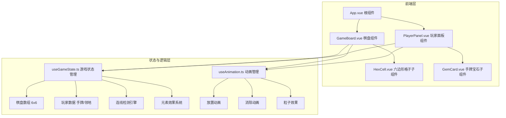

## 1. 架构设计



## 2. 技术说明

- **前端框架**：Vue 3 + TypeScript + Composition API
- **构建工具**：Vite
- **路由**：vue-router（单页游戏，仅用于结构化）
- **样式方案**：Tailwind CSS + CSS自定义属性 + CSS动画
- **状态管理**：Composables（useGameState）+ reactive响应式
- **动画方案**：CSS Transition/Animation + requestAnimationFrame + Canvas粒子
- **无后端**：纯前端游戏，所有逻辑在浏览器端执行

## 3. 路由定义

| 路由 | 用途 |
|------|------|
| / | 游戏主页面，包含棋盘和玩家面板 |

## 4. 数据模型

### 4.1 核心类型定义

```typescript
type ElementType = 'fire' | 'ice' | 'wind' | 'earth'

interface Gem {
  id: string
  element: ElementType
}

interface Cell {
  row: number
  col: number
  gem: Gem | null
  owner: 1 | 2 | null
  isFortified: boolean
  isFrozen: boolean
  frozenBy: 1 | 2 | null
}

interface Player {
  id: 1 | 2
  name: string
  hand: Gem[]
  territoryCount: number
}

interface GameState {
  board: Cell[][]
  players: [Player, Player]
  currentPlayer: 1 | 2
  selectedGem: Gem | null
  phase: 'select' | 'place' | 'resolving' | 'gameover'
  winner: 1 | 2 | null
}
```

### 4.2 棋盘数据结构

- 6×6二维数组 `Cell[][]`，每个格子包含宝石、领地归属、强化/冻结状态
- 连线检测使用8方向扫描算法
- 元素效果在消除后触发，按优先级执行

## 5. 关键算法

### 5.1 连线检测

从放置位置出发，沿8个方向（上、下、左、右、左上、右上、左下、右下）扫描同色宝石，找出所有≥3的连续序列。

### 5.2 元素效果执行顺序

1. 先执行消除→领地转换
2. 再按元素类型触发效果：火→冰→风→土
3. 同一次消除多种元素按触发顺序依次执行

## 6. 文件结构

```
src/
├── main.ts                    # Vue应用入口
├── App.vue                    # 根组件
├── components/
│   ├── GameBoard.vue          # 棋盘主组件
│   ├── HexCell.vue            # 六边形格子子组件
│   ├── PlayerPanel.vue        # 玩家面板
│   └── GemCard.vue            # 手牌宝石卡
├── composables/
│   ├── useGameState.ts        # 游戏状态与规则逻辑
│   └── useAnimation.ts        # 动画与粒子效果管理
├── types/
│   └── game.ts                # 类型定义
└── styles/
    └── variables.css          # CSS自定义属性与全局样式
```
