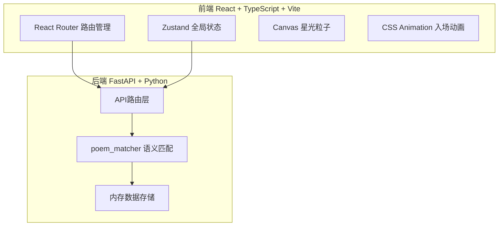

# 言灵诗歌 - 技术架构文档

## 1. 架构设计



## 2. 技术说明
- **前端**：React@18 + TypeScript + Vite + Tailwind CSS + Zustand
- **初始化工具**：vite-init（react-ts模板）
- **后端**：FastAPI + uvicorn（Python）
- **语义匹配**：scikit-learn（TF-IDF + 余弦相似度）
- **数据库**：无数据库，内存存储（Python列表 + 字典）

## 3. 路由定义
| 路由 | 用途 |
|------|------|
| `/` | 首页：诗歌生成器 + 瀑布流展示 + 星光粒子背景 |
| `/user/:anonymousId` | 匿名用户主页：诗行历史 + 被拼接统计 |
| `/hot` | 今日热诗榜 |

## 4. API定义

### 4.1 提交诗行
- **POST** `/api/poems/submit`
- Request: `{ "content": "一行短诗内容" }`
- Response: `{ "anonymous_id": "灵_3a7f", "line_id": "line_001", "poem": { "id": "poem_001", "lines": [...], "created_at": "..." } }`

### 4.2 获取最近诗歌列表
- **GET** `/api/poems/recent?limit=20`
- Response: `{ "poems": [...] }`

### 4.3 获取匿名用户主页
- **GET** `/api/users/{anonymous_id}`
- Response: `{ "anonymous_id": "灵_3a7f", "lines": [...], "total_lines": 5, "total_stitched": 12 }`

### 4.4 获取今日热诗榜
- **GET** `/api/poems/hot`
- Response: `{ "poems": [{ "id": "...", "lines": [...], "stitch_count": 8, "created_at": "..." }] }`

### 4.5 全局搜索
- **GET** `/api/search?q=关键词`
- Response: `{ "results": [{ "type": "line"|"user", "data": {...} }] }`

### 4.6 TypeScript类型定义
```typescript
interface PoemLine {
  id: string
  content: string
  anonymous_id: string
  created_at: string
  stitch_count: number
}

interface Poem {
  id: string
  lines: PoemLine[]
  created_at: string
  stitch_count: number
}

interface UserProfile {
  anonymous_id: string
  lines: PoemLine[]
  total_lines: number
  total_stitched: number
}

interface SearchResult {
  type: 'line' | 'user'
  data: PoemLine | UserProfile
}
```

## 5. 服务端架构

```mermaid
flowchart LR
    "API路由层 main.py" --> "语义匹配 poem_matcher.py"
    "语义匹配 poem_matcher.py" --> "内存数据存储"
    "API路由层 main.py" --> "内存数据存储"
```

### main.py 职责
- FastAPI应用入口，CORS配置
- `/api/poems/submit`：接收诗行，调用matcher拼接，返回结果
- `/api/poems/recent`：返回最近生成的诗歌
- `/api/users/{anonymous_id}`：查询用户诗行历史和统计
- `/api/poems/hot`：返回24小时内拼接次数TOP10
- `/api/search`：按关键词搜索诗行或匿名ID

### poem_matcher.py 职责
- `find_similar_lines(content, lines, top_k)`：基于TF-IDF + 余弦相似度匹配最相似的top_k行诗
- `generate_poem(new_line, all_lines)`：匹配2-4行，与新增行拼接为完整诗歌
- 过滤近7天内的诗行，排除自身，按相似度排序

## 6. 数据模型

### 6.1 内存数据结构
```python
poems = []           # List[dict] 所有生成的诗歌
lines = []           # List[dict] 所有提交的诗行
users = {}           # Dict[anonymous_id, user_data]
```

### 6.2 数据结构定义
```python
{
    "poem": {
        "id": "poem_xxxx",
        "lines": [{"id": "line_xxxx", "content": "...", "anonymous_id": "灵_xxxx", "created_at": "ISO8601", "stitch_count": 0}],
        "created_at": "ISO8601",
        "stitch_count": 0
    },
    "line": {
        "id": "line_xxxx",
        "content": "一行短诗",
        "anonymous_id": "灵_xxxx",
        "created_at": "ISO8601",
        "stitch_count": 0
    },
    "user": {
        "anonymous_id": "灵_xxxx",
        "lines": ["line_xxxx", ...],
        "total_stitched": 0
    }
}
```

## 7. 前端项目结构
```
frontend/
├── src/
│   ├── main.tsx          # 入口挂载
│   ├── App.tsx           # 主组件+路由+全局状态
│   ├── HomePage.tsx      # 首页：生成器+瀑布流+粒子
│   ├── UserPage.tsx      # 匿名用户主页
│   ├── HotPoems.tsx      # 今日热诗榜
│   ├── components/       # 可复用组件
│   ├── hooks/            # 自定义hooks
│   ├── utils/            # 工具函数
│   └── index.css         # 全局样式+Tailwind
├── index.html
├── package.json
├── tsconfig.json
└── vite.config.ts
```
