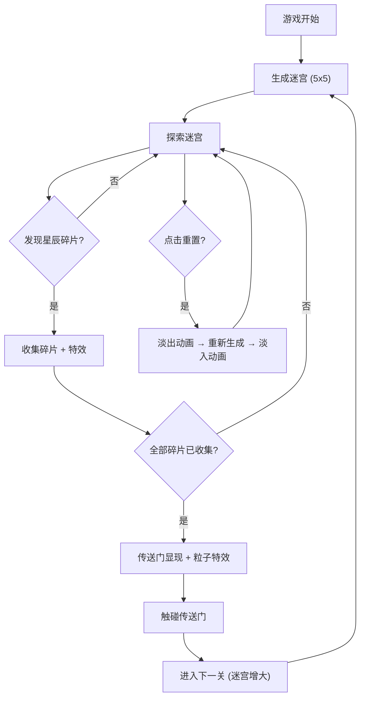

## 1. 产品概述

「织梦秘径」是一款暗夜星空风格的2D迷宫探索游戏。玩家控制一个发光精灵在随机生成的迷宫中寻找出口，同时收集散落的星辰碎片来解锁传送门。迷宫的墙壁会缓慢流动变化，增加探索的挑战性。

- 目标用户：喜欢休闲解谜和探索类游戏的玩家
- 核心价值：融合随机迷宫生成、收集机制和流动墙壁的独特探索体验

## 2. 核心功能

### 2.1 功能模块

1. **游戏主界面**：迷宫Canvas渲染区域 + UI覆盖层
2. **迷宫系统**：随机生成、保证有解、墙壁流动动画、关卡递增

### 2.2 页面详情

| 页面名称 | 模块名称 | 功能描述 |
|----------|----------|----------|
| 游戏主界面 | 迷宫Canvas | 渲染迷宫网格、角色、碎片、传送门；处理键盘输入；60fps游戏循环 |
| 游戏主界面 | UI覆盖层-顶部信息栏 | 显示当前关卡编号、已收集碎片数/总碎片数 |
| 游戏主界面 | UI覆盖层-底部重置按钮 | 点击重置当前关卡，迷宫淡出再淡入切换 |
| 游戏主界面 | 角色精灵 | 四方向键盘移动、缓动动画、脉冲光晕、地面光痕 |
| 游戏主界面 | 星辰碎片 | 3个/关、旋转六芒星、闪烁效果、收集时旋转放大+粒子消散 |
| 游戏主界面 | 传送门 | 收集全部碎片后显现、旋转发光光环、触碰进入下一关 |
| 游戏主界面 | 墙壁流动动画 | 墙壁颜色在墨蓝到淡紫间缓慢渐变流动 |
| 游戏主界面 | 收集反馈特效 | 收集碎片时屏幕边缘彩色光晕闪烁 |
| 游戏主界面 | 传送门出现特效 | 全屏粒子扩散特效 |
| 游戏主界面 | 重置动画 | 迷宫淡出再淡入 |

## 3. 核心流程

玩家进入游戏 → 随机生成第1关迷宫(5x5) → 控制精灵在迷宫中移动 → 发现并收集星辰碎片 → 收集3个碎片后传送门显现 → 精灵触碰传送门 → 进入下一关(7x7) → 迷宫变大、难度提升 → 循环往复

## 4. 用户界面设计

### 4.1 设计风格

- **主色调**：深蓝(#0a0e27)到紫黑(#1a0a2e)渐变背景
- **墙壁色**：半透明发光网格，墨蓝(#1e3a5f)到淡紫(#8b5cf6)渐变流动
- **角色色**：发光小圆球，青白色(#67e8f9)脉冲光晕
- **碎片色**：旋转六芒星，金色(#fbbf24)闪烁
- **传送门色**：旋转发光光环，紫粉色(#c084fc)
- **按钮风格**：半透明毛玻璃效果，圆角，淡紫边框
- **字体**：Orbitron（科幻感展示字体）+ Noto Sans SC（中文UI字体）
- **布局**：Canvas全屏铺底，UI元素叠加在Canvas之上

### 4.2 页面设计概览

| 页面名称 | 模块名称 | UI元素 |
|----------|----------|--------|
| 游戏主界面 | 顶部信息栏 | 半透明深色背景、Orbitron字体显示关卡和碎片数、左侧关卡编号、右侧碎片计数 |
| 游戏主界面 | 底部重置按钮 | 居中放置、毛玻璃风格按钮、hover时发光加强 |
| 游戏主界面 | 迷宫Canvas | 全屏深蓝到紫黑渐变背景、发光网格墙壁 |
| 游戏主界面 | 角色精灵 | 圆形发光体、脉冲光晕、移动时留光痕 |
| 游戏主界面 | 星辰碎片 | 旋转六芒星、金色闪烁 |
| 游戏主界面 | 传送门 | 旋转光环、紫粉色粒子环绕 |

### 4.3 响应式

- 桌面优先设计，Canvas自适应窗口大小
- 迷宫单元格大小根据窗口和迷宫维度动态计算
- UI元素使用绝对定位叠加在Canvas之上

### 4.4 3D场景指引

不适用，本项目为2D Canvas游戏。
