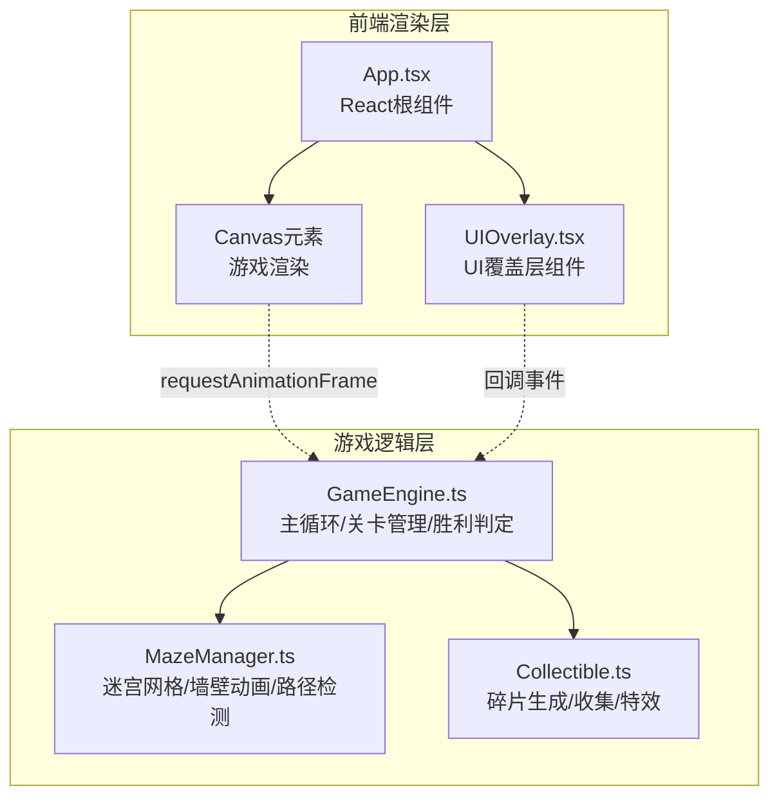

## 1. 架构设计



## 2. 技术说明

- **前端框架**：React 18 + TypeScript
- **构建工具**：Vite
- **渲染引擎**：HTML5 Canvas 2D API
- **状态管理**：React useState/useEffect + 游戏引擎内部状态
- **动画**：requestAnimationFrame 游戏循环 + Canvas绘制
- **样式**：CSS-in-JS（内联样式）+ CSS变量
- **无后端**：纯前端单页应用

## 3. 文件结构

```
├── index.html                 # 入口HTML
├── package.json               # 依赖和脚本
├── tsconfig.json              # TypeScript配置
├── vite.config.ts             # Vite配置
└── src/
    ├── main.tsx               # React入口
    ├── App.tsx                # 根组件，Canvas+UIOverlay
    ├── GameEngine.ts          # 主循环、迷宫生成、关卡切换、胜利判定
    ├── MazeManager.ts         # 迷宫网格、墙壁动画、路径检测
    ├── Collectible.ts         # 星辰碎片生成、收集、特效
    └── UIOverlay.tsx          # React组件：计分板、收集进度、关卡提示
```

## 4. 核心模块职责

### 4.1 GameEngine.ts

- 初始化Canvas和游戏循环（requestAnimationFrame）
- 管理游戏状态：当前关卡、角色位置、碎片收集状态
- 调用MazeManager生成迷宫
- 处理键盘输入，驱动角色移动（含缓动动画）
- 碰撞检测（墙壁检测委托MazeManager）
- 碎片收集检测（委托Collectible）
- 传送门检测和关卡切换
- 渲染调度：调用各模块绘制方法
- 重置关卡功能
- 粒子系统管理（收集特效、传送门特效）

### 4.2 MazeManager.ts

- 使用递归回溯算法（Recursive Backtracking）生成随机迷宫
- 迷宫数据结构：二维网格，每个单元格存储四面墙壁状态
- 保证起点到终点有解（递归回溯天然保证连通性）
- 关卡迷宫大小：5x5, 7x7, 9x9, 11x11, ...
- 墙壁流动动画：颜色在墨蓝到淡紫之间随时间周期性渐变
- 路径检测：判断角色移动目标位置是否有墙壁阻挡
- 迷宫渲染：绘制网格和发光墙壁

### 4.3 Collectible.ts

- 每关在迷宫中随机放置3个星辰碎片（确保不在起点）
- 碎片数据：位置、是否已收集、动画状态
- 六芒星绘制和旋转动画
- 碎片闪烁效果
- 收集检测：角色位置与碎片位置碰撞
- 收集特效：旋转放大 + 粒子消散
- 传送门位置生成和显现动画
- 传送门旋转光环绘制
- 全屏粒子扩散特效（传送门出现时）

### 4.4 UIOverlay.tsx

- 接收props：currentLevel, collectedCount, totalFragments, onReset
- 顶部信息栏：关卡编号 + 碎片收集进度
- 底部重置按钮：点击触发onReset回调
- 收集反馈：屏幕边缘彩色光晕闪烁（CSS动画）
- 关卡切换提示文字

## 5. 数据模型

### 5.1 核心数据结构

```typescript
interface Cell {
  x: number;
  y: number;
  walls: { top: boolean; right: boolean; bottom: boolean; left: boolean };
  visited: boolean;
}

interface Fragment {
  x: number;
  y: number;
  collected: boolean;
  collectAnimProgress: number;
  rotation: number;
  pulse: number;
}

interface Portal {
  x: number;
  y: number;
  visible: boolean;
  appearProgress: number;
  rotation: number;
}

interface Particle {
  x: number;
  y: number;
  vx: number;
  vy: number;
  life: number;
  maxLife: number;
  color: string;
  size: number;
}

interface Player {
  gridX: number;
  gridY: number;
  renderX: number;
  renderY: number;
  targetX: number;
  targetY: number;
  moving: boolean;
  pulsePhase: number;
  trail: Array<{ x: number; y: number; alpha: number }>;
}
```

### 5.2 游戏状态

```typescript
interface GameState {
  level: number;
  mazeSize: number;
  player: Player;
  fragments: Fragment[];
  portal: Portal;
  particles: Particle[];
  resetting: boolean;
  resetAlpha: number;
  screenGlow: { active: boolean; color: string; alpha: number };
}
```
