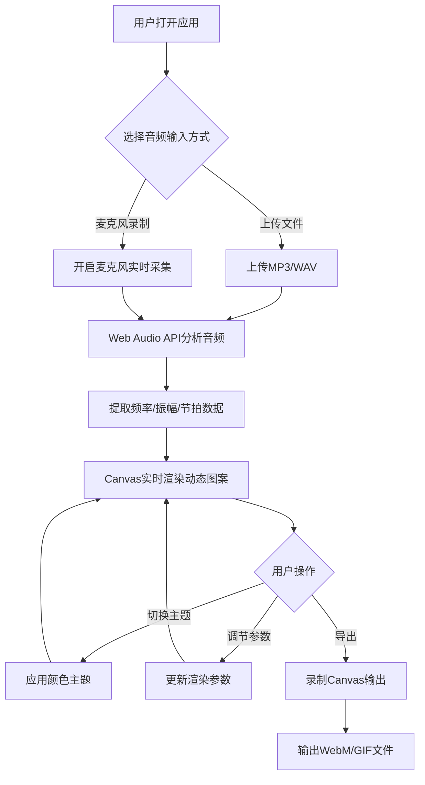

## 1. 产品概述

「幻音壁纸」是一款交互式音频可视化Web应用，用户上传音频文件或使用麦克风实时录制，应用会生成随音乐节奏动态变化的抽象壁纸图案，并支持导出为视频或GIF。面向音乐爱好者、内容创作者和视觉艺术爱好者，提供沉浸式音频可视化体验。

## 2. 核心功能

### 2.1 用户角色

| 角色 | 注册方式 | 核心权限 |
|------|----------|----------|
| 普通用户 | 无需注册 | 上传音频、录制麦克风、切换主题、调节参数、导出作品 |

### 2.2 功能模块

1. **主画布页面**：全屏Canvas动态壁纸渲染区域
2. **控制面板**：音频上传/录制、颜色主题切换、参数调节、导出功能

### 2.3 页面详情

| 页面名称 | 模块名称 | 功能描述 |
|----------|----------|----------|
| 主画布页面 | Canvas渲染区 | 全屏Canvas实时渲染音频可视化图案（同心圆波纹、粒子喷泉、频谱条） |
| 主画布页面 | 控制面板 | 固定底部的半透明毛玻璃控制面板，包含所有交互控件 |
| 控制面板 | 音频输入模块 | 支持MP3/WAV文件上传和麦克风实时录制 |
| 控制面板 | 主题切换模块 | 5种预设颜色主题切换（霓虹、极光、熔岩、深海、星尘） |
| 控制面板 | 参数调节模块 | 粒子密度、粒子大小、颜色变化速度、背景亮度 |
| 控制面板 | 导出模块 | 导出为WebM视频或GIF，可选时长、帧率、循环次数 |

## 3. 核心流程

## 4. 用户界面设计

### 4.1 设计风格

- **主色调**：深灰到黑色渐变背景，强调沉浸感
- **辅助色**：根据主题动态变化（霓虹-紫粉绿、极光-蓝绿紫、熔岩-红橙黄、深海-蓝靛青、星尘-银紫金）
- **按钮风格**：圆角半透明按钮，悬停时光晕扩散效果
- **字体**：Orbitron（标题/品牌）+ Noto Sans SC（正文/UI），大小层级分明
- **布局风格**：全屏画布为主，底部浮动毛玻璃控制面板
- **图标风格**：线性图标（Lucide），与深色主题协调

### 4.2 页面设计概览

| 页面名称 | 模块名称 | UI元素 |
|----------|----------|--------|
| 主画布页面 | Canvas渲染区 | 全屏Canvas，深色渐变背景，动态图案覆盖全屏 |
| 主画布页面 | 控制面板 | 毛玻璃背景，圆角，固定底部，桌面端横向排列/移动端汉堡菜单 |
| 控制面板 | 音频上传按钮 | 半透明圆角按钮，音频波形图标，悬停光晕 |
| 控制面板 | 录制按钮 | 红色圆点脉冲动画，录制中状态指示 |
| 控制面板 | 主题选择器 | 5个色块按钮，选中态有边框高亮+缩放 |
| 控制面板 | 参数滑块 | 渐变条样式，自定义滑块圆点 |
| 控制面板 | 导出按钮 | 渐变背景按钮，下拉选项面板 |

### 4.3 响应式设计

- **桌面端（>768px）**：控制面板横向排列，所有控件一行展示
- **移动端（≤768px）**：控制面板纵向折叠为汉堡菜单，点击展开后垂直排列
- **触控优化**：按钮和滑块触控区域≥44px，手势友好

### 4.4 动效设计

- 主题切换时全局颜色缓动过渡（transition 0.6s ease）
- 按钮悬停光晕扩散（box-shadow渐变扩大）
- 录制状态脉冲呼吸动画
- 滑块拖动实时预览
- Canvas图案平滑过渡不闪烁
