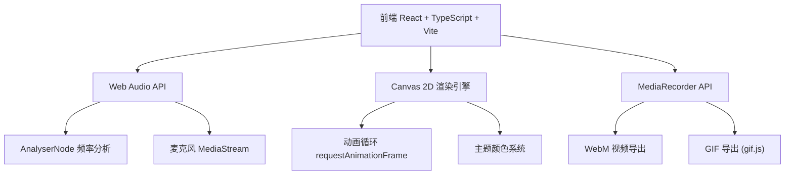
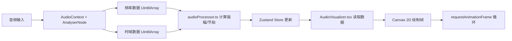

## 1. 架构设计



## 2. 技术说明

- **前端框架**：React 18 + TypeScript
- **构建工具**：Vite
- **状态管理**：Zustand
- **样式方案**：Tailwind CSS + CSS Variables（主题色切换）
- **音频处理**：Web Audio API（原生浏览器API，无需额外库）
- **视频导出**：MediaRecorder API（WebM）+ gif.js（GIF）
- **图标库**：lucide-react
- **初始化工具**：vite-init（react-ts模板）

## 3. 路由定义

本应用为单页面应用，无路由切换。

| 路由 | 用途 |
|------|------|
| / | 主页面，包含全屏Canvas可视化区域和底部控制面板 |

## 4. 文件结构

```
src/
├── main.tsx                # 入口挂载React应用
├── App.tsx                 # 主组件，管理音频状态和布局
├── AudioVisualizer.tsx     # Canvas渲染引擎，根据音频数据绘制动态图案
├── ControlPanel.tsx        # 控制面板，包含所有交互控件
├── store.ts                # Zustand状态管理
├── utils/
│   └── audioProcessor.ts   # 音频分析，提取频率/振幅/节拍数据
└── styles/
    └── index.css           # 全局样式和Tailwind
```

## 5. 核心数据流



## 6. 关键技术实现

### 6.1 音频分析

- 使用 `AudioContext` + `AnalyserNode` 获取频域和时域数据
- `fftSize` 设为 2048，频率分辨率 1024 bins
- 提取低频(0-200Hz)、中频(200-2000Hz)、高频(2000Hz+)能量
- 节拍检测：基于低频能量突变，与前一帧比较超过阈值即判定为节拍

### 6.2 可视化图案

- **同心圆波纹**：从中心向外扩散的圆环，半径随低频振幅变化
- **粒子喷泉**：粒子从中心喷射，受节拍驱动加速度
- **频谱条**：底部或圆周排列的频率条，高度映射频率能量

### 6.3 主题颜色系统

5种预设主题，每种定义5个渐变色：
- 霓虹：#FF00FF, #00FFFF, #FF1493, #7B68EE, #00FF7F
- 极光：#00CED1, #7B68EE, #48D1CC, #6A5ACD, #40E0D0
- 熔岩：#FF4500, #FF6347, #FF8C00, #DC143C, #FFD700
- 深海：#000080, #191970, #4169E1, #00BFFF, #1E90FF
- 星尘：#C0C0C0, #9370DB, #FFD700, #BA55D3, #E6E6FA

### 6.4 导出实现

- **WebM视频**：使用 `canvas.captureStream()` + `MediaRecorder` 录制Canvas流
- **GIF导出**：使用 gif.js 库，逐帧采集Canvas像素数据编码为GIF

### 6.5 性能优化

- Canvas绘制使用 `requestAnimationFrame` 保证60fps
- 音频分析数据每帧只获取一次，避免重复计算
- 粒子数量根据设备性能自适应
- 使用 `OffscreenCanvas` 进行后台计算（如果浏览器支持）
