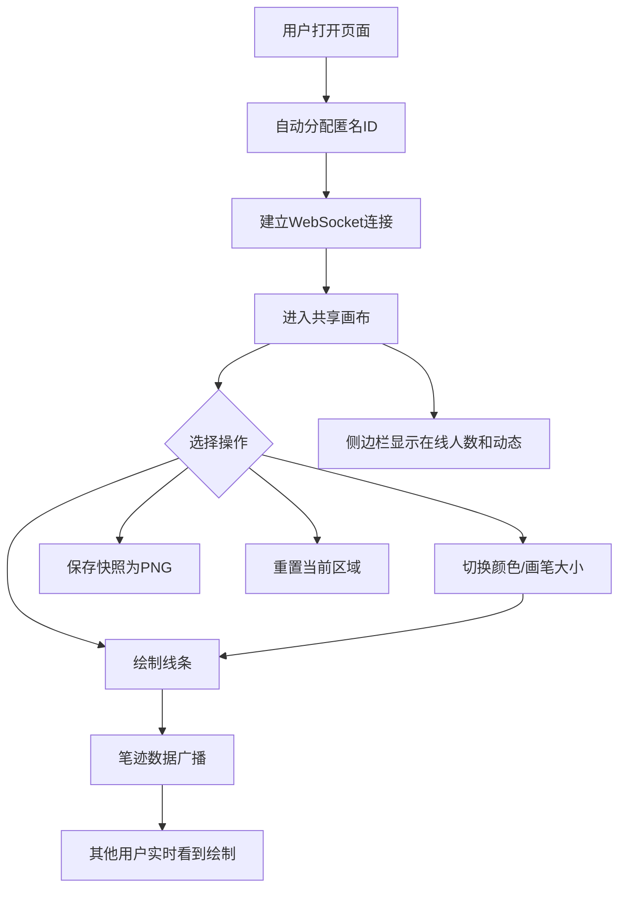

## 1. 产品概述

「匿名共绘」是一个多人实时协作绘画的 Web 应用，用户可以在一个共享的无限画布上匿名创作。每位用户打开页面后即可自由绘制彩色线条，所有笔迹通过 WebSocket 实时同步给其他在线用户，实现真正的多人共创体验。

- 解决陌生人之间创意协作的门槛问题，零注册即可参与
- 目标用户：创意工作者、休闲用户、团队协作爱好者

## 2. 核心功能

### 2.1 用户角色

| 角色 | 注册方式 | 核心权限 |
|------|----------|----------|
| 匿名用户 | 无需注册，打开即用 | 绘制、调色、保存快照、查看在线动态 |

### 2.2 功能模块

1. **画布页面**：无限滚动画布、自由绘制、调色盘、画笔大小控制
2. **侧边栏**：在线人数、最近绘制动态

### 2.3 页面详情

| 页面名称 | 模块名称 | 功能描述 |
|----------|----------|----------|
| 画布页面 | 无限画布 | 支持鼠标按住左键拖动绘制彩色线条，画布背景为浅灰网格，内容实时同步 |
| 画布页面 | 工具栏 | 调色盘选择颜色、画笔大小滑块、重置按钮清空当前区域、保存快照下载PNG |
| 画布页面 | 侧边栏 | 显示当前在线人数、最近几位匿名用户的绘制动态（如「匿名用户1画了一条蓝色曲线」） |

## 3. 核心流程

用户打开页面 → 自动分配匿名身份 → 连接 WebSocket → 进入共享画布 → 选择颜色和画笔大小 → 在画布上绘制 → 笔迹实时广播给其他在线用户 → 查看侧边栏了解其他用户动态 → 可保存快照或重置自己的区域

## 4. 用户界面设计

### 4.1 设计风格

- **主色调**：极简白灰色系，以浅灰网格为画布底色
- **辅助色**：柔和的蓝色作为交互元素高亮色
- **按钮风格**：圆角、半透明毛玻璃质感
- **字体**：使用 DM Sans 作为界面字体，轻量现代
- **布局**：画布占满视口，左上角浮动工具栏，右侧半透明侧边栏
- **图标风格**：细线条图标，与毛玻璃风格统一

### 4.2 页面设计概述

| 页面名称 | 模块名称 | UI元素 |
|----------|----------|--------|
| 画布页面 | 画布区域 | 浅灰网格背景、白色画布、鼠标光标变为画笔指示 |
| 画布页面 | 工具栏（左上角） | 毛玻璃半透明面板、色盘按钮组、画笔大小滑块、重置按钮、保存按钮，悬停缩放+发光 |
| 画布页面 | 侧边栏（右侧） | 毛玻璃半透明面板、在线人数气泡、动态列表滚动区域 |

### 4.3 响应式设计

- 桌面优先设计，画布始终铺满视口
- 工具栏和侧边栏在窄屏下自动收起为图标按钮
- 画布绘制支持触摸设备的基础手势

## 5. 性能要求

- 多人同时绘制时帧率不低于 30fps
- WebSocket 消息延迟尽量低（本地网络 < 50ms）
- 画布绘制采用 requestAnimationFrame 和增量渲染优化
- 绘制数据采用增量坐标点传输，减少带宽占用
