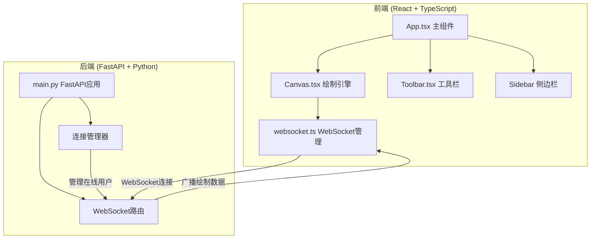
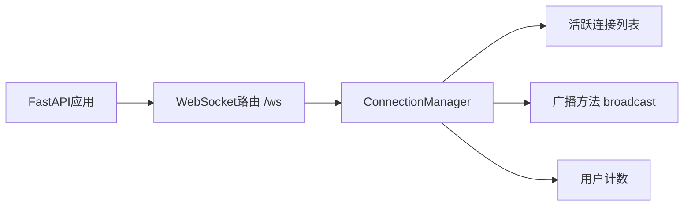

## 1. 架构设计



## 2. 技术说明

- **前端**：React@18 + TypeScript + Vite + Tailwind CSS
- **构建工具**：Vite
- **后端**：FastAPI (Python) + uvicorn
- **实时通信**：WebSocket
- **数据库**：无（纯内存状态，无需持久化）

## 3. 路由定义

| 路由 | 用途 |
|------|------|
| `/` | 画布主页面 |

## 4. API定义

### 4.1 WebSocket 消息协议

```typescript
type WebSocketMessage =
  | {
      type: "draw";
      userId: string;
      points: Array<{ x: number; y: number }>;
      color: string;
      size: number;
    }
  | {
      type: "user_join";
      userId: string;
      username: string;
    }
  | {
      type: "user_leave";
      userId: string;
    }
  | {
      type: "clear";
      userId: string;
      bounds: { x: number; y: number; width: number; height: number };
    }
  | {
      type: "online_count";
      count: number;
    }
  | {
      type: "activity";
      userId: string;
      action: string;
      color: string;
    };
```

### 4.2 WebSocket端点

| 端点 | 用途 |
|------|------|
| `ws://localhost:8000/ws` | WebSocket连接，用于实时绘制同步和用户状态管理 |

## 5. 服务端架构



## 6. 文件结构

```
project/
├── frontend/
│   ├── src/
│   │   ├── main.tsx          # 入口文件
│   │   ├── App.tsx           # 主组件（画布布局 + 状态管理）
│   │   ├── Canvas.tsx        # Canvas绘制引擎
│   │   ├── Toolbar.tsx       # 调色盘 + 画笔控制面板
│   │   ├── Sidebar.tsx       # 右侧边栏（在线人数 + 动态）
│   │   ├── utils/
│   │   │   └── websocket.ts  # WebSocket连接管理
│   │   └── index.css         # 全局样式
│   ├── package.json
│   ├── vite.config.ts
│   ├── tsconfig.json
│   └── index.html
├── backend/
│   ├── main.py               # FastAPI应用 + WebSocket路由
│   └── requirements.txt
```

## 7. 关键技术决策

- **增量绘制传输**：每次鼠标移动只传输新增的坐标点，而非整条路径，减少带宽
- **双缓冲Canvas**：使用离屏Canvas缓存已完成的笔迹，当前笔迹绘制在主Canvas上，提升性能
- **requestAnimationFrame**：绘制循环使用rAF确保60fps，同时做帧率降级保护
- **用户身份**：前端随机生成匿名ID（如"匿名用户42"），无需服务端分配
- **清空区域**：重置只清空当前视口范围内的内容，不影响其他区域
