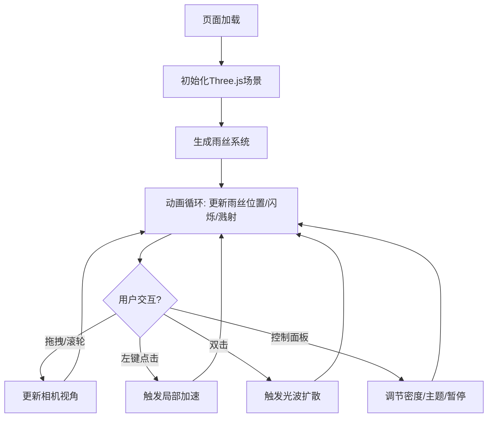

## 1. 产品概述

「流光织雨」是一个3D交互可视化项目，在黑暗空间中模拟由无数发光雨丝编织成的动态光影森林。每条雨丝是半透明光带，从顶部垂直下落并在触底溅起光滴，营造有生命的发光雨幕效果。用户可通过鼠标旋转、缩放视角，并通过点击/双击与雨幕产生交互。

- 目标用户：视觉艺术爱好者、交互设计从业者、WebGL技术探索者
- 核心价值：提供沉浸式的视觉体验，展示WebGL/Three.js在艺术可视化领域的能力

## 2. 核心功能

### 2.1 功能模块

1. **3D雨幕场景**：数千条发光雨丝从顶部垂直下落，群青到湖蓝渐变色，带闪烁和飘移效果
2. **溅射动画**：雨丝触底时溅起细小光滴，光滴弥散后融入地面
3. **鼠标交互**：拖拽旋转视角，滚轮缩放，左键点击触发局部加速，双击触发光波扩散
4. **控制面板**：毛玻璃风格UI，包含密度滑块、亮暗主题切换、暂停/继续按钮

### 2.2 页面详情

| 页面名称 | 模块名称 | 功能描述 |
|----------|----------|----------|
| 主场景 | 雨丝系统 | 生成和更新数千条发光雨丝，包括下落、闪烁、溅射动画 |
| 主场景 | 光波扩散 | 双击触发的椭圆形光波动画，推动雨丝弯曲并闪烁 |
| 主场景 | 相机控制 | 鼠标拖拽旋转、滚轮缩放 |
| 主场景 | 点击加速 | 左键点击周围雨丝瞬间变亮且速度翻倍，2秒后恢复 |
| 控制面板 | 密度滑块 | 调节雨丝数量 |
| 控制面板 | 主题切换 | 冷色调/暖色调切换，带平滑过渡动画 |
| 控制面板 | 暂停/继续 | 暂停或继续雨丝动画 |

## 3. 核心流程

用户打开页面 → 进入3D暗黑场景 → 雨丝自动下落形成光影森林 → 用户可旋转/缩放视角 → 点击任意位置触发局部加速效果 → 双击触发光波扩散 → 通过控制面板调节密度/主题/暂停

## 4. 用户界面设计

### 4.1 设计风格

- 主色调：深黑背景(#050510)，群青(#1a3a6c)到湖蓝(#4ecdc4)渐变
- 暖色调模式：深棕背景(#1a0f0a)，琥珀(#c4841d)到暖橙(#e8722a)渐变
- 按钮样式：圆角毛玻璃效果，悬停上浮阴影加深
- 字体：无衬线字体，偏小字号(12-14px)，对比度清晰
- 布局：全屏3D画布，左下角浮动控制面板

### 4.2 页面设计概览

| 页面名称 | 模块名称 | UI元素 |
|----------|----------|--------|
| 主场景 | 全屏3D画布 | 深黑背景带微弱星点，发光雨丝，光滴，光波 |
| 控制面板 | 毛玻璃面板 | backdrop-filter:blur, 半透明背景, 阴影, 圆角 |
| 控制面板 | 密度滑块 | 自定义滑块样式, 冷光色accent |
| 控制面板 | 主题切换 | 切换按钮, 平滑颜色过渡 |
| 控制面板 | 暂停/继续 | 图标按钮, 悬停上浮效果 |

### 4.3 响应式

- 桌面优先设计，全屏画布自适应窗口大小
- 控制面板在小屏幕上保持左下角定位但缩小尺寸

### 4.4 3D场景指导

- 环境：深黑空间带微弱星点，营造无限纵深感
- 灯光：无传统灯光，雨丝自发光作为主要光源
- 相机：透视相机，FOV 60°，初始位置偏上方俯瞰雨幕
- 交互：OrbitControls旋转/缩放，Raycaster检测点击位置
- 后处理：Bloom效果增强发光感，可选UnrealBloomPass
- 性能：InstancedMesh或粒子系统渲染雨丝，目标60fps
