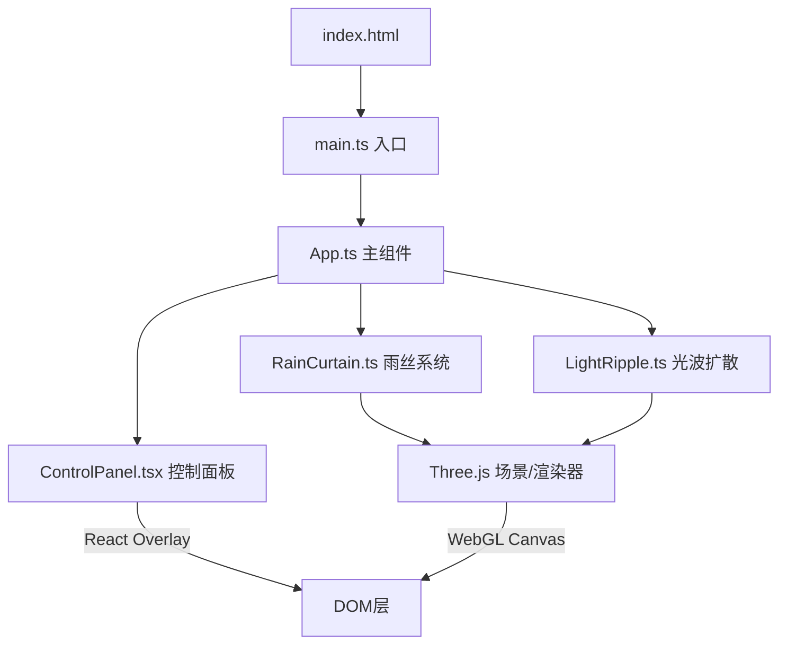

## 1. 架构设计



## 2. 技术说明

- 前端框架：React 18 + TypeScript
- 3D引擎：Three.js（直接使用，非@react-three/fiber）
- 构建工具：Vite + @vitejs/plugin-react
- 状态管理：组件内部state + 事件回调
- 初始化工具：Vite

### 核心依赖

| 依赖 | 版本 | 用途 |
|------|------|------|
| three | ^0.170.0 | 3D渲染引擎 |
| @types/three | ^0.170.0 | Three.js类型定义 |
| react | ^18.3.0 | UI框架（控制面板） |
| react-dom | ^18.3.0 | React DOM渲染 |
| @types/react | ^18.3.0 | React类型定义 |
| @types/react-dom | ^18.3.0 | ReactDOM类型定义 |
| vite | ^6.0.0 | 构建工具 |
| @vitejs/plugin-react | ^4.3.0 | Vite React插件 |
| typescript | ^5.6.0 | TypeScript编译器 |

## 3. 路由定义

本项目为单页面3D可视化应用，无路由需求。

## 4. 文件结构

```
项目根目录/
├── index.html              # 入口HTML
├── package.json            # 依赖配置
├── tsconfig.json           # TypeScript配置
├── vite.config.js          # Vite配置
└── src/
    ├── main.ts             # 入口：初始化场景、相机、渲染器
    ├── App.ts              # 主组件：管理场景状态和交互逻辑
    ├── RainCurtain.ts      # 雨丝系统：生成/更新雨丝、闪烁、溅射
    ├── LightRipple.ts      # 光波扩散：双击触发的椭圆光波动画
    └── ControlPanel.tsx    # React组件：控制面板UI和事件处理
```

## 5. 核心技术方案

### 5.1 雨丝系统 (RainCurtain)

- 使用 `THREE.InstancedMesh` 渲染数千条雨丝，每个instance对应一条雨丝
- 自定义ShaderMaterial实现：群青→湖蓝渐变、半透明、闪烁效果
- 顶点着色器：处理每条雨丝的位置、下落动画、飘移偏移
- 片元着色器：颜色渐变、透明度、闪烁亮度变化
- 溅射效果：使用独立粒子系统(Points)模拟触底光滴

### 5.2 光波扩散 (LightRipple)

- 使用 `THREE.ShaderMaterial` 的环形网格(RingGeometry)
- 椭圆形扩散通过顶点着色器缩放实现
- 推动雨丝弯曲：在RainCurtain中检测光波范围，施加偏移力

### 5.3 交互系统

- OrbitControls：鼠标拖拽旋转、滚轮缩放
- Raycaster：检测点击位置，映射到3D空间坐标
- 点击加速：记录点击位置和时间，2秒内对附近雨丝施加速度倍增
- 双击光波：在点击位置创建LightRipple实例

### 5.4 控制面板

- React组件覆盖在Three.js画布上方
- 毛玻璃效果：`backdrop-filter: blur(12px)` + 半透明背景
- 事件通过回调函数传递到App.ts

### 5.5 性能优化

- InstancedMesh减少draw call
- 自定义着色器避免CPU端逐帧更新geometry
- 对象池复用溅射粒子
- requestAnimationFrame驱动动画循环
- 目标：60fps稳定运行
