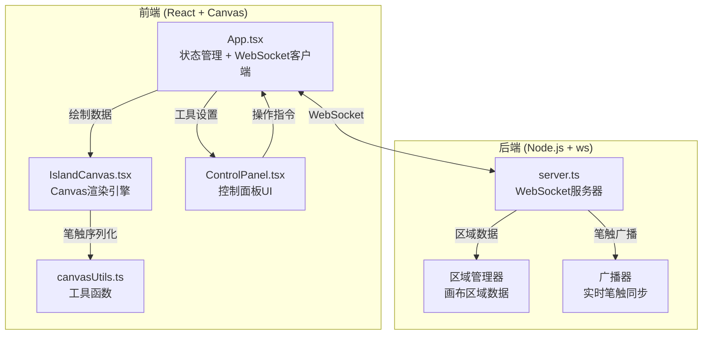
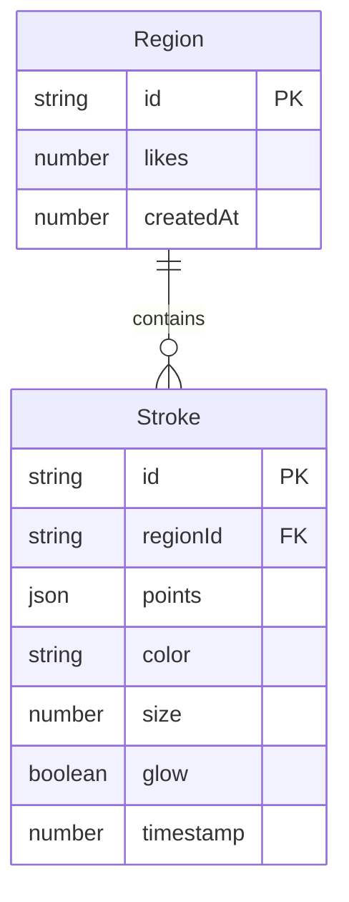

## 1. 架构设计



## 2. 技术说明
- 前端：React@18 + TypeScript + Vite
- 初始化工具：Vite
- 后端：Node.js + ws（WebSocket服务端）
- 数据库：无持久化数据库，内存中管理画布区域数据
- 实时通信：WebSocket（ws库）
- 画布渲染：HTML5 Canvas 2D API + requestAnimationFrame

## 3. 路由定义
| 路由 | 用途 |
|------|------|
| / | 画布主页面（单页应用，无前端路由） |

## 4. API定义

### 4.1 WebSocket消息类型

```typescript
type WSMessage =
  | { type: "stroke"; payload: StrokeData }
  | { type: "discover"; payload: { fromRegion: string } }
  | { type: "like"; payload: { regionId: string } }
  | { type: "online_count"; payload: { count: number } }
  | { type: "activity"; payload: ActivityItem }
  | { type: "region_data"; payload: RegionData }
  | { type: "init"; payload: { regionId: string; strokes: StrokeData[]; likes: number } }

interface StrokeData {
  id: string
  regionId: string
  points: { x: number; y: number }[]
  color: string
  size: number
  glow: boolean
  timestamp: number
}

interface ActivityItem {
  userTag: string
  description: string
  timestamp: number
}

interface RegionData {
  id: string
  strokes: StrokeData[]
  likes: number
}
```

### 4.2 REST API
无REST API，所有通信通过WebSocket完成。

## 5. 服务端架构图

```mermaid
flowchart LR
    "WebSocket连接" --> "消息路由器"
    "消息路由器" --> "区域管理器"
    "消息路由器" --> "广播器"
    "区域管理器" --> "内存区域存储"
    "广播器" --> "在线用户列表"
```

## 6. 数据模型

### 6.1 数据模型定义



### 6.2 数据定义语言
本项目使用内存数据结构，无持久化DDL。区域与笔触数据在服务端以Map存储，服务重启后数据清空。

## 7. 文件结构

```
├── index.html
├── package.json
├── tsconfig.json
├── vite.config.js
├── server.ts
└── src/
    ├── main.tsx
    ├── App.tsx
    ├── IslandCanvas.tsx
    ├── ControlPanel.tsx
    └── utils/
        └── canvasUtils.ts
```
