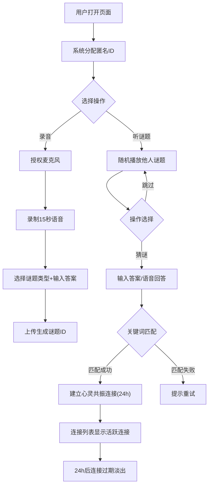

## 1. 产品概述

「谜境电台」是一个匿名语音谜题社交平台——用户录制15秒以内的语音谜题，系统随机将谜题播给另一位匿名用户，接收者猜测答案后若匹配成功则双方建立限时24小时的「心灵共振」连接。无需注册，开箱即玩，复古收音机风格营造沉浸式神秘氛围。

- 目标用户：喜爱声音社交、匿名互动、轻量猜谜游戏的年轻用户
- 核心价值：用声音建立陌生人之间短暂而神秘的连接，创造"被一个陌生人的声音触动"的独特体验

## 2. 核心功能

### 2.1 用户角色

| 角色 | 注册方式 | 核心权限 |
|------|----------|----------|
| 匿名用户 | 无需注册，浏览器自动分配匿名ID | 录音提交谜题、猜谜、查看连接列表 |

### 2.2 功能模块

1. **首页（谜题电台）**：录音提交入口、随机谜题播放、猜谜/跳过操作
2. **猜谜页**：文字答案输入、可选语音回答、匹配结果反馈
3. **连接列表页**：历史谜题记录、活跃心灵共振倒计时、过期连接淡出动画

### 2.3 页面详情

| 页面名称 | 模块名称 | 功能描述 |
|----------|----------|----------|
| 首页 | 录音面板 | 浏览器麦克风权限获取，15秒限时录音，录音波形动画，录音完成后自动上传生成匿名谜题ID |
| 首页 | 谜题播放器 | 随机展示他人谜题，显示谜题类型标签（歌词/梦境/模仿/其他）和发布时间，播放时指针摆动动画 |
| 首页 | 操作按钮 | "猜谜"进入猜谜流程，"跳过"随机获取下一个谜题 |
| 猜谜页 | 答案输入区 | 文字输入框 + 可选语音回答按钮，提交后系统关键词模糊匹配 |
| 猜谜页 | 匹配结果 | 猜对弹出「心灵共振」成功动画，猜错显示提示可重试 |
| 连接列表页 | 活跃连接 | 显示当前所有活跃心灵共振，倒计时显示剩余时间，过期后淡出动画 |
| 连接列表页 | 历史记录 | 自己发布的和猜过的谜题记录列表，支持滚动浏览 |

## 3. 核心流程

**用户录音流程**：打开首页 → 授权麦克风 → 点击录音 → 15秒内完成 → 选择谜题类型 → 输入答案关键词 → 上传 → 获得谜题ID

**猜谜流程**：首页随机播放谜题 → 点击猜谜 → 输入答案/语音回答 → 提交 → 系统模糊匹配 → 匹配成功建立连接 / 匹配失败提示重试

**连接管理流程**：猜对后自动建立24h连接 → 连接列表显示活跃连接 → 倒计时归零 → 连接淡出消失

## 4. 用户界面设计

### 4.1 设计风格

- **主色调**：暖棕（#5C3A21）、暗金（#B8860B）、米白（#F5F0E8）、深木色（#3E2723）
- **辅助色**：铜绿（#4A6741）、暖橙（#D2691E）、烟灰（#696969）
- **按钮风格**：圆角矩形 + 浮雕效果（box-shadow模拟3D凸起），悬停时微弱发光+上浮阴影
- **字体**：标题用衬线字体（Playfair Display），正文用等宽复古字体（Courier Prime），中文用思源宋体
- **布局风格**：居中卡片式布局，收音机外壳造型，金属旋钮装饰元素
- **动画**：播放/录音时模拟收音机指针摆动，页面切换渐变过渡，连接过期淡出动画

### 4.2 页面设计概览

| 页面名称 | 模块名称 | UI元素 |
|----------|----------|--------|
| 首页 | 收音机外壳 | 深棕色木质纹理背景，圆角矩形主面板，顶部金属旋钮装饰，频率刻度盘动画 |
| 首页 | 录音面板 | 红色圆形录音按钮（模拟REC指示灯），波形可视化条，15秒倒计时弧形进度条 |
| 首页 | 谜题播放器 | 黑胶唱片样式播放区域，指针从左侧摆动到右侧动画，谜题类型标签徽章 |
| 猜谜页 | 答案输入区 | 复古打字机风格输入框，米白底色+棕色边框，语音按钮为麦克风图标+铜色 |
| 猜谜页 | 匹配结果 | 成功：金色光晕扩散动画 + "心灵共振"文字浮现；失败：指针抖动 + 温馨提示 |
| 连接列表页 | 活跃连接卡片 | 暖棕卡片，金色倒计时数字，进度条渐变（绿→黄→红），过期时透明度渐变淡出 |
| 连接列表页 | 历史记录列表 | 紧凑列表项，左侧谜题类型色条，右侧发布时间，滚动时平滑 |

### 4.3 响应式设计

- 桌面优先设计，最大宽度1200px居中
- 移动端适配：收音机面板全宽，按钮触控友好（最小44px），滚动区域固定高度
- 触屏优化：录音按钮加大，滑动切换谜题

### 4.4 3D场景指导

不适用，本项目为2D复古风格界面。
