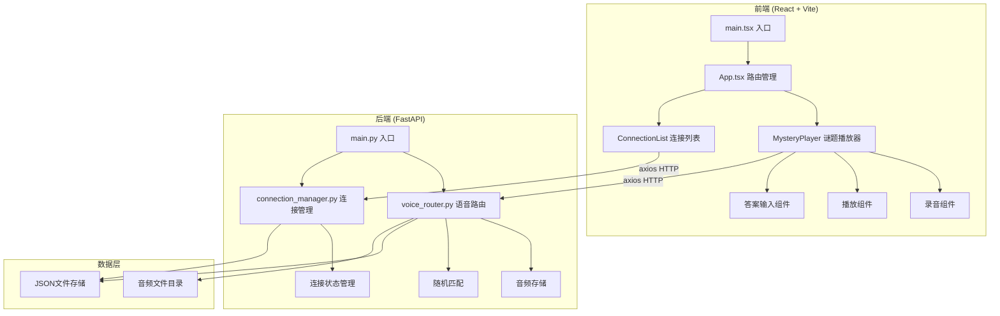
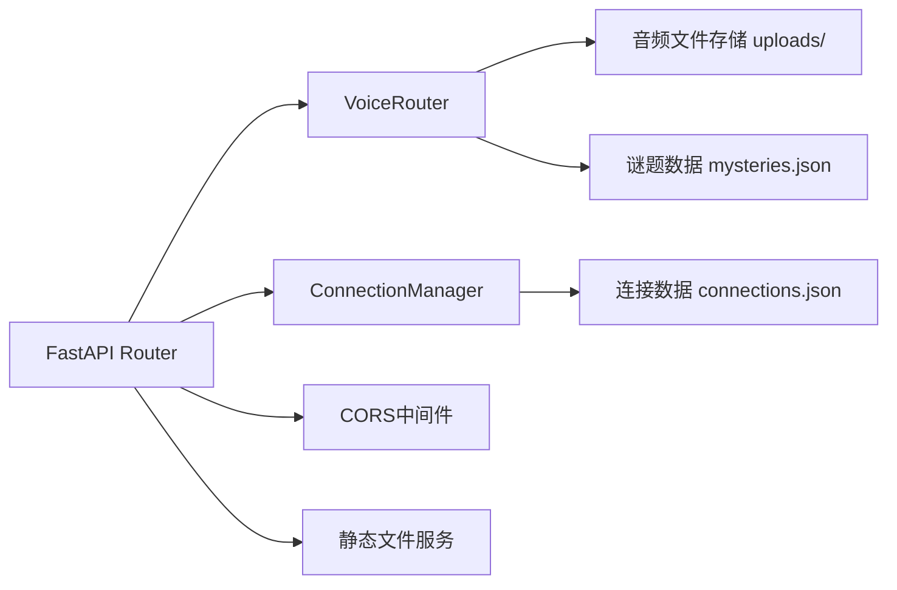
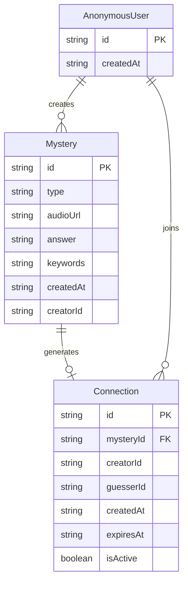

## 1. 架构设计



## 2. 技术说明

- **前端**：React@18 + TypeScript + Vite + Tailwind CSS + Zustand（状态管理）
- **初始化工具**：vite-init（react-ts模板）
- **后端**：FastAPI@0.100+（Python 3.10+）
- **数据库**：JSON文件存储（轻量级demo，无需数据库服务）
- **音频处理**：Web Audio API（前端录音/播放），MediaRecorder API（前端录音）
- **HTTP客户端**：axios

## 3. 路由定义

| 路由 | 用途 |
|------|------|
| `/` | 首页：录音提交 + 随机谜题播放 |
| `/guess/:id` | 猜谜页：指定谜题ID的猜谜界面 |
| `/connections` | 连接列表页：历史记录和活跃连接 |

## 4. API定义

### 4.1 语音谜题相关

```typescript
interface Mystery {
  id: string;
  type: "lyrics" | "dream" | "imitate" | "other";
  audioUrl: string;
  answer: string;
  keywords: string[];
  createdAt: string;
  creatorId: string;
}

interface CreateMysteryRequest {
  type: "lyrics" | "dream" | "imitate" | "other";
  answer: string;
  keywords: string[];
  audioBlob: Blob;
}

interface CreateMysteryResponse {
  id: string;
  type: string;
  createdAt: string;
}

// POST /api/mysteries - 上传新谜题（multipart: audio + JSON metadata）
// GET /api/mysteries/random - 获取随机谜题（不含答案）
// GET /api/mysteries/:id/audio - 获取谜题音频文件
```

### 4.2 猜谜相关

```typescript
interface GuessRequest {
  mysteryId: string;
  answer: string;
  guesserId: string;
}

interface GuessResponse {
  correct: boolean;
  connectionId?: string;
  remainingAttempts?: number;
  hint?: string;
}

// POST /api/guess - 提交猜谜答案
```

### 4.3 连接相关

```typescript
interface Connection {
  id: string;
  mysteryId: string;
  creatorId: string;
  guesserId: string;
  createdAt: string;
  expiresAt: string;
  isActive: boolean;
}

interface ConnectionListResponse {
  connections: Connection[];
  published: Mystery[];
  guessed: { mystery: Mystery; correct: boolean }[];
}

// GET /api/connections/:userId - 获取用户连接列表
```

### 4.4 用户相关

```typescript
interface AnonymousUser {
  id: string;
  createdAt: string;
}

// GET /api/users/anonymous - 获取/创建匿名用户ID
```

## 5. 服务器架构图



## 6. 数据模型

### 6.1 数据模型定义



### 6.2 数据存储说明

本项目使用JSON文件作为轻量级存储方案：
- `server/data/mysteries.json` — 存储所有谜题数据
- `server/data/connections.json` — 存储所有连接数据
- `server/data/users.json` — 存储匿名用户数据
- `server/uploads/` — 存储上传的音频文件（WebM格式）

启动时自动创建数据目录和文件，无需手动初始化。
