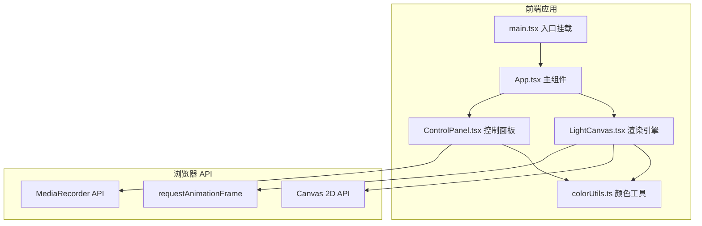

## 1. 架构设计



## 2. 技术说明

- **前端框架**：React 18 + TypeScript
- **构建工具**：Vite
- **样式方案**：CSS Modules + 内联样式（Canvas 应用以逻辑为主，UI 组件用内联样式实现毛玻璃效果）
- **状态管理**：React useState/useRef（轻量级应用无需 Redux）
- **动画引擎**：requestAnimationFrame 60fps 渲染循环
- **视频录制**：Canvas.captureStream() + MediaRecorder API
- **后端**：无（纯前端应用）
- **数据库**：无

## 3. 路由定义

| 路由 | 用途 |
|------|------|
| / | 主画布页面，包含全屏光影画布和控制面板 |

## 4. 核心数据结构

### 4.1 光痕（LightTrail）

```typescript
interface LightTrail {
  id: number;
  points: Array<{ x: number; y: number; speed: number; time: number }>;
  baseColor: { h: number; s: number; l: number };
  baseWidth: number;
  opacity: number;
  createdAt: number;
  decayRate: number;
}
```

### 4.2 粒子（Particle）

```typescript
interface Particle {
  x: number;
  y: number;
  vx: number;
  vy: number;
  life: number;
  maxLife: number;
  size: number;
  color: { h: number; s: number; l: number; a: number };
}
```

### 4.3 画笔设置（BrushSettings）

```typescript
interface BrushSettings {
  color: { h: number; s: number; l: number };
  size: number;
  decaySpeed: number;
}
```

## 5. 渲染流程

```mermaid
flowchart TD
    "requestAnimationFrame 回调" --> "清空画布（半透明黑色覆盖实现拖尾）"
    "清空画布" --> "遍历活跃光痕"
    "遍历活跃光痕" --> "绘制光痕路径（宽度/亮度随速度变化）"
    "绘制光痕路径" --> "生成新粒子"
    "生成新粒子" --> "更新粒子位置和生命值"
    "更新粒子位置和生命值" --> "绘制粒子"
    "绘制粒子" --> "衰减光痕透明度和宽度"
    "衰减光痕透明度和宽度" --> "移除已消亡的光痕和粒子"
    "移除已消亡的光痕和粒子" --> "下一帧"
```

## 6. 性能策略

- **双 Canvas 分层**：可选方案，将光痕和粒子分别渲染到不同 Canvas，减少重绘范围
- **对象池**：粒子使用对象池复用，避免频繁 GC
- **增量渲染**：仅渲染当前帧变化的部分，非全量重绘
- **衰减清理**：及时移除透明度为 0 的光痕和生命值为 0 的粒子
- **帧率监控**：开发模式下显示 FPS 计数器
