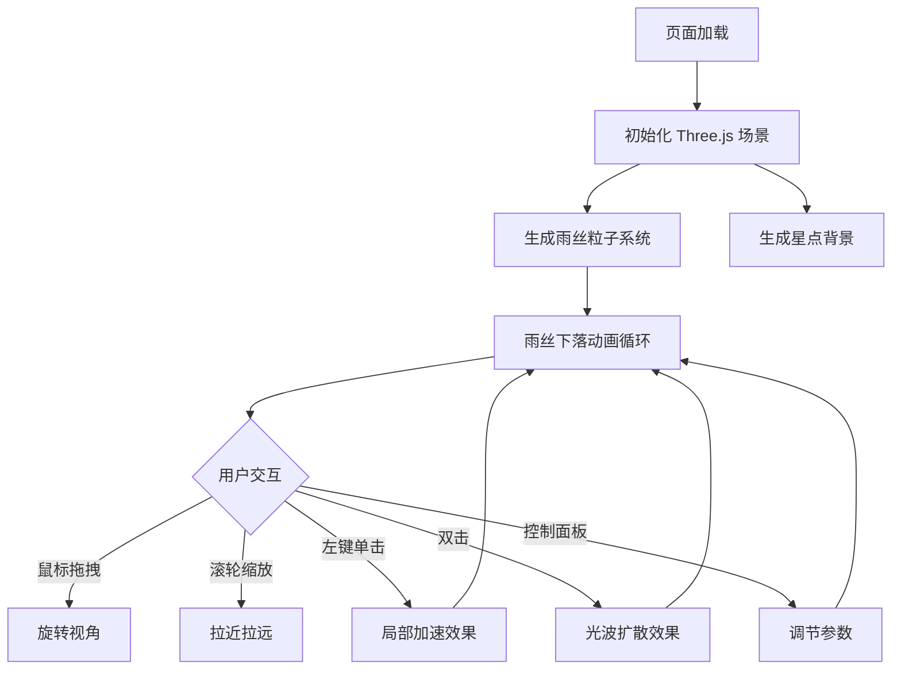

## 1. 产品概述

「流光织雨」是一款基于 Three.js 的 3D 交互可视化项目，在黑暗空间中模拟由无数发光雨丝编织成的动态光影森林。用户可通过鼠标交互与雨幕产生丰富的视觉反馈，体验梦幻冷光系沉浸式场景。

- 目标用户：视觉艺术爱好者、交互设计从业者、前端技术探索者
- 核心价值：提供极具视觉冲击力的实时 3D 交互体验，展示 WebGL 粒子系统与光效渲染的技术艺术融合

## 2. 核心功能

### 2.1 功能模块

1. **3D 雨幕场景页**：发光雨丝系统、光波扩散效果、星点背景、交互控制面板

### 2.2 页面详情

| 页面名称 | 模块名称 | 功能描述 |
|----------|----------|----------|
| 3D 雨幕场景 | 雨丝系统 | 数千条半透明发光雨丝从顶部垂直下落，群青到湖蓝渐变色，带闪烁和飘移效果，触底溅射光滴 |
| 3D 雨幕场景 | 光波扩散 | 双击触发椭圆形光波，推动周围雨丝向外弯曲并短暂闪烁 |
| 3D 雨幕场景 | 局部加速 | 左键单击触发点击点周围雨丝瞬间变亮且速度翻倍，持续2秒恢复 |
| 3D 雨幕场景 | 视角控制 | 鼠标拖拽旋转视角，滚轮缩放远近 |
| 3D 雨幕场景 | 控制面板 | 毛玻璃面板：雨丝密度滑块、亮暗主题切换、暂停/继续按钮 |
| 3D 雨幕场景 | 星点背景 | 深黑背景上微弱的星点粒子 |

## 3. 核心流程

用户进入页面后，沉浸在黑暗空间中的发光雨幕场景。可通过鼠标拖拽旋转视角，滚轮缩放。左键单击雨幕触发局部加速效果，双击空白区域触发光波扩散。左下角控制面板可调节雨丝密度、切换亮暗主题、暂停/继续动画。

## 4. 用户界面设计

### 4.1 设计风格

- **主色调**：群青（#1a237e）到湖蓝（#0097a7）渐变，深黑背景（#050510）
- **暖色调主题**：琥珀（#ff6f00）到橘红（#e65100）渐变，深褐背景（#1a0a00）
- **按钮风格**：圆角毛玻璃按钮，backdrop-filter: blur(12px)，悬停上浮2px + 阴影加深
- **字体**：无衬线字体，小字号（12-14px），白色/浅蓝色文字，高对比度
- **布局风格**：全屏 3D 场景，左下角浮动控制面板
- **图标风格**：线性简约图标，细线条，半透明发光

### 4.2 页面设计概览

| 页面名称 | 模块名称 | UI 元素 |
|----------|----------|---------|
| 3D 雨幕场景 | 全屏 Canvas | 深黑背景，微弱星点，发光雨丝 |
| 3D 雨幕场景 | 控制面板 | 毛玻璃容器，滑块、切换按钮、暂停按钮，左下角固定定位 |
| 3D 雨幕场景 | 交互反馈 | 点击处亮光脉冲，双击处椭圆光波，雨丝弯曲变形 |

### 4.3 响应式

- 桌面优先设计，Canvas 自适应窗口大小
- 控制面板在移动端缩小并调整布局

### 4.4 3D 场景指导

- **环境/氛围**：深黑空间，微弱星点，无环境光，仅靠发光雨丝照亮场景
- **光照设置**：无传统光源，雨丝使用自发光材质（MeshBasicMaterial / ShaderMaterial），底部溅射光点发光
- **相机设置**：PerspectiveCamera，FOV 60°，初始位置 (0, 5, 20)，看向原点
- **构图与焦点**：雨丝垂直下落形成雨幕森林感，纵深分布增强空间感
- **交互与动画**：OrbitControls 旋转/缩放，点击/双击事件触发粒子行为变化
- **后处理效果**：无额外后处理，通过材质透明度和自发光实现视觉效果
- **性能预算**：60fps，雨丝数量 2000-5000，使用 BufferGeometry + Points 实例化渲染
