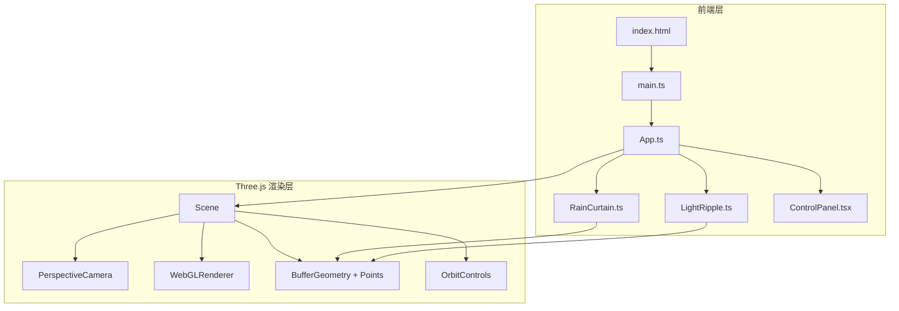

## 1. 架构设计



## 2. 技术说明

- **前端框架**：React 18 + TypeScript + Three.js
- **构建工具**：Vite（使用 @vitejs/plugin-react）
- **3D 渲染**：Three.js + @types/three
- **相机控制**：Three.js OrbitControls
- **粒子系统**：BufferGeometry + Points + ShaderMaterial（自定义着色器实现渐变、闪烁、飘移）
- **状态管理**：React useState/useRef，无额外状态库
- **样式方案**：内联样式 + CSS-in-JS（控制面板毛玻璃效果）

## 3. 路由定义

| 路由 | 用途 |
|------|------|
| / | 全屏 3D 雨幕场景 |

## 4. 文件结构

```
├── index.html
├── package.json
├── tsconfig.json
├── vite.config.js
└── src/
    ├── main.ts          # 入口：初始化场景、相机、渲染器，挂载 React 控制面板
    ├── App.ts           # 主组件：管理场景状态和交互逻辑
    ├── RainCurtain.ts   # 雨丝系统：生成和更新发光雨丝
    ├── LightRipple.ts   # 光波扩散效果
    └── ControlPanel.tsx # React 控制面板组件
```

## 5. 核心模块设计

### 5.1 RainCurtain（雨丝系统）

- **渲染方式**：BufferGeometry + Points，每个 Point 代表一条雨丝的头部
- **属性**：位置（x, y, z）、下落速度、颜色（群青→湖蓝渐变）、透明度、闪烁相位、飘移偏移
- **着色器**：
  - Vertex Shader：根据位置计算颜色渐变、闪烁和飘移偏移
  - Fragment Shader：绘制发光椭圆形状（雨丝形态），半透明带光晕
- **溅射**：雨丝触底时在底部生成短暂存在的光点粒子
- **性能**：使用 BufferAttribute 批量更新，避免逐个创建 Mesh

### 5.2 LightRipple（光波扩散）

- **渲染方式**：独立的 BufferGeometry + Points 或 RingGeometry
- **行为**：双击时从点击点生成椭圆形光波，向外扩散并推动附近雨丝
- **影响范围**：通过距离检测影响周围雨丝的位置偏移
- **生命周期**：光波扩散到最大范围后淡出消失

### 5.3 App（主组件）

- **职责**：初始化 Three.js 场景，管理动画循环，处理鼠标事件
- **交互**：
  - mousedown/mousemove/mouseup：OrbitControls 旋转
  - wheel：缩放
  - click：局部加速（Raycaster 检测点击位置，影响半径内雨丝）
  - dblclick：光波扩散（在点击位置生成 LightRipple）
- **状态**：主题（冷/暖）、暂停/继续、雨丝密度

### 5.4 ControlPanel（控制面板）

- **技术**：React 组件，通过 ReactDOM.createRoot 挂载到独立容器
- **UI**：
  - 雨丝密度滑块（range input）
  - 亮暗主题切换按钮
  - 暂停/继续按钮
- **样式**：毛玻璃效果（backdrop-filter: blur(12px)），悬停上浮动画
