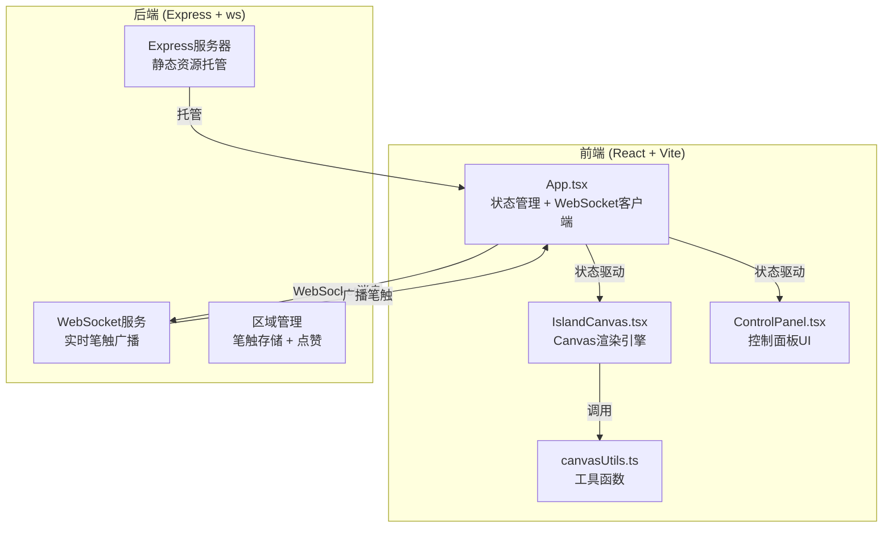
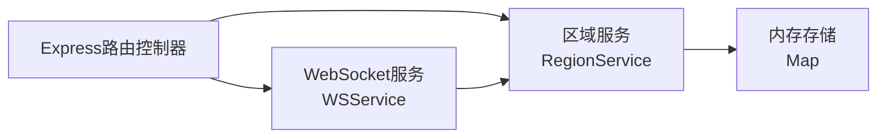
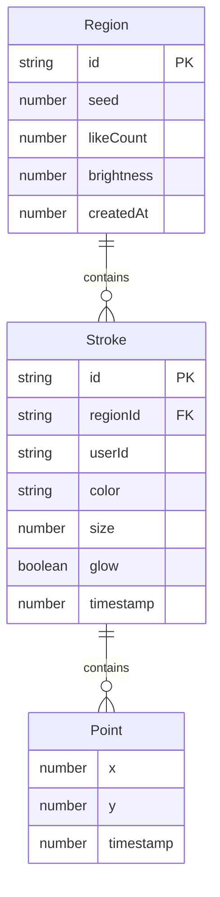

## 1. 架构设计



## 2. 技术说明

- 前端：React@18 + TypeScript + Vite + Tailwind CSS + Zustand
- 初始化工具：vite-init（react-express-ts 模板）
- 后端：Express@4 + ws（WebSocket服务端）
- 数据库：内存存储（Map结构，无需持久化数据库）
- 实时通信：WebSocket（ws库），笔触消息即时广播

## 3. 路由定义

| 路由 | 用途 |
|------|------|
| / | 主页面，全屏画布应用 |
| /api/strokes/:regionId | GET 获取某区域笔触数据 |
| /api/regions/:regionId/like | POST 对某区域点赞 |

## 4. API定义

### 4.1 WebSocket消息类型

```typescript
type WSMessage =
  | { type: 'stroke'; payload: { regionId: string; points: Point[]; color: string; size: number; glow: boolean; userId: string } }
  | { type: 'discover'; payload: { regionId: string } }
  | { type: 'like'; payload: { regionId: string } }
  | { type: 'online_count'; payload: { count: number } }
  | { type: 'activity'; payload: { text: string; timestamp: number } }
  | { type: 'region_update'; payload: { regionId: string; likeCount: number; brightness: number } }

interface Point {
  x: number;
  y: number;
  timestamp: number;
}
```

### 4.2 REST API

```typescript
// GET /api/strokes/:regionId
interface StrokesResponse {
  regionId: string;
  strokes: StrokeData[];
}

// POST /api/regions/:regionId/like
interface LikeResponse {
  regionId: string;
  likeCount: number;
  brightness: number;
}

interface StrokeData {
  id: string;
  points: Point[];
  color: string;
  size: number;
  glow: boolean;
  userId: string;
  timestamp: number;
}
```

## 5. 服务端架构图



## 6. 数据模型

### 6.1 数据模型定义



### 6.2 内存数据结构

```typescript
interface Region {
  id: string;
  seed: number;
  likeCount: number;
  brightness: number;
  createdAt: number;
  strokes: StrokeData[];
}
```
