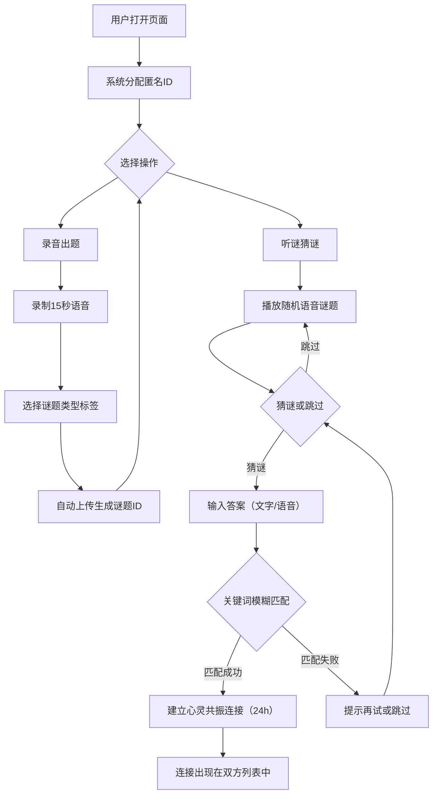

## 1. 产品概述

「谜境电台」是一个匿名语音谜题社交平台，用户通过提交15秒内的语音谜题与他人建立"心灵共振"连接。核心玩法：录音出题 → 随机匹配听谜 → 猜对建立24小时连接，让陌生人通过声音和想象力产生短暂而神秘的联结。

- 目标用户：喜欢创意表达、寻求新奇社交体验的年轻用户
- 核心价值：用声音打破社交壁垒，创造一次性的匿名心灵碰撞

## 2. 核心功能

### 2.1 用户角色

| 角色 | 注册方式 | 核心权限 |
|------|----------|----------|
| 匿名用户 | 无需注册，打开即用 | 录音出题、听谜猜谜、查看连接列表 |

### 2.2 功能模块

1. **首页**：随机语音谜题播放、录音出题入口、谜题类型标签
2. **猜谜页**：语音播放、文字/语音回答、答案比对
3. **连接列表页**：历史谜题记录、心灵共振倒计时、过期淡出动画

### 2.3 页面详情

| 页面名称 | 模块名称 | 功能描述 |
|----------|----------|----------|
| 首页 | 谜题播放器 | 随机展示他人语音谜题，显示类型标签和发布时间，提供"猜谜"和"跳过"按钮 |
| 首页 | 录音出题 | 点击录音按钮开始15秒录音，自动上传生成匿名谜题ID，可选谜题类型标签 |
| 猜谜页 | 答案输入 | 文字输入框+可选语音回答按钮，提交后系统关键词模糊匹配 |
| 猜谜页 | 匹配结果 | 猜对显示"心灵共振"建立动画，猜错提示再试或跳过 |
| 连接列表页 | 活跃连接 | 显示当前所有"心灵共振"连接及剩余倒计时，过期自动淡出 |
| 连接列表页 | 历史记录 | 展示自己发布和猜过的所有谜题记录，包含出题者/猜谜者视角 |

## 3. 核心流程

用户打开页面后，系统分配匿名ID并随机推送一条语音谜题。用户可以：选择"猜谜"进入答题，或"跳过"获取下一条。猜对后双方建立24小时"心灵共振"连接。用户也可随时录音出题，等待他人来猜。

## 4. 用户界面设计

### 4.1 设计风格

- **主色调**：暖棕（#5C3D2E）、暗金（#B8860B）、米白（#F5F0E8）
- **辅助色**：深棕（#3E2723）用于背景、铜色（#CD7F32）用于交互高亮
- **按钮风格**：圆角矩形+浮雕效果，hover时微弱发光和上浮阴影
- **字体**：标题使用衬线体（Playfair Display），正文使用等宽/复古无衬线体（Special Elite）
- **布局风格**：居中卡片式，模拟收音机面板布局
- **图标风格**：复古金属质感图标，旋钮和指针元素

### 4.2 页面设计概述

| 页面名称 | 模块名称 | UI元素 |
|----------|----------|--------|
| 首页 | 谜题播放器 | 深棕木质纹理背景卡片，模拟收音机调频面板，中央指针摆动动画，圆角浮雕按钮，谜题类型标签为铜色小徽章 |
| 首页 | 录音出题 | 圆形金属质感录音按钮，录音时脉冲波纹动画，15秒进度弧线，类型标签选择器 |
| 猜谜页 | 答案输入 | 米白输入框配铜色边框，语音回答按钮为复古麦克风图标，提交按钮带浮雕效果 |
| 猜谜页 | 匹配结果 | 成功时全屏暖光渐变+脉冲扩散动画，失败时指针晃动+暗色闪烁 |
| 连接列表页 | 活跃连接 | 铜色边框卡片，倒计时数字使用等宽字体，过期时卡片缩小淡出动画 |
| 连接列表页 | 历史记录 | 木质纹理卡片列表，滚动平滑，每条记录左侧有谜题类型图标 |

### 4.3 响应式设计

- 桌面优先设计，最大内容宽度960px居中
- 移动端自适应：卡片宽度100%，按钮触控友好（最小44px触控区）
- 列表页移动端单列布局，桌面端可双列

### 4.4 动效设计

- 页面切换：渐变淡入淡出过渡（300ms）
- 播放/录音：模拟收音机指针摆动动画（CSS keyframe）
- 按钮hover：微弱金色发光+上浮2px阴影
- 连接过期：卡片缩小至0.8+透明度渐变为0（1s ease-out）
- 录音脉冲：从中心扩散的圆环波纹（0.6s循环）
