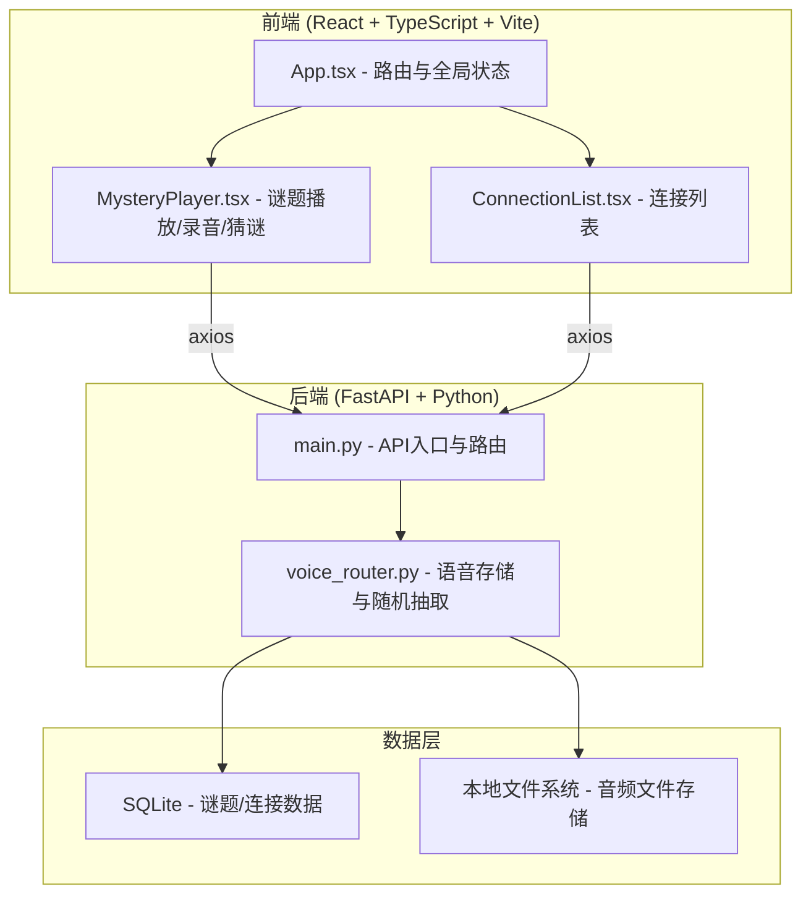
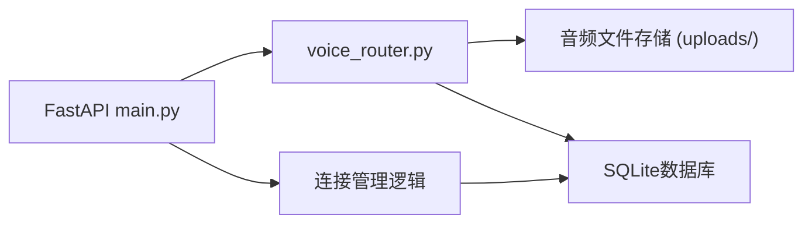
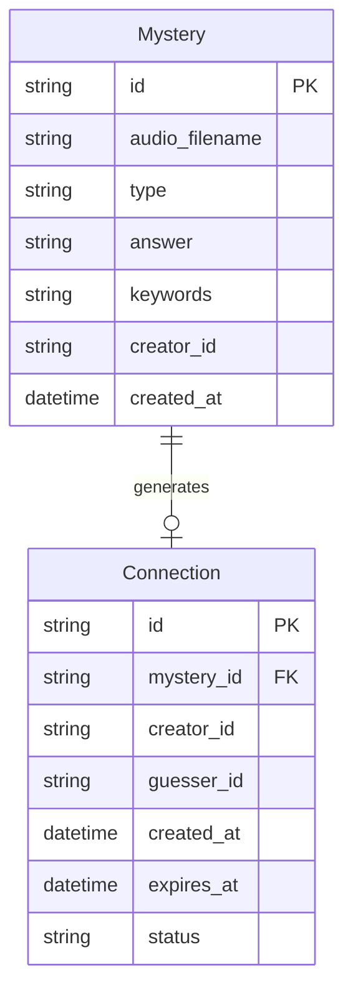

## 1. 架构设计



## 2. 技术说明

- **前端**：React@18 + TypeScript + Vite + Tailwind CSS + Zustand
- **初始化工具**：vite-init（react-ts模板）
- **后端**：FastAPI (Python 3.10+) + uvicorn
- **数据库**：SQLite（轻量本地存储，无需额外服务）
- **音频处理**：浏览器 MediaRecorder API（录音），Web Audio API（播放）
- **状态管理**：Zustand

## 3. 路由定义

| 路由 | 用途 |
|------|------|
| `/` | 首页：随机谜题播放 + 录音出题入口 |
| `/guess/:id` | 猜谜页：播放指定谜题并输入答案 |
| `/connections` | 连接列表页：心灵共振记录与倒计时 |

## 4. API 定义

### 4.1 数据类型

```typescript
interface Mystery {
  id: string
  audio_url: string
  type: "lyrics" | "dream" | "sound" | "other"
  answer: string
  keywords: string[]
  created_at: string
  creator_id: string
}

interface Connection {
  id: string
  mystery_id: string
  creator_id: string
  guesser_id: string
  created_at: string
  expires_at: string
  status: "active" | "expired"
}

interface GuessRequest {
  mystery_id: string
  answer: string
  guesser_id: string
}

interface GuessResponse {
  correct: boolean
  connection?: Connection
  hint?: string
}
```

### 4.2 接口列表

| 方法 | 路径 | 请求体 | 响应 | 说明 |
|------|------|--------|------|------|
| POST | `/api/mysteries` | FormData(audio + type + answer + keywords) | Mystery | 上传语音谜题 |
| GET | `/api/mysteries/random` | - | Mystery | 获取随机谜题 |
| POST | `/api/guess` | GuessRequest | GuessResponse | 提交猜谜答案 |
| GET | `/api/connections` | ?user_id=xxx | Connection[] | 获取用户连接列表 |
| GET | `/api/audio/{filename}` | - | audio/wav | 获取音频文件 |

## 5. 服务器架构图



## 6. 数据模型

### 6.1 数据模型定义



### 6.2 数据定义语言

```sql
CREATE TABLE mysteries (
    id TEXT PRIMARY KEY,
    audio_filename TEXT NOT NULL,
    type TEXT NOT NULL CHECK(type IN ('lyrics', 'dream', 'sound', 'other')),
    answer TEXT NOT NULL,
    keywords TEXT NOT NULL,
    creator_id TEXT NOT NULL,
    created_at DATETIME DEFAULT CURRENT_TIMESTAMP
);

CREATE TABLE connections (
    id TEXT PRIMARY KEY,
    mystery_id TEXT NOT NULL REFERENCES mysteries(id),
    creator_id TEXT NOT NULL,
    guesser_id TEXT NOT NULL,
    created_at DATETIME DEFAULT CURRENT_TIMESTAMP,
    expires_at DATETIME NOT NULL,
    status TEXT DEFAULT 'active' CHECK(status IN ('active', 'expired'))
);

CREATE INDEX idx_mysteries_type ON mysteries(type);
CREATE INDEX idx_connections_creator ON connections(creator_id);
CREATE INDEX idx_connections_guesser ON connections(guesser_id);
CREATE INDEX idx_connections_status ON connections(status);
```
