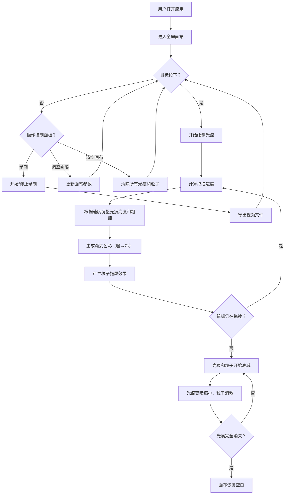

## 1. 产品概述

「浮光绘影」是一款交互式光影绘画Web应用，用户可以在虚拟画布上通过鼠标拖拽生成动态光痕，光痕随时间缓慢衰减消失，拖拽速度越快光痕越亮越粗，并带有渐变色彩和粒子拖尾效果。
- 面向创意爱好者、数字艺术创作者，提供沉浸式的光影绘画体验
- 核心价值：将抽象的光影交互转化为可感知的视觉艺术创作

## 2. 核心功能

### 2.1 用户角色
| 角色 | 注册方式 | 核心权限 |
|------|----------|----------|
| 普通用户 | 无需注册 | 使用全部绘画和导出功能 |

### 2.2 功能模块
1. **画布页面**: 全屏光影画布、鼠标拖拽绘制、动态光痕渲染、粒子系统、光痕衰减动画
2. **控制面板**: 画笔颜色选择器、画笔大小滑块、光痕衰减速度滑块、清空画布按钮、录制导出视频按钮

### 2.3 页面详情
| 页面名称 | 模块名称 | 功能描述 |
|----------|----------|----------|
| 画布页面 | 全屏Canvas | 支持鼠标拖拽绘制光痕，光痕颜色从暖色（红橙）渐变到冷色（蓝紫），速度越快光痕越亮越粗，停止后自动衰减消失 |
| 画布页面 | 粒子系统 | 光痕周围生成粒子拖尾效果，粒子随光痕衰减逐渐消散 |
| 画布页面 | 动画循环 | 60fps流畅动画循环，持续渲染光痕衰减和粒子消散 |
| 控制面板 | 画笔颜色选择器 | 选择光痕的基础色调 |
| 控制面板 | 画笔大小滑块 | 调节光痕粗细（1-50px） |
| 控制面板 | 衰减速度滑块 | 调节光痕消失速度（快/中/慢） |
| 控制面板 | 清空画布按钮 | 一键清除所有光痕和粒子 |
| 控制面板 | 录制按钮 | 录制画布操作，导出为视频文件 |

## 3. 核心流程

用户打开应用后，进入全屏暗色画布。鼠标按住并拖拽时，画布上生成动态光痕，光痕颜色随拖拽距离从暖色渐变到冷色，拖拽速度越快光痕越亮越粗，同时产生粒子拖尾。松开鼠标后，光痕和粒子开始自动衰减消失。用户可通过右下角控制面板调整画笔参数或清空画布，也可录制操作导出视频。

## 4. 用户界面设计

### 4.1 设计风格
- 主色调：深灰（#1a1a2e）到纯黑（#0a0a0f）渐变背景
- 强调色：暖橙（#ff6b35）和冷蓝紫（#7b68ee），用于光痕渐变
- 按钮风格：圆角、半透明毛玻璃效果、悬停时柔和光晕和微缩放动画
- 字体：JetBrains Mono（控制面板标签）+ Noto Sans SC（中文UI文字）
- 布局：画布占满主体，控制面板悬浮右下角
- 图标：Lucide Icons，细线条风格

### 4.2 页面设计概览
| 页面名称 | 模块名称 | UI元素 |
|----------|----------|--------|
| 画布页面 | 全屏Canvas | 深色渐变背景，画布占满视口，光痕辐射扩散，粒子飘散 |
| 画布页面 | 控制面板 | 半透明毛玻璃卡片，右下角悬浮，圆角12px，内含滑块和按钮 |
| 控制面板 | 颜色选择器 | 圆形色盘，选中色带光晕边框 |
| 控制面板 | 滑块 | 自定义样式，轨道半透明，滑块圆形带光晕 |
| 控制面板 | 清空按钮 | 圆角矩形，悬停变亮+微缩放 |
| 控制面板 | 录制按钮 | 红色圆形指示器+文字，录制中脉冲动画 |

### 4.3 响应式设计
- 桌面优先设计，画布自适应窗口大小
- 控制面板在小屏幕上可折叠收起
- 支持触摸设备的触摸绘画交互

### 4.4 动效设计
- 控制面板出现/消失：淡入淡出 + 轻微上浮
- 按钮悬停：柔和光晕扩散 + scale(1.05)微缩放
- 滑块悬停：轨道高亮，滑块光晕增强
- 录制中：红色指示器脉冲动画
- 光痕绘制：从中心向外辐射，颜色暖→冷渐变
- 光痕衰减：亮度递减、尺寸缩小、粒子飘散消散
