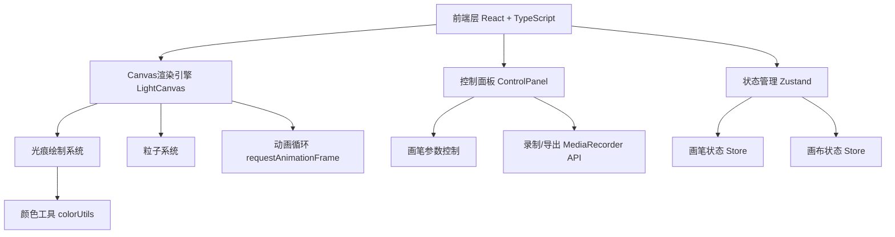

## 1. 架构设计



## 2. 技术说明
- 前端：React@18 + TypeScript + Vite + Tailwind CSS
- 初始化工具：vite-init（react-ts模板）
- 后端：无（纯前端应用）
- 数据库：无
- 状态管理：Zustand
- 视频录制：浏览器原生 MediaRecorder API + Canvas.captureStream()

## 3. 路由定义
| 路由 | 用途 |
|------|------|
| / | 单页面应用，包含画布和控制面板 |

## 4. 核心技术实现

### 4.1 Canvas渲染引擎
- 使用双层Canvas架构：底层绘制光痕轨迹，上层绘制粒子
- requestAnimationFrame驱动60fps动画循环
- 光痕存储为轨迹点数组，每帧更新衰减状态
- 粒子系统维护粒子池，每帧更新位置和透明度

### 4.2 光痕系统
- 轨迹点结构：`{ x, y, timestamp, speed, hue, opacity, size }`
- 速度计算：通过相邻两帧鼠标位移/时间差得出
- 亮度映射：速度越快 → opacity越高（0.3~1.0）
- 粗细映射：速度越快 → size越大（2~30px基础值 + 画笔大小）
- 颜色渐变：基于拖拽累计距离，hue从0°(红)渐变到270°(蓝紫)
- 衰减机制：每帧减少opacity和size，opacity归零后移除轨迹点

### 4.3 粒子系统
- 粒子结构：`{ x, y, vx, vy, life, maxLife, size, hue, opacity }`
- 每帧在活跃光痕点周围随机生成2-5个粒子
- 粒子沿随机方向扩散，速度0.5~2.0px/帧
- 粒子生命值递减，opacity = life/maxLife
- life归零后从粒子池移除

### 4.4 视频录制
- 使用Canvas.captureStream(60)获取60fps视频流
- MediaRecorder录制为webm格式
- 录制停止后生成Blob，创建下载链接

## 5. 文件结构
```
├── index.html
├── package.json
├── tsconfig.json
├── vite.config.ts
├── src/
│   ├── main.tsx          # 入口挂载React应用
│   ├── App.tsx           # 主组件管理画布状态和UI布局
│   ├── LightCanvas.tsx   # Canvas渲染引擎
│   ├── ControlPanel.tsx  # 控制面板组件
│   └── utils/
│       └── colorUtils.ts # 颜色渐变生成和HSL转换工具函数
```
