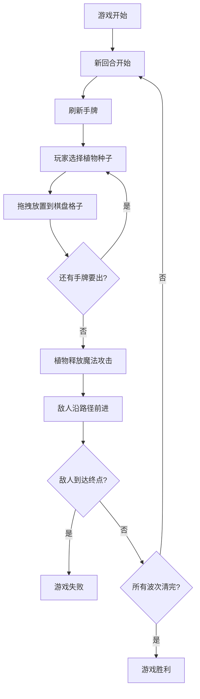

## 1. 产品概述

「四季之森」是一款2D回合制塔防游戏，玩家在森林地图上种植不同季节属性的魔法植物，抵御入侵的暗影生物。每个回合，玩家从手牌中选择植物种子种在预设格子中，植物释放对应季节的魔法攻击敌人。整体视觉走手绘童话风格，追求60fps流畅体验。

## 2. 核心功能

### 2.1 功能模块

1. **游戏棋盘页面**：Canvas渲染的森林地图，含路径、格子、植物、敌人和攻击特效
2. **手牌操作界面**：圆角卡片手牌组件，展示当前回合可选植物种子，支持拖拽放置
3. **回合系统**：回合判定、手牌刷新、敌人波次推进、胜负结算

### 2.2 页面详情

| 页面名称 | 模块名称 | 功能描述 |
|----------|----------|----------|
| 游戏棋盘 | Canvas棋盘 | 渲染森林背景渐变、路径、防塔格子（浮雕纹理）、植物（圆润卡通造型）、敌人（暗影剪影）、攻击特效（半透明发光粒子） |
| 游戏棋盘 | 路径交互点 | 水塘被冰晶冻结后变成冰面，让后续敌人滑行变向 |
| 手牌界面 | 卡片手牌 | 展示可选植物种子卡片，鼠标悬停微光扩散动画，拖拽放置到棋盘格子 |
| 游戏界面 | 回合控制 | 回合开始/结束、手牌刷新、敌人波次推进、胜负判定和结算 |

### 2.3 植物系统

| 季节属性 | 植物名称 | 技能效果 | 攻击特效 |
|----------|----------|----------|----------|
| 春 | 春日藤蔓 | 缠绕减速，降低敌人移动速度50% | 绿色藤蔓粒子扩散 |
| 夏 | 夏日火花 | 灼烧范围伤害，对周围格子敌人造成AOE | 红橙色火花粒子爆裂 |
| 秋 | 秋日落叶 | 护盾吸收伤害，为周围植物提供护盾 | 金黄色落叶粒子旋绕 |
| 冬 | 冬日冰晶 | 冻结路径，冰冻交互点变冰面 | 冰蓝色冰晶粒子凝结 |

## 3. 核心流程

玩家进入游戏后，每回合从手牌中选择一种植物种子拖拽放置到棋盘格子中。放置后植物自动攻击路径上的敌人。敌人沿固定路径前进，经过冰面交互点时会滑行变向。每回合结束后刷新手牌并推进下一波敌人。当敌人突破防线到达终点则游戏失败，消灭所有波次敌人则胜利。

## 4. 用户界面设计

### 4.1 设计风格

- **主色调**：森林绿(#4A7C59)到金黄(#D4A843)渐变背景
- **辅助色**：暗影紫黑(#2D1B4E)用于敌人，冰蓝(#A8D8EA)用于冬系效果
- **按钮风格**：圆角卡片，毛玻璃质感面板(backdrop-filter: blur)
- **字体**：正文使用Noto Sans SC，标题使用ZCOOL KuaiLe（卡通风格中文字体）
- **布局**：上方Canvas棋盘区域 + 下方手牌区域
- **图标风格**：圆润手绘卡通风格

### 4.2 页面设计概览

| 页面名称 | 模块名称 | UI元素 |
|----------|----------|--------|
| 游戏棋盘 | 棋盘区域 | 浅绿到金黄渐变背景、浮雕纹理格子、圆润卡通植物、暗影剪影敌人、半透明发光粒子特效 |
| 游戏棋盘 | 路径交互 | 水塘蓝色圆点、冰面蓝白渐变区域 |
| 手牌界面 | 卡片组件 | 圆角毛玻璃卡片、植物图标+名称+属性标签、悬停微光扩散动画 |
| 游戏界面 | 状态面板 | 毛玻璃面板显示回合数、生命值、分数 |

### 4.3 动画与交互

- 鼠标悬停植物：微光扩散动画（radial-gradient脉冲）
- 植物攻击：粒子爆裂反馈（半透明发光粒子从植物位置向外扩散）
- 敌人被消灭：消散动画（暗影粒子逐渐透明消失）
- 冰面交互：冻结时冰晶扩散动画，敌人滑行时拖尾特效
- 帧率要求：稳定60fps，使用requestAnimationFrame驱动

### 4.4 响应式

- 桌面端优先，Canvas棋盘固定16:9比例居中
- 手牌区域自适应宽度
- 最小支持1280x720分辨率
