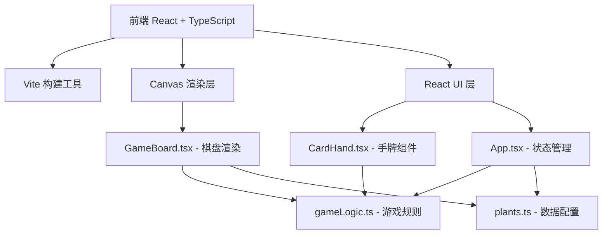

## 1. 架构设计



## 2. 技术说明

- **前端框架**：React 18 + TypeScript
- **构建工具**：Vite
- **渲染引擎**：HTML5 Canvas 2D（用于游戏棋盘渲染）
- **UI组件**：React组件（手牌、状态面板等HTML/CSS界面）
- **状态管理**：React useState + useRef（游戏状态通过ref驱动Canvas渲染，避免React重渲染影响性能）
- **动画驱动**：requestAnimationFrame实现60fps游戏循环
- **样式方案**：CSS Modules + CSS变量（毛玻璃、渐变等视觉效果）
- **包管理**：npm

## 3. 路由定义

本游戏为单页应用，无需路由切换。所有游戏内容在一个页面内完成。

| 路由 | 用途 |
|------|------|
| / | 游戏主页面 |

## 4. 文件结构

```
├── index.html              # 入口HTML
├── package.json            # 依赖和脚本
├── vite.config.ts          # Vite配置
├── tsconfig.json           # TypeScript配置
└── src/
    ├── main.tsx            # 入口挂载React应用
    ├── App.tsx             # 主组件：游戏状态管理、布局、回合逻辑
    ├── GameBoard.tsx       # Canvas渲染：棋盘、植物、敌人、攻击特效、动画循环
    ├── CardHand.tsx        # 卡片手牌组件：展示可选种子、拖拽放置
    ├── index.css           # 全局样式
    └── utils/
        ├── gameLogic.ts    # 纯函数：回合判定、伤害计算、路径规划
        └── plants.ts       # 数据配置：植物/敌人属性、技能、动画参数
```

## 5. 核心数据模型

### 5.1 植物数据模型

```typescript
interface PlantConfig {
  id: string;
  name: string;
  season: 'spring' | 'summer' | 'autumn' | 'winter';
  skill: string;
  damage: number;
  range: number;
  cooldown: number;
  cost: number;
  color: string;
  particleColor: string;
  animationParams: {
    pulseSpeed: number;
    particleCount: number;
    particleSpeed: number;
    particleLife: number;
  };
}
```

### 5.2 敌人数据模型

```typescript
interface EnemyConfig {
  id: string;
  name: string;
  hp: number;
  speed: number;
  reward: number;
  color: string;
  size: number;
}
```

### 5.3 游戏状态模型

```typescript
interface GameState {
  turn: number;
  wave: number;
  lives: number;
  score: number;
  phase: 'player' | 'attack' | 'enemy_move' | 'game_over' | 'victory';
  grid: (PlantConfig | null)[][];
  enemies: EnemyInstance[];
  handCards: PlantConfig[];
  interactivePoints: InteractivePoint[];
}
```

## 6. 性能策略

- Canvas渲染使用双缓冲策略，通过requestAnimationFrame驱动
- 游戏状态使用useRef存储，避免React重渲染导致Canvas重绘
- 粒子系统使用对象池模式，减少GC压力
- 敌人路径使用预计算waypoint数组，避免实时寻路开销
- 攻击特效使用轻量级粒子（控制单帧粒子数<200）
