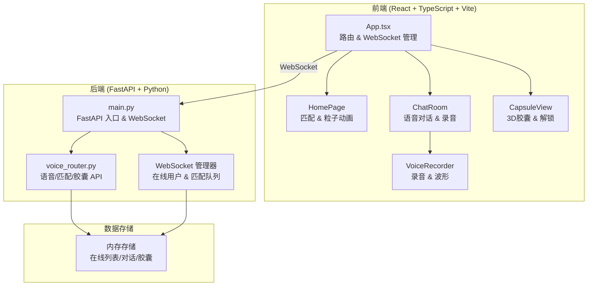
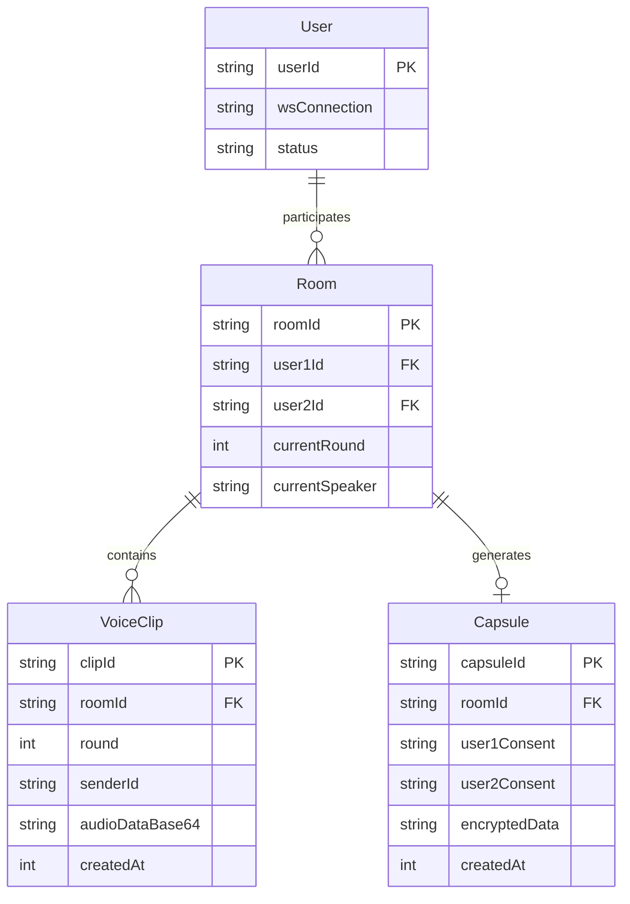

## 1. 架构设计



## 2. 技术说明

- 前端：React 18 + TypeScript + TailwindCSS 3 + Vite + Zustand（状态管理）
- 构建工具：Vite
- 后端：FastAPI (Python 3.10+) + uvicorn + websockets
- 数据存储：内存存储（在线用户列表、对话数据、胶囊数据）
- 音频处理：Web Audio API（录音、播放、波形可视化）
- 通信：WebSocket 双向实时通信
- 加密：Fernet 对称加密（胶囊内容）

## 3. 路由定义

| 路由 | 用途 |
|------|------|
| `/` | 首页 - 匹配界面与粒子动画 |
| `/chat/:roomId` | 对话房间 - 语音对话与录音 |
| `/capsule/:capsuleId` | 胶囊页 - 3D胶囊展示与解锁 |

## 4. API 定义

### WebSocket 消息协议

```typescript
type WSMessage =
  | { type: "join"; userId: string }
  | { type: "waiting" }
  | { type: "matched"; roomId: string; partnerId: string }
  | { type: "voice"; roomId: string; round: number; senderId: string; audioData: string }
  | { type: "round_start"; roomId: string; round: number; currentSpeaker: string }
  | { type: "dialogue_end"; roomId: string; capsuleId: string }
  | { type: "consent"; capsuleId: string; userId: string }
  | { type: "capsule_unlocked"; capsuleId: string }
  | { type: "partner_disconnected" }
```

### HTTP API

| 方法 | 路径 | 用途 | 请求体 | 响应 |
|------|------|------|--------|------|
| GET | `/api/capsule/{id}` | 获取胶囊信息 | - | `{ capsuleId, createdAt, bothConsented, audioClips }` |
| POST | `/api/capsule/{id}/consent` | 用户同意解锁 | `{ userId }` | `{ unlocked, audioClips? }` |

### 音频数据格式

- 录音格式：WebM/Opus (MediaRecorder 默认)
- 传输格式：Base64 编码字符串
- 最大时长：15 秒
- 播放：Audio 元素 + Blob URL

## 5. 服务端架构图

```mermaid
flowchart LR
    "WebSocket 端点" --> "ConnectionManager"
    "ConnectionManager" --> "匹配队列"
    "ConnectionManager" --> "房间管理"
    "房间管理" --> "对话数据"
    "对话数据" --> "胶囊生成器"
    "胶囊生成器" --> "加密存储"
    "HTTP 路由" --> "胶囊查询"
    "胶囊查询" --> "加密存储"
    "HTTP 路由" --> "同意状态"
    "同意状态" --> "加密存储"
```

## 6. 数据模型

### 6.1 数据模型定义



### 6.2 核心数据结构（内存存储）

```python
# 在线用户队列
waiting_queue: list[str]  # userId 列表

# 连接映射
connections: dict[str, WebSocket]  # userId -> WebSocket

# 房间数据
rooms: dict[str, dict]  # roomId -> { user1, user2, currentRound, currentSpeaker, clips }

# 胶囊数据
capsules: dict[str, dict]  # capsuleId -> { roomId, user1Consent, user2Consent, audioData }
```

## 7. 项目文件结构

```
auto365/
├── server/
│   ├── main.py              # FastAPI 入口，WebSocket 端点，CORS 配置
│   └── voice_router.py      # 语音上传、匹配、对话管理、胶囊生成 API
├── client/
│   ├── src/
│   │   ├── main.tsx         # React 入口
│   │   ├── App.tsx          # 主组件，路由 & WebSocket 连接
│   │   ├── HomePage.tsx     # 首页 - 匹配按钮 & 粒子动画
│   │   ├── ChatRoom.tsx     # 对话房间 - 语音气泡 & 状态
│   │   ├── CapsuleView.tsx  # 胶囊页 - 3D 胶囊 & 解锁
│   │   ├── VoiceRecorder.tsx # 录音组件 - 15秒倒计时 & 波形
│   │   ├── store.ts         # Zustand 状态管理
│   │   └── types.ts         # TypeScript 类型定义
│   ├── index.html           # HTML 入口
│   ├── vite.config.ts       # Vite 构建配置
│   ├── tsconfig.json        # TypeScript 配置
│   ├── tailwind.config.js   # Tailwind 配置
│   ├── postcss.config.js    # PostCSS 配置
│   └── package.json         # 依赖和脚本
├── .trae/
│   └── documents/
│       ├── prd.md
│       └── tech-arch.md
```
